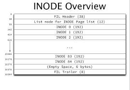
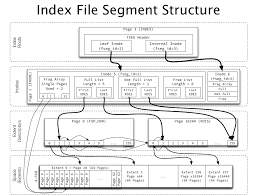
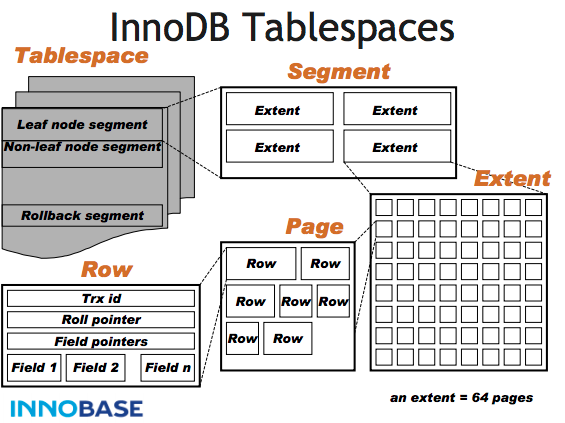

# 段 区 页

这是 InnoDB 表空间中的真实组织关系（逻辑 + 物理）：

```sass (scss) title="user.ibd (Tablespace)
│
├── FSP_HDR Page              ← 表空间头
│
├── INODE Page(s)             ← 段目录页（核心）
│   ├── INODE Entry #1
│   │    ├── Segment ID
│   │    ├── Leaf Segment ?   (yes / no)
│   │    ├── Free Extent List
│   │    ├── Partial Extent List
│   │    └── Full Extent List
│   │
│   ├── INODE Entry #2
│   │    └── ...
│   │
│   └── ...
│
├── Extent A (1MB)
│   ├── Page 0
│   ├── Page 1
│   └── ...
│
├── Extent B (1MB)
│   └── ...
│
└── Free Extents"
user.ibd (Tablespace)
│
├── FSP_HDR Page              ← 表空间头
│
├── INODE Page(s)             ← 段目录页（核心）
│   ├── INODE Entry #1
│   │    ├── Segment ID
│   │    ├── Leaf Segment ?   (yes / no)
│   │    ├── Free Extent List
│   │    ├── Partial Extent List
│   │    └── Full Extent List
│   │
│   ├── INODE Entry #2
│   │    └── ...
│   │
│   └── ...
│
├── Extent A (1MB)
│   ├── Page 0
│   ├── Page 1
│   └── ...
│
├── Extent B (1MB)
│   └── ...
│
└── Free Extents

```


> **INODE 页是“段的目录”，段不存数据，但精确指向 Extent。**




### INODE 页是什么？

- 一种**特殊的 Page**
- 专门存放**Segment 的元数据**
- 每个 INODE Entry = 一个 Segment

👉**没有 INODE，就没有 Segment**

### 2️⃣ 一个 INODE Entry 里有什么？

INODE Entry
├── segment\_id
├── segment\_type      (leaf / non-leaf / undo / temp)
├── free\_extents      → Extent List
├── partial\_extents   → Extent List
├── full\_extents      → Extent List

## 三、Segment 到底“管什么”

### Segment 不管 Page 内容

### Segment 只管三件事：

1. 这些 Extent 是谁的
2. 哪些 Extent 还能继续用
3. 哪些 Extent 已经满了

Segment = 空间所有权 + 分配状态机

## 四、Extent：Segment 的“弹药库”





### Extent 的职责

- 保证物理连续
- 批量分配
- 支撑顺序扫描

### Segment 如何使用 Extent？

Segment

├── Partial Extent  (正在写)

├── Partial Extent

├── Full Extent     (写满)

## 五、Page：真正存数据的地方

Segment 和 Extent**永远不会关心 Page 内容**：

Page

├── B+Tree Node

├── Records

└── Page Header / Trailer

## 六、一次真实的 INSERT 发生了什么（从 Segment 视角）

INSERT INTO user VALUES (100, '<a@x.com>');

### 真实流程（高度贴近源码）

1. 找到 PRIMARY KEY Leaf Segment
2. Segment 的 Partial Extent 是否存在？

   ├── 有 → 从里面找 Free Page

   └── 无 → 向 Tablespace 申请新 Extent
3. Extent 加入 Partial Extent List
4. Page 分配
5. 写记录
6. Page 满？

   └── 是 → Extent 移入 Full Extent List

👉**整个过程中没有“全文件扫描”**

## 七、为什么这套设计极其重要？

### 1️⃣ DROP INDEX 是 O(1)

DROP INDEX idx\_email;

找到 idx\_email 的 Segment

→ 遍历 INODE Entry

→ 释放其 Extent

✔ 不碰其他索引 &#x20;
✔ 不扫描 Page

### 2️⃣ 不同 Segment 可用不同策略

| Segment  | 策略   |
| -------- | ---- |
| Leaf     | 快速增长 |
| Non-Leaf | 极少扩展 |
| Undo     | 循环复用 |

### 3️⃣ 后台线程全靠它工作

- Flush：知道哪些 Page 属于哪个 Segment
- Purge：知道 Undo Segment 的生命周期
- Compact：按 Segment 回收

## 最终精确定义版本

> \*\*Segment 是逻辑概念，
> 但它通过 INODE 页，在磁盘上维护了一套“从逻辑对象到物理 Extent 的映射表”，
> \*\*
> **因此它是“逻辑外壳 + 物理约束”的结合体。**

区（Extent）解决的是「磁盘 I/O 连续性与效率」问题，
段（Segment）解决的是「索引/对象的空间隔离与生命周期管理」问题。

[为什么需要](为什么需要/为什么需要.md "为什么需要")
