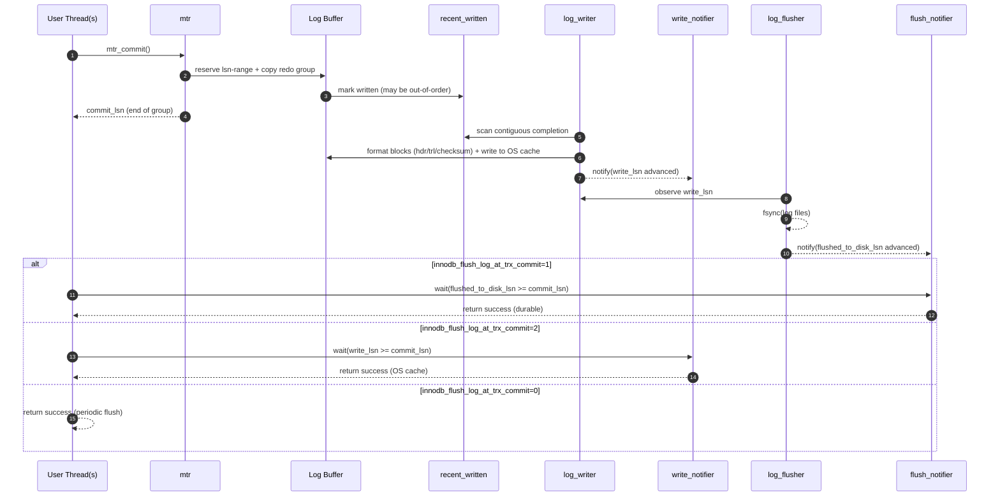
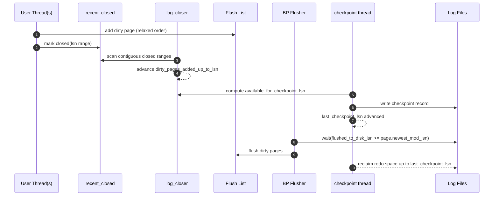
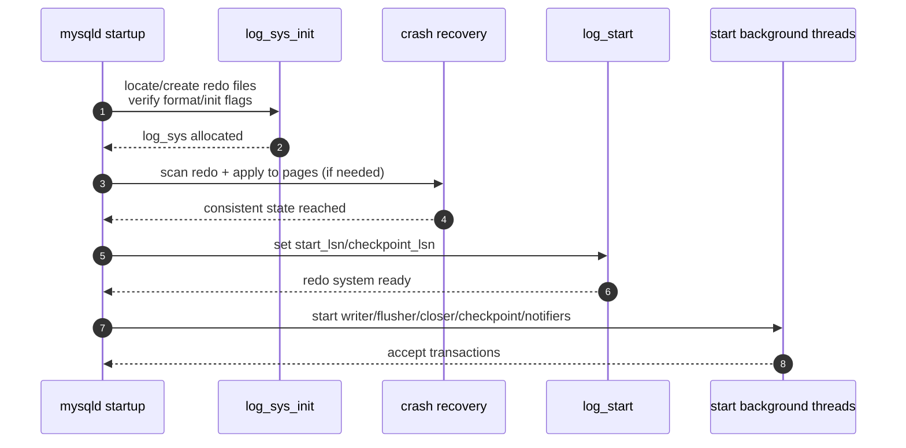

# InnoDB Redo Log（MySQL 8.x）Claude Skill

主要参考：
- CatKang《庖丁解InnoDB之REDO LOG》（概念分层、物理格式、配图、sn/lsn/offset 思路）
- 数据库内核月报：
  - 2019/03/03：MySQL 8.0 redo 子系统“无锁化”并发写入（recent_written / recent_closed / link_buf），线程分工
  - 2022/09/03：MySQL 8.0.30+ redo log 重构（动态容量、#innodb_redo、32 files、在线 resize）
- 《MySQL内核：InnoDB存储引擎（卷一）》：补充 mtr、WAL、恢复的主线脉络（作为“辅参考”）

> 使用方式：当你需要解释/设计/实现 redo 子系统，直接按本文结构输出；当用户问“插入/更新/提交/崩溃恢复”，用第 6/7 节时序图模板回答。

---

## 1) 为什么需要 Redo（WAL）

InnoDB 为获得吞吐：修改优先落在 Buffer Pool 的页上（脏页异步刷盘）。如果崩溃，内存修改丢失。Redo Log 的目的：

- **持久性（D）**：事务提交点要能“证明”其修改可恢复（按参数策略写盘/刷盘）。
- **崩溃恢复**：重启扫描 redo，重放到数据页，把页恢复到崩溃前状态。
- **顺序写换随机写**：redo 是 append/循环顺序写，远快于数据页随机写。
- **允许模糊检查点（fuzzy checkpoint）**：提交不需要等待脏页刷盘，只需保证 redo 先行。

WAL 约束：**数据页刷盘前，对应 redo 必须已落盘**。

---

## 2) Redo 记录了什么（Physiological Logging）

### 2.1 目标
Redo 同时要：小、可重入（幂等）、便于并发恢复（基于 Page）。CatKang 将其概括为 **Physiological Logging**：
- **Page 粒度定位**（space_id + page_no）
- Page 内部用逻辑方式描述增量（record offset、field delta 等）

示例（概念）：
- `MLOG_REC_UPDATE_IN_PLACE`：记录对 Page 内某条 record 的字段更新：
  - (PageID, RecordOffset, (FieldNo, Value) ...)

### 2.2 分类（按作用对象）
MySQL 8.0 已有数十种 redo record 类型，可归为：

1) **Page 类 redo（最多）**
- Index Page redo（B+Tree 插入/删除/分裂/合并）
- Undo Page redo
- 其它页类型 redo

2) **Space/File 类 redo**
- 如 `MLOG_FILE_CREATE/DELETE/RENAME`：表空间/文件元信息变更（恢复时多用于校验与补偿）

3) **Logic/Meta 类 redo**
- 典型：`MLOG_MULTI_REC_END`：标识一个 **redo record group** 的结束（用于“原子边界”定位）

> 关键概念：**redo group ≈ 一个 mtr（mini-transaction）的提交边界**。一个 mtr 内会产出多条 redo record，提交时作为一个组写入。

### 2.3 幂等性的关键：Page LSN
每个 Page 在头部记录最新应用的 LSN（如 `FIL_PAGE_LSN`）。恢复重放 redo 时：
- 若 `page_lsn >= redo_lsn` → 跳过（说明页已经包含该修改）
- 从而保证重复 replay 不破坏一致性。

---

## 3) Redo 如何组织（sn → lsn → file offset）

CatKang 的三层模型：
- **逻辑层：sn（只统计 redo payload 字节）**
- **物理层：log block / lsn（包含 block header/trailer 的开销）**
- **文件层：offset（落到 redo 文件集合的实际位置）**

### 3.1 逻辑层：sn
逻辑 redo 是“纯内容”字节流，多个 record 首尾相连，sn 全局单调递增。

（图）逻辑层示意：


### 3.2 物理层：log block + lsn
磁盘按块读写。InnoDB 的 redo 文件按 **log block** 组织（典型 512B）。每个 log block：
- header（含 block no、data len、first record group offset、checkpoint no 等）
- data（承载 redo records；一个 record group 可跨 block；一个 block 也可容纳多个 group）
- trailer（checksum）

（图）log block 结构：


（图）record 跨 block：


#### sn ↔ lsn 换算（必备）
设：
- `OS_FILE_LOG_BLOCK_SIZE = 512`
- `LOG_BLOCK_HDR_SIZE = 12`
- `LOG_BLOCK_TRL_SIZE = 4`
- `LOG_BLOCK_DATA_SIZE = 512 - 12 - 4 = 496`（以经典值举例）

**sn → lsn**
```text
lsn = (sn / LOG_BLOCK_DATA_SIZE) * OS_FILE_LOG_BLOCK_SIZE
    + (sn % LOG_BLOCK_DATA_SIZE)
    + LOG_BLOCK_HDR_SIZE
```

**lsn → sn（lsn 落在 header/trailer 需要吸附）**
```text
sn_base = (lsn / OS_FILE_LOG_BLOCK_SIZE) * LOG_BLOCK_DATA_SIZE
diff    =  lsn % OS_FILE_LOG_BLOCK_SIZE

if diff < LOG_BLOCK_HDR_SIZE:
    sn = sn_base
else if diff > OS_FILE_LOG_BLOCK_SIZE - LOG_BLOCK_TRL_SIZE:
    sn = sn_base + LOG_BLOCK_DATA_SIZE
else:
    sn = sn_base + (diff - LOG_BLOCK_HDR_SIZE)
```

### 3.3 文件层：offset（8.0.30 前后两套布局）

#### 3.3.1 8.0.29 及之前：`ib_logfile0/1/...`（经典环形）
多个 `ib_logfileN` 逻辑上拼成一个环形大文件，文件头保留若干 block 存 header/checkpoint 信息：


概念换算：
```text
real_offset = current_file_real_offset + (lsn - current_file_lsn)
```

#### 3.3.2 8.0.30+：Redo 重构（动态容量、#innodb_redo、32 文件）
从 8.0.30 起引入：
- `innodb_redo_log_capacity`：redo 总容量（可动态调整）
- `datadir/#innodb_redo/`：目录
- 32 个普通 redo 文件：`#ib_redoN`
- resize 过程使用 spare 文件：`#ib_redoN_tmp`（短暂存在/切换）

工程可用的“近似”映射模型（足够讲清偏移量计算）：

```text
capacity = innodb_redo_log_capacity
N = 32
file_size ~= capacity / N   (resize 期间可能暂时不等)

delta = lsn - start_lsn
file_index = (delta / file_size) % N
in_file    =  delta % file_size

offset_in_file = file_header_bytes + in_file
file_name = "#innodb_redo/#ib_redo{file_index}"
```

---

## 4) 并发写入（MySQL 8.0 的“无锁化”核心）

MySQL 8.0 的 redo 子系统重构点：
- 用户线程可以**并发** copy redo 到 log buffer（先 reserve 一段 lsn/sn 范围，再填充内容）
- 因并发导致 **log buffer 出现空洞（holes）**，writer 不能把不连续的数据写入文件
- 解决：引入 `link_buf` 思路的两个结构：
  - `recent_written`：跟踪“哪些 lsn 段已经写完”，推进 `buf_ready_for_write_lsn`
  - `recent_closed`：跟踪“哪些 lsn 段对应的 dirty pages 已挂入 flush list”，推进 checkpoint 安全边界

直觉图景：
- **reserve 顺序** 是按 lsn 单调递增分配的；
- **写完顺序** 可能乱序；
- writer 必须找到“从某个起点开始连续写完”的最大前缀才能推进写盘边界。

---

## 5) 后台线程与关键 LSN 水位（工程级理解）

建议把 redo 子系统拆成“推进水位”的流水线：

- `write_lsn`：写入 OS page cache 的边界（log_writer 推进）
- `flushed_to_disk_lsn`：fsync 到磁盘的边界（log_flusher 推进）
- `last_checkpoint_lsn`：最近 checkpoint 的位置（checkpoint thread 推进）
- `buf_ready_for_write_lsn`：log buffer 中“连续写完”的边界（由 recent_written 推进）
- `dirty_pages_added_up_to_lsn`：对应 dirty pages 已加入 flush list 的边界（由 recent_closed/log_closer 推进）

线程角色（常见拆分）：
- **log_writer**：把 `buf_ready_for_write_lsn` 之前的内容格式化成 log blocks 写到 OS cache → 推进 `write_lsn`
- **log_flusher**：对 redo 文件 fsync → 推进 `flushed_to_disk_lsn`
- **log_closer**：扫描 recent_closed → 推进 `dirty_pages_added_up_to_lsn`
- **write_notifier/flush_notifier**：唤醒等待 write/flushed 条件的线程
- **checkpoint thread**：计算可 checkpoint 的 lsn → 写 checkpoint → 回收 redo 空间

---

## 6) 必备时序图模板（Mermaid）

### 6.1 写路径（mtr_commit → writer → flusher → commit-wait）



### 6.2 Checkpoint 推进（flush list → checkpoint_lsn → free space）



### 6.3 初始化（发现/创建 redo → recovery → 启动线程）



---

## 7) “Redo 最终长什么样”（解释型 dump 模板）

真实 redo 是二进制。讲解时建议输出“可读化 dump”，强调 Page 定位与 group 边界：

```text
[LSN 1000]  MLOG_REC_INSERT
  page: (space=USER_TBL, page=PkLeaf#123)
  payload: rec_off=0x1A2, fields=[...]

[LSN 1088]  MLOG_MULTI_REC_END   # end of mtr redo group

[LSN 1100]  MLOG_REC_INSERT
  page: (space=USER_TBL, page=SecLeaf#45)   # or Change Buffer page (if buffered)
  payload: ...

[LSN 1180]  MLOG_MULTI_REC_END
```

讲解要点：
- 一个 mtr 产生一个 redo group；组内包含对多个 page 的修改记录（但每条 record 仍只指向一个 page）。
- group 可以跨多个 log block；log block 也可以包含多个 group。
- 崩溃恢复按 LSN 扫描，按 page_lsn 做幂等判断。

---

## 8) 常见误区与修正（把旧文纠偏到 MySQL 8.x）

1) **“redo 只有 ib_logfile0/1”**  
8.0.30+ 改为 `#innodb_redo/#ib_redoN`（32 文件）并支持动态 resize（以 capacity 管理）。

2) **“用户线程直接写 redo 文件”**  
MySQL 8.0 的目标是：用户线程并发写 log buffer；writer/flusher 后台独占系统调用与 IO。

3) **“checkpoint 只取决于脏页 flush”**  
并发下必须额外保证：某 lsn 之前的 dirty pages 已经加入 flush list（recent_closed/log_closer）。否则 checkpoint 可能越过尚未登记的脏页修改。

4) **“redo 是纯物理日志/纯逻辑日志”**  
InnoDB redo 是 physiological：Page 定位 + Page 内逻辑增量描述。

---

## 9) 工程级模块拆分（用于实现/重构）

- `redo.api`：reserve/copy, wait_for_lsn, lsn_state queries
- `redo.buffer`：log buffer 管理、block formatter、checksum
- `redo.linkbuf`：recent_written / recent_closed（环形 slot）
- `redo.writer`：log_writer（推进 write_lsn）
- `redo.flusher`：log_flusher（推进 flushed_to_disk_lsn）
- `redo.checkpoint`：checkpoint 计算、写入、空间回收
- `redo.fileset`：8.0.29- 与 8.0.30+ 两套文件布局 + lsn→offset 映射
- `redo.recovery`：scan/parse/apply（page_lsn 幂等）
- `redo.monitor`：等待/水位/吞吐指标

---

## 10) 参考链接（按优先级）
- CatKang：`https://catkang.github.io/2020/02/27/mysql-redo.html`
- 数据库内核月报：
  - `https://mysql.taobao.org/monthly/2019/03/03/`
  - `https://mysql.taobao.org/monthly/2022/09/03/`
- MySQL 官方：`innodb_redo_log_capacity` / dynamic redo resizing / redo arch（用于对齐 8.0.30+ 行为）
