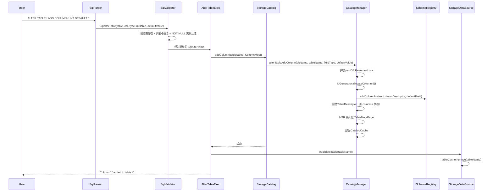

# Design Document: ALTER TABLE ADD COLUMN (Instant DDL)

## Kernel-Safe Mode: ON
Module: sql/exec + sql/catalog + storage/catalog + storage/record/schema

## Overview

本设计实现 mini-db 的 `ALTER TABLE ADD COLUMN` Instant DDL 功能。核心思想：添加新列时仅修改 Schema 元数据，不重写任何已有数据页。旧行在读取时通过 `SchemaRegistry.fillInstantDefaults()` 自动获得新列的默认值。

### 设计目标

1. 打通 SQL 层 → 存储层的完整 ADD COLUMN 链路
2. 利用已有的 `SchemaRegistry.addColumnInstant()` + `RowReader` 读路径
3. 保证 DDL 原子性：先持久化再更新内存
4. 保证缓存一致性：DDL 后 `StorageDataSource.tableCache` 正确失效

### 数据流路径



## Architecture

### 模块职责划分

| 层次 | 模块 | 职责 |
|------|------|------|
| SQL AST | `SqlAlterTable` | 携带 `nullable`、`defaultValue` 信息 |
| SQL Parser | `SqlParser.parseAlterTable()` | 解析 `NOT NULL`、`DEFAULT` 子句 |
| SQL Validation | `SqlValidator.validateAlterTable()` | 新增 NOT NULL 无默认值拒绝 |
| SQL Catalog | `ColumnMeta` (SQL层) | 扩展 `nullable`、`defaultValue` 字段 |
| SQL Exec | `AlterTableExec` | 构造扩展 ColumnMeta，调用 `CatalogSpi.addColumn()`，触发缓存失效 |
| Bridge | `StorageCatalog` | SQL 类型 → 存储类型转换，委托 `CatalogManager` |
| Storage Catalog | `CatalogManager.alterTableAddColumn()` | 原子 DDL：分配 ID → Schema 变更 → 重建 TD → 持久化 → 更新缓存 |
| Storage Schema | `SchemaRegistry` | `addColumnInstant()` 已实现 |
| Storage Read | `RowReader` | `fillInstantDefaults()` 已实现 |
| Data Source | `StorageDataSource` | 新增 `invalidateTable()` 缓存失效 |

### Fail-First Design Gate

#### Forbidden Designs

| # | 禁止设计 | 危险原因 | 破坏的不变量 | 失败类型 |
|---|---------|---------|-------------|---------|
| F1 | 直接修改 `TableDescriptor.columns` 列表（反射绕过 unmodifiableList） | `columns` 是 `Collections.unmodifiableList`，绕过不可变约束会导致并发读取者看到不一致的列表状态 | TableDescriptor 不可变契约 | silent corruption |
| F2 | 在 `AlterTableExec` 中直接调用 `CatalogManager` 绕过 `StorageCatalog` | 跳过 SQL→Storage 类型转换层，破坏分层架构；且 `AlterTableExec` 不应持有 `CatalogManager` 引用 | CAT-1 单一真相源 | crash / 类型不匹配 |
| F3 | 先更新内存（SchemaRegistry + CatalogCache）再持久化 | 如果持久化失败，内存已被污染，无法回滚；崩溃恢复后新列定义丢失但内存中曾存在 | 持久化契约：先持久化再更新内存 | recovery failure |
| F4 | 原地修改现有 `RecordSchema` 对象添加新列 | `RecordSchema` 是不可变快照，原地修改会导致正在使用旧版本 schema 的读操作看到不一致状态 | I5 rowVersion 自描述 | silent corruption |

#### Core Invariants (Design Level)

| # | 不变量 | 说明 |
|---|--------|------|
| INV-1 | 先持久化再更新内存 | `CatalogManager` 必须在 MTR commit 成功后才更新 `CatalogCache` 和 `SchemaRegistry` 的对外可见状态 |
| INV-2 | I5: rowVersion 从记录 peek | `RowReader` 读取 rowVersion 从物理记录的 `dataStart+13` 偏移获取，不由调用者传入 |
| INV-3 | I6: Instant 默认值按 columnId + introducedVersion 填充 | `SchemaRegistry.fillInstantDefaults()` 按 `InstantColumnMeta.introducedVersion > rowVersion` 条件填充 |
| INV-4 | TableDescriptor 重建而非修改 | ADD COLUMN 后必须创建新的 `TableDescriptor` 实例，不可修改原实例的 `columns` |
| INV-5 | DDL 后缓存失效 | `StorageDataSource.tableCache` 必须在 DDL 成功后移除对应表的缓存条目 |
| INV-6 | columnId 全局唯一 | 新列的 `columnId` 由 `IdGenerator.allocateColumnId()` 分配，单调递增 |
| INV-7 | NOT NULL 列必须有默认值 | Instant DDL 不重写旧行，NOT NULL 列若无默认值则旧行读取时无法填充 |

### Concurrency / Latch / Lock Analysis

| 共享状态 | 保护机制 | 说明 |
|---------|---------|------|
| `CatalogManager` DDL 操作 | per-DB `ReentrantLock` via `getOrCreateDbLock()` | 同库 DDL 串行，不同库可并发 |
| `SchemaRegistry.currentSchema` | `volatile` | DDL 写入后对所有线程立即可见 |
| `SchemaRegistry.schemas` Map | `ConcurrentHashMap` | 读写并发安全 |
| `SchemaRegistry.instantColumns` List | per-DB lock 保护写入；读路径在 `fillInstantDefaults` 中遍历 | DDL 持锁期间写入，读路径遍历快照 |
| `CatalogCache` | `ConcurrentHashMap` | `putTable()` 原子替换引用 |
| `StorageDataSource.tableCache` | `LinkedHashMap`（非线程安全） | 当前设计假设单线程 SQL 执行；`invalidateTable()` 在同一线程调用 |
| `IdGenerator` | `AtomicLong` | 无锁分配 |

**Lock Ordering**: `per-DB ReentrantLock` → `BufferFrame X-latch`（MTR 内部）

**Deadlock Prevention**: DDL 操作只获取单个 DB 锁，不会跨库加锁；MTR 内部的 page latch 由 MTR 生命周期管理。

**JMM Happens-Before Chain**:
1. `CatalogManager` 在 per-DB lock 内执行 `SchemaRegistry.addColumnInstant()`
2. `SchemaRegistry.currentSchema` 是 `volatile`，写入后对所有线程可见
3. `CatalogCache.putTable()` 使用 `ConcurrentHashMap.put()`，保证 happens-before
4. `StorageDataSource.invalidateTable()` 在同一线程执行，后续 `openTable()` 重新加载


## Detailed Design

### Component 1: SqlAlterTable AST 扩展

**文件:** `mini-db/src/main/java/cn/zhangyis/minidb/sql/ast/SqlAlterTable.java`

**当前签名:**
```java
public record SqlAlterTable(SqlIdentifier table, String columnName, SqlType columnType) implements SqlNode
```

**修改后签名:**
```java
public record SqlAlterTable(
    SqlIdentifier table,
    String columnName,
    SqlType columnType,
    boolean nullable,       // 新增：默认 true（Instant DDL 安全默认值）
    SqlNode defaultValue    // 新增：DEFAULT 子句的值，null 表示无显式默认值
) implements SqlNode
```

**向后兼容:** 新增工厂方法 `SqlAlterTable.of(table, columnName, columnType)` 默认 `nullable=true, defaultValue=null`，保持现有 Parser 调用点兼容。

**对应 Requirement:** Req 1

### Component 2: SQL 层 ColumnMeta 扩展

**文件:** `mini-db/src/main/java/cn/zhangyis/minidb/sql/catalog/ColumnMeta.java`

**当前签名:**
```java
public record ColumnMeta(String name, SqlType type, boolean isPrimaryKey)
```

**修改后签名:**
```java
public record ColumnMeta(
    String name,
    SqlType type,
    boolean isPrimaryKey,
    boolean nullable,       // 新增
    Object defaultValue     // 新增：null 表示无显式默认值
)
```

**向后兼容:** 保留原三参数构造器作为便捷方法（默认 `nullable=true, defaultValue=null`），或在所有调用点更新。

**对应 Requirement:** Req 1, Req 3

### Component 3: SqlParser ALTER TABLE 解析增强

**文件:** `mini-db/src/main/java/cn/zhangyis/minidb/sql/parser/SqlParser.java`

**修改内容:** `parseAlterTable()` 方法增加对 `NOT NULL` 和 `DEFAULT <value>` 子句的解析。

**解析逻辑:**
```
ALTER TABLE <table> ADD COLUMN <col> <type> [NOT NULL] [DEFAULT <literal>]
```

1. 解析 `<type>` 后，检查下一个 token
2. 如果是 `NOT`，消费 `NOT NULL`，设置 `nullable=false`
3. 如果是 `DEFAULT`，消费 `DEFAULT`，解析 literal 值
4. 构造 `SqlAlterTable(table, col, type, nullable, defaultValue)`

**对应 Requirement:** Req 1

### Component 4: SqlValidator 增强

**文件:** `mini-db/src/main/java/cn/zhangyis/minidb/sql/validation/SqlValidator.java`

**修改方法:** `validateAlterTable(SqlAlterTable alter)`

**新增逻辑（在现有检查之后）:**
```java
// 已有：表存在性检查、列名重复检查
// 新增：NOT NULL 无默认值拒绝
if (!alter.nullable() && alter.defaultValue() == null) {
    throw new ValidationException(
        "Instant DDL requires nullable column or explicit DEFAULT value for NOT NULL column '"
        + alter.columnName() + "'");
}
```

**对应 Requirement:** Req 2 AC5, INV-7

### Component 5: AlterTableExec 更新

**文件:** `mini-db/src/main/java/cn/zhangyis/minidb/sql/exec/AlterTableExec.java`

**修改内容:**

1. `open()` 方法构造扩展后的 SQL 层 `ColumnMeta`（含 nullable/defaultValue）
2. 调用 `catalog.addColumn()` 后，触发 `StorageDataSource.invalidateTable()`

**关键设计决策:** `AlterTableExec` 需要访问 `DataSourceSpi` 来触发缓存失效。通过 `RelAlterTable` 传递 `DataSourceSpi` 引用，或在 `AlterTableExec` 构造时注入。

**推荐方案:** `AlterTableExec` 构造器接收 `DataSourceSpi`（由 `PhysicalPlanner` 注入），DDL 成功后调用 `dataSource.invalidateTable(tableName)`。

**修改后 open():**
```java
@Override
public void open() {
    SqlAlterTable alter = relAlter.alterTable();
    CatalogSpi catalog = relAlter.catalog();
    String tableName = alter.table().name();

    // 构造扩展 ColumnMeta
    ColumnMeta newCol = new ColumnMeta(
        alter.columnName(), alter.columnType(), false,
        alter.nullable(), alter.defaultValue()
    );
    catalog.addColumn(tableName, newCol);

    // 触发缓存失效 (INV-5)
    if (dataSource != null) {
        dataSource.invalidateTable(tableName);
    }

    message = "Column '" + alter.columnName() + "' added to table '" + tableName + "'";
    returned = false;
}
```

**对应 Requirement:** Req 3, Req 9 (INV-5)

### Component 6: StorageCatalog.addColumn() 实现

**文件:** `mini-db/src/main/java/cn/zhangyis/minidb/sql/catalog/StorageCatalog.java`

**当前代码:**
```java
@Override
public void addColumn(String tableName, ColumnMeta column) {
    throw new UnsupportedOperationException(...);
}
```

**修改后:**
```java
@Override
public void addColumn(String tableName, ColumnMeta column) {
    requireBufferPool("addColumn");

    // SQL 类型 → 存储层 FieldType
    FieldType fieldType = sqlTypeToFieldType(column.type(), false);
    if (column.nullable()) {
        fieldType = fieldType.withNullable(true);
    }

    // 转换默认值为 DataField
    DataField defaultField = null;
    if (column.defaultValue() != null) {
        defaultField = convertDefaultValue(column.defaultValue(), fieldType);
    }

    // 委托 CatalogManager
    catalogManager.alterTableAddColumn(
        databaseName, tableName, column.name(), fieldType, defaultField
    );
}
```

**辅助方法:** `convertDefaultValue(Object sqlDefault, FieldType type)` — 将 SQL 层的默认值字面量转换为 `DataField`。

**对应 Requirement:** Req 4, INV-1

### Component 7: CatalogManager.alterTableAddColumn() 新增方法

**文件:** `mini-db/src/main/java/cn/zhangyis/minidb/storage/catalog/CatalogManager.java`

**新增方法签名:**
```java
public void alterTableAddColumn(String dbName, String tableName,
                                String columnName, FieldType fieldType,
                                DataField defaultValue) throws CatalogException
```

**执行流程（严格顺序）:**

```
1. ensureInitialized()
2. ReentrantLock lock = getOrCreateDbLock(dbName)
3. lock.lock()
4. try {
5.     TableDescriptor oldTd = getTable(dbName, tableName)
6.     SchemaRegistry registry = oldTd.getSchemaRegistry()
7.
8.     // 分配 columnId (INV-6)
9.     long columnId = idGenerator.nextColumnId()
10.
11.    // 构造 ColumnDescriptor
12.    ColumnDescriptor colDesc = ColumnDescriptor.of(
13.        columnId, columnName, fieldType, oldTd.getColumns().size()
14.    )
15.
16.    // 调用 SchemaRegistry.addColumnInstant() (已实现)
17.    RecordSchema newSchema = registry.addColumnInstant(colDesc, defaultValue)
18.
19.    // 构造新的 storage ColumnMeta
20.    ColumnMeta newStorageCol = new ColumnMeta(
21.        columnId, columnName, fieldType,
22.        oldTd.getColumns().size(), defaultValue
23.    )
24.
25.    // 重建 TableDescriptor (INV-4: 不可修改原实例)
26.    List<ColumnMeta> newColumns = new ArrayList<>(oldTd.getColumns())
27.    newColumns.add(newStorageCol)
28.    TableDescriptor newTd = new TableDescriptor(
29.        oldTd.getTableId(), oldTd.getTableName(), oldTd.getDatabaseId(),
30.        oldTd.getSpaceId(), registry, newColumns,
31.        oldTd.getPrimaryIndexId(), oldTd.getSecondaryIndexIds(),
32.        oldTd.getCreateTime(), System.currentTimeMillis(),
33.        TableDescriptor.TableState.ACTIVE
34.    )
35.
36.    // MTR 持久化 (INV-1: 先持久化再更新内存)
37.    persistTableUpdate(newTd)
38.
39.    // 更新 CatalogCache（持久化成功后）
40.    cache.putTable(newTd)
41.
42. } finally {
43.     lock.unlock()
44. }
```

**异常安全:** 如果 `persistTableUpdate()` 抛出异常，`SchemaRegistry` 已被 `addColumnInstant()` 修改。需要在异常路径中回滚 `SchemaRegistry` 状态。

**回滚策略:**
```java
// 保存回滚点
RecordSchema oldSchema = registry.getCurrentSchema();
int oldInstantColumnsSize = registry.getInstantColumns().size();

try {
    RecordSchema newSchema = registry.addColumnInstant(colDesc, defaultValue);
    // ... 持久化 ...
} catch (Exception e) {
    // 回滚 SchemaRegistry
    registry.setCurrentSchema(oldSchema);
    // 注意：schemas map 中已注册的新版本需要移除
    // 或者：改为先持久化，再调用 addColumnInstant
    throw new CatalogException(700600, "ALTER TABLE ADD COLUMN failed: " + e.getMessage(), e);
}
```

**更优方案（推荐）:** 将 `SchemaRegistry.addColumnInstant()` 拆分为两步：
1. 先构造新 schema 和 InstantColumnMeta（不修改 registry 状态）
2. 持久化成功后，再调用 `registry.register(newSchema)` + `registry.addInstantColumn(meta)`

这样异常路径无需回滚。但当前 `addColumnInstant()` 已是原子操作，修改它会影响已有测试。

**实际推荐:** 保持 `addColumnInstant()` 不变，采用"先持久化元数据到 page，再调用 addColumnInstant 更新内存"的顺序。持久化时使用新 schema 信息但不通过 registry，而是直接构造 `TableMetaPage.TableEntry`。

**对应 Requirement:** Req 5, Req 6

### Component 8: persistTableUpdate() 新增方法

**文件:** `mini-db/src/main/java/cn/zhangyis/minidb/storage/catalog/CatalogManager.java`

**参考现有模式:** `persistTableCreate()` 已有完整的 MTR 持久化模式。

**新增方法:**
```java
private void persistTableUpdate(TableDescriptor table) throws CatalogException {
    try (MiniTransaction mtr = new MiniTransaction(bufferPool)) {
        // 获取 CatalogMetaPage
        BufferFrame metaFrame = mtr.getPage(
            CatalogMetaPage.CATALOG_SPACE_ID,
            CatalogMetaPage.CATALOG_META_PAGE_NO,
            BufferPool.FetchMode.READ_EXISTING
        );

        // 获取 TableMetaPage
        int tableMetaPageNo = CatalogMetaPage.findTableMetaPage(
            metaFrame, table.getDatabaseId()
        );
        BufferFrame tableFrame = mtr.getPage(
            CatalogMetaPage.CATALOG_SPACE_ID,
            tableMetaPageNo,
            BufferPool.FetchMode.READ_EXISTING
        );

        // 更新表元数据（覆盖写入）
        TableMetaPage.updateTable(tableFrame, toTableEntry(table));
        mtr.markDirty(tableFrame);

        mtr.commit();
    } catch (MiniDbException e) {
        throw new CatalogException(700601,
            "Failed to persist ALTER TABLE: " + e.getMessage(), e);
    }
}
```

**注意:** `TableMetaPage.updateTable()` 可能需要新增，当前只有 `addTable()` 和 `removeTable()`。需要实现按 `tableId` 查找并覆盖写入的逻辑。

**对应 Requirement:** Req 5 AC5

### Component 9: DataSourceSpi 接口扩展 + StorageDataSource 缓存失效

**文件:** `mini-db/src/main/java/cn/zhangyis/minidb/sql/exec/DataSourceSpi.java`

**新增方法:**
```java
/**
 * DDL 后使指定表的缓存失效
 */
default void invalidateTable(String tableName) {
    // 默认空实现，MockDataSource 等不需要缓存失效
}
```

**文件:** `mini-db/src/main/java/cn/zhangyis/minidb/sql/exec/StorageDataSource.java`

**新增方法:**
```java
@Override
public void invalidateTable(String tableName) {
    tableCache.remove(tableName.toUpperCase());
}
```

**触发时机:** `AlterTableExec.open()` 在 `catalog.addColumn()` 成功后调用 `dataSource.invalidateTable(tableName)`。

**对应 Requirement:** Req 9, INV-5

### Component 10: PhysicalPlanner 注入 DataSourceSpi

**文件:** `mini-db/src/main/java/cn/zhangyis/minidb/sql/exec/PhysicalPlanner.java`

**修改内容:** `planInternal()` 中 `RelAlterTable` 分支传递 `dataSource` 给 `AlterTableExec`。

```java
if (relNode instanceof RelAlterTable alter) {
    return new AlterTableExec(alter, dataSource);
}
```

**对应 Requirement:** Req 3, Req 9

## Symbolic Trace

### ADD COLUMN age INT DEFAULT 0 执行流程

**初始状态:**
- 表 `users`，columns = `[id(INT, colId=1), name(VARCHAR, colId=2)]`
- SchemaRegistry: version=1, schemas={1: [id, name]}
- 已有 3 行数据，rowVersion=1

**DDL 执行:**
1. `SqlParser` → `SqlAlterTable(users, "age", INT, nullable=true, defaultValue=SqlLiteral("0"))`
2. `SqlValidator` → 表存在 ✓，列名不重复 ✓，nullable=true 无需检查默认值 ✓
3. `AlterTableExec.open()` → `StorageCatalog.addColumn("users", ColumnMeta("age", INT, false, true, 0))`
4. `StorageCatalog` → `fieldType = FieldType(INT, nullable=true)`, `defaultField = DataField.intField(0)`
5. `CatalogManager.alterTableAddColumn("testdb", "users", "age", fieldType, defaultField)`
6. `lock = getOrCreateDbLock("testdb")`, `lock.lock()`
7. `columnId = idGenerator.nextColumnId()` → 假设 `columnId=3`
8. `colDesc = ColumnDescriptor.of(3, "age", FieldType(INT, nullable), ordinal=2)`
9. `registry.addColumnInstant(colDesc, DataField.intField(0))`
   - `newVersion = 1 + 1 = 2`
   - `newSchema = RecordSchema(version=2, columns=[id, name, age])`
   - `InstantColumnMeta(columnId=3, introducedVersion=2, defaultBytes=[0,0,0,0], type=INT)`
   - `schemas = {1: [id,name], 2: [id,name,age]}`
   - `currentSchema = version 2`
10. `newColumns = [ColumnMeta(1,"id",...), ColumnMeta(2,"name",...), ColumnMeta(3,"age",...)]`
11. `newTd = new TableDescriptor(...)` 重建
12. `persistTableUpdate(newTd)` → MTR commit
13. `cache.putTable(newTd)`
14. `lock.unlock()`
15. `StorageDataSource.invalidateTable("users")` → `tableCache.remove("USERS")`

**DDL 后读取旧行 (rowVersion=1):**
1. `StorageDataSource.openTable("users")` → cache miss → `loadTableAccess("users")`
2. `loadTableAccess` → `catalogManager.getTable("testdb", "users")` → 新 TableDescriptor
3. `RowReader.read(buffer, recStart)`
4. `peekRowVersion` → 1 (I5: 从记录 peek)
5. `registry.get(1)` → `RecordSchema(version=1, [id, name])`
6. `decode` → `DataTuple([1001, "张三"])` (2 个字段)
7. `fillInstantDefaults(tuple, rowVersion=1)`:
   - `InstantColumnMeta(colId=3, introducedVersion=2)`: `2 > 1` → 需要填充
   - `currentSchema.indexOfColumn(3)` → index=2
   - `tuple.setField(2, DataField.intField(0))`
8. 返回 `DataTuple([1001, "张三", 0])` ✓

**DDL 后插入新行:**
1. `StorageDataSource.insertRow("users", Row{id=1004, name="李四", age=25})`
2. `dml()` → `table.getSchemaRegistry().getCurrentSchema()` → version=2
3. `rowToTuple` → `DataTuple([1004, "李四", 25])` (3 个字段)
4. `encodeTo` → ROW_VERSION=2 写入记录
5. 后续读取：`peekRowVersion` → 2, `fillInstantDefaults` 跳过（`2 >= 2`）✓

### 边界情况：连续两次 ADD COLUMN

**第一次:** ADD COLUMN age INT → version=2, colId=3
**第二次:** ADD COLUMN email VARCHAR(100) → version=3, colId=4

**读取 rowVersion=1 的行:**
- `InstantColumnMeta(colId=3, ver=2)`: `2 > 1` → 填充 age 默认值
- `InstantColumnMeta(colId=4, ver=3)`: `3 > 1` → 填充 email 默认值
- 结果：`[id, name, age_default, email_default]` ✓

**读取 rowVersion=2 的行（第一次 DDL 后插入）:**
- `InstantColumnMeta(colId=3, ver=2)`: `2 > 2` → false，不填充
- `InstantColumnMeta(colId=4, ver=3)`: `3 > 2` → 填充 email 默认值
- 结果：`[id, name, age_actual, email_default]` ✓

## Invariant Enforcement Mapping

| 不变量 | 执行位置 |
|--------|---------|
| INV-1: 先持久化再更新内存 | `CatalogManager.alterTableAddColumn()`: MTR commit 在 `cache.putTable()` 之前 |
| INV-2: I5 rowVersion 从记录 peek | `RowReader.read()` 第一步调用 `format.peekRowVersion(buffer, recStart)` |
| INV-3: I6 按 columnId+introducedVersion 填充 | `SchemaRegistry.fillInstantDefaults()` 遍历 `instantColumns` 检查 `meta.introducedVersion() > rowVersion` |
| INV-4: TableDescriptor 重建 | `CatalogManager.alterTableAddColumn()`: `new TableDescriptor(...)` 而非修改原实例 |
| INV-5: DDL 后缓存失效 | `AlterTableExec.open()`: `dataSource.invalidateTable(tableName)` |
| INV-6: columnId 全局唯一 | `CatalogManager.alterTableAddColumn()`: `idGenerator.nextColumnId()` |
| INV-7: NOT NULL 需默认值 | `SqlValidator.validateAlterTable()`: `!alter.nullable() && alter.defaultValue() == null` → 拒绝 |

## Testing Strategy

### Test 1: 端到端 ALTER TABLE ADD COLUMN + SELECT 旧行默认值 (验证 I6)

```
1. CREATE TABLE t (id INT PRIMARY KEY, name VARCHAR(50))
2. INSERT INTO t VALUES (1, 'Alice'), (2, 'Bob')
3. ALTER TABLE t ADD COLUMN age INT DEFAULT 0
4. SELECT * FROM t WHERE id = 1
5. 断言：结果包含 age=0（Instant 默认值填充）
6. INSERT INTO t VALUES (3, 'Charlie', 25)
7. SELECT * FROM t WHERE id = 3
8. 断言：结果包含 age=25（新行直接写入）
```

**验证不变量:** INV-3 (I6), INV-2 (I5), INV-5

### Test 2: 连续两次 ADD COLUMN + 多版本读取 (验证版本隔离)

```
1. CREATE TABLE t (id INT PRIMARY KEY)
2. INSERT INTO t VALUES (1)                    -- rowVersion=1
3. ALTER TABLE t ADD COLUMN a INT DEFAULT 10   -- version=2
4. INSERT INTO t VALUES (2, 20)                -- rowVersion=2
5. ALTER TABLE t ADD COLUMN b INT DEFAULT 30   -- version=3
6. INSERT INTO t VALUES (3, 20, 30)            -- rowVersion=3
7. SELECT * FROM t ORDER BY id
8. 断言：
   - id=1: a=10(默认), b=30(默认)
   - id=2: a=20(实际), b=30(默认)
   - id=3: a=20(实际), b=30(实际)
```

**验证不变量:** INV-3 (I6 多版本), INV-4

### Test 3: SqlValidator 拒绝 NOT NULL 无默认值 (验证 INV-7)

```
1. CREATE TABLE t (id INT PRIMARY KEY)
2. ALTER TABLE t ADD COLUMN c INT NOT NULL
3. 断言：抛出 ValidationException，包含 "Instant DDL requires nullable column or explicit DEFAULT value"
4. ALTER TABLE t ADD COLUMN c INT NOT NULL DEFAULT 0
5. 断言：成功执行
```

**验证不变量:** INV-7

### Test 4: DDL 后缓存失效 (验证 INV-5)

```
1. CREATE TABLE t (id INT PRIMARY KEY, name VARCHAR(50))
2. INSERT INTO t VALUES (1, 'Alice')
3. SELECT * FROM t  -- 触发 tableCache 加载
4. ALTER TABLE t ADD COLUMN age INT DEFAULT 0
5. SELECT * FROM t  -- 必须使用新 schema，包含 age 列
6. 断言：结果包含 age=0
```

**验证不变量:** INV-5, INV-1

### Test 5: Schema 版本注册正确性 (验证 INV-6)

```
1. 直接调用 CatalogManager.alterTableAddColumn()
2. 断言：SchemaRegistry.getCurrentSchema().getVersion() == oldVersion + 1
3. 断言：SchemaRegistry.get(oldVersion) 返回旧 schema（不含新列）
4. 断言：SchemaRegistry.get(newVersion) 返回新 schema（含新列）
5. 断言：新列的 columnId 由 IdGenerator 分配，全局唯一
```

**验证不变量:** INV-6, INV-4

### Test 6: 并发 DDL 串行化 (验证 per-DB lock)

```
1. CREATE TABLE t (id INT PRIMARY KEY)
2. 并发提交 10 个 ALTER TABLE ADD COLUMN (col_0 到 col_9)
3. 断言：所有 ADD COLUMN 成功
4. 断言：最终 schema version == 初始 version + 10
5. 断言：所有 columnId 唯一
6. 断言：SchemaRegistry 包含 11 个版本（初始 + 10 次 DDL）
```

**验证不变量:** per-DB ReentrantLock 串行化, INV-6

## Implementation Order

按以下顺序实现，每步可独立编译测试：

| 步骤 | 修改文件 | 说明 |
|------|---------|------|
| 1 | `SqlAlterTable.java` | 扩展 record 字段，新增兼容工厂方法 |
| 2 | `sql/catalog/ColumnMeta.java` | 扩展 record 字段 |
| 3 | `SqlParser.java` | 解析 NOT NULL / DEFAULT 子句 |
| 4 | `SqlValidator.java` | 新增 NOT NULL 无默认值拒绝 |
| 5 | `DataSourceSpi.java` | 新增 `invalidateTable()` default 方法 |
| 6 | `StorageDataSource.java` | 实现 `invalidateTable()` |
| 7 | `CatalogManager.java` | 新增 `alterTableAddColumn()` + `persistTableUpdate()` |
| 8 | `StorageCatalog.java` | 实现 `addColumn()`，替换 UnsupportedOperationException |
| 9 | `AlterTableExec.java` | 更新构造器接收 DataSourceSpi，open() 传递扩展 ColumnMeta + 触发缓存失效 |
| 10 | `RelAlterTable.java` | 可选：传递 DataSourceSpi 引用 |
| 11 | `PhysicalPlanner.java` | 注入 dataSource 给 AlterTableExec |
| 12 | 测试 | 按 Test 1-6 顺序编写 |

## Correctness Properties

### P1: Round-Trip 属性
对于任意有效的 `DataTuple t`，`INSERT(t)` 后 `SELECT` 读取的结果 `t'` 满足：对于所有 `t` 中非 NULL 的字段 `i`，`t'.getField(i).getValue() == t.getField(i).getValue()`。

### P2: Instant 默认值一致性
对于 ADD COLUMN 之前写入的行（rowVersion < newVersion），读取时新列的值等于 `InstantColumnMeta.getDefaultValue()`。

### P3: Schema 版本单调递增
每次 `alterTableAddColumn()` 调用后，`SchemaRegistry.getCurrentSchema().getVersion()` 严格递增 1。

### P4: 零数据迁移
`alterTableAddColumn()` 执行期间，不修改任何已有数据页（仅修改 TableMetaPage）。

### P5: DDL 原子性
如果 `alterTableAddColumn()` 抛出异常，`SchemaRegistry` 和 `CatalogCache` 的状态与调用前一致。
