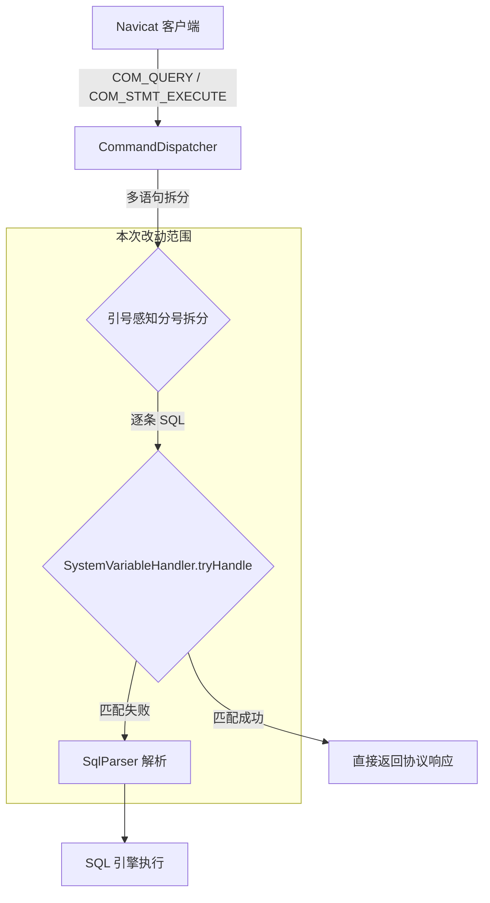
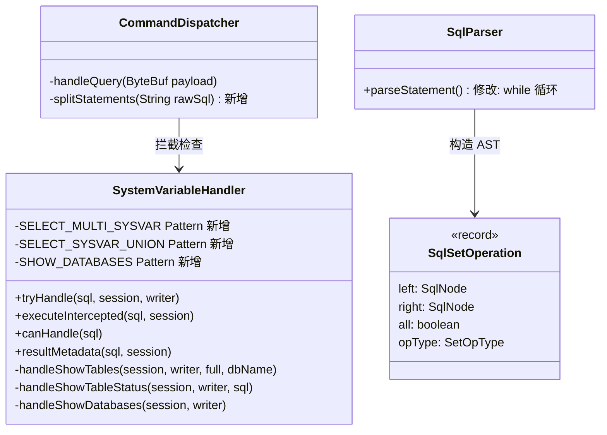

# 技术设计文档：Navicat 客户端兼容性支持

## 概述

本设计解决 Navicat 客户端连接 mini-db 时遇到的 7 个兼容性问题。改动范围限定在 SQL 解析层（`sql/parser`）和协议处理层（`server/handler`），不涉及存储引擎。

核心改动点：
1. **SqlParser** — `parseStatement()` 中 UNION/EXCEPT/INTERSECT 从 `if` 改为 `while` 循环
2. **SystemVariableHandler** — 增强正则匹配和处理逻辑，支持多变量 SELECT、FROM 子句、LIKE 过滤、SHOW DATABASES
3. **CommandDispatcher** — `handleQuery()` 的分号拆分从简单 `split(";")` 改为引号感知拆分

设计原则：在协议拦截层（SystemVariableHandler）处理 Navicat 探测查询，不让这些查询落入 SQL 引擎。tryHandle（文本协议）和 executeIntercepted（二进制协议）两个路径必须保持行为一致。

## 架构

### 请求处理流程



### 改动模块关系



## 组件与接口

### 1. SqlParser.parseStatement() — 多路集合操作（需求 1）

**现状：** `if` 语句只处理一次 UNION，遇到第二个 UNION 时报 "Extra tokens after statement"。

**改动：** 将 `if` 改为 `while` 循环，每次迭代将前一个结果作为新 `SqlSetOperation` 的 `left`，新解析的 SELECT 作为 `right`，形成左结合嵌套结构。

```java
// 改动前（伪代码）
SqlNode s = parseSelect();
if (isSetOp) { s = setOperation(s, parseSelect()); }
yield s;

// 改动后
SqlNode s = parseSelect();
while (isSetOp) { s = setOperation(s, parseSelect()); }
yield s;
```

AST 结构示例：`SELECT a UNION SELECT b UNION ALL SELECT c` →
```
SqlSetOperation(UNION ALL)
├── left: SqlSetOperation(UNION)
│   ├── left: SELECT a
│   └── right: SELECT b
└── right: SELECT c
```

### 2. SystemVariableHandler — 多系统变量 SELECT（需求 2）

**新增正则模式：**

- `SELECT_MULTI_SYSVAR`：匹配 `SELECT @@var1 [AS alias1], @@var2 [AS alias2], ...`
- `SELECT_SYSVAR_UNION`：匹配 `SELECT @@var1 UNION SELECT @@var2 UNION ...`

**处理逻辑：**
- 多变量逗号形式：解析每个 `@@variable [AS alias]` 项，返回单行多列结果集
- UNION 形式：解析每个 `SELECT @@variable`，返回多行单列结果集
- 未知变量返回空字符串（复用现有 `resolveSystemVariable` 的 default 分支）

**tryHandle / executeIntercepted 一致性：** 两个方法使用相同的正则匹配和变量解析逻辑，区别仅在于输出格式（文本协议写 PacketWriter vs 二进制协议返回 `List<Row>`）。

### 3. SystemVariableHandler — SHOW TABLES FROM db_name（需求 3、5）

**正则改动：** 当前 `SHOW_TABLES` 正则不包含 `FROM db_name`。

```java
// 改动前
"(?i)^\\s*SHOW\\s+(?:FULL\\s+)?TABLES(?:\\s+WHERE\\s+.+)?\\s*$"

// 改动后
"(?i)^\\s*SHOW\\s+(?:FULL\\s+)?TABLES(?:\\s+FROM\\s+\\S+)?(?:\\s+WHERE\\s+.+)?\\s*$"
```

**处理逻辑改动：** `handleShowTables` 增加 `dbName` 参数，从 SQL 中解析 `FROM db_name`。若指定了 db_name，使用 `session.catalog().listTables(dbName)` 替代 `session.currentDatabase()`。

### 4. SystemVariableHandler — SHOW TABLE STATUS FROM/LIKE（需求 4）

**处理逻辑改动：** `handleShowTableStatus` 从 SQL 文本中解析可选的 `FROM db_name` 和 `LIKE 'pattern'` 子句。

- FROM 子句：指定目标数据库
- LIKE 子句：将 `%` → `.*`、`_` → `.` 转为正则，过滤表名（复用 `handleShowVariables` 中已有的通配符转换逻辑）

### 5. SystemVariableHandler — SHOW DATABASES（需求 6）

**改动：** 将 `SHOW DATABASES` 从 `SHOW_MISC` 正则中移除，新增独立的 `SHOW_DATABASES` 正则和处理方法。

```java
private static final Pattern SHOW_DATABASES = Pattern.compile(
    "(?i)^\\s*SHOW\\s+DATABASES\\s*$");
```

**处理逻辑：** 调用 `session.catalog().listDatabases()` 获取数据库列表。若列表为空，返回包含 `minidb` 的默认结果。结果列名为 `Database`。

**匹配优先级：** `SHOW_DATABASES` 必须在 `SHOW_MISC` 之前检查，避免被 SHOW_MISC 吞掉。

### 6. CommandDispatcher — 引号感知分号拆分（需求 7）

**新增方法：** `splitStatements(String rawSql)` — 遍历字符，跟踪单引号/双引号/反引号状态，仅在引号外的分号处拆分。

```java
static List<String> splitStatements(String rawSql) {
    // 状态机：跟踪 inSingleQuote / inDoubleQuote / inBacktick
    // 遇到引号外的 ';' 时拆分
    // 跳过转义字符 \'
}
```

替换 `handleQuery` 中的 `rawSql.split(";")`。

## 数据模型

本次改动不涉及新的持久化数据模型。涉及的运行时数据结构：

### SqlSetOperation（已有，无需修改）

```java
public record SqlSetOperation(
    SqlNode left,      // 左侧查询或嵌套 SetOperation
    SqlNode right,     // 右侧 SELECT
    boolean all,       // UNION ALL vs UNION DISTINCT
    SetOpType opType   // UNION / EXCEPT / INTERSECT
) implements SqlNode { }
```

多路 UNION 通过左结合嵌套表达：3 路 UNION 产生 2 层嵌套的 SqlSetOperation。

### Row（已有，无需修改）

`cn.zhangyis.minidb.sql.exec.Row` — 用于 `executeIntercepted` 返回结果。多变量 SELECT 返回单个 Row 包含多列；UNION 形式返回多个 Row 各含单列。

### CatalogSpi 接口（已有，无需修改）

```java
List<String> listTables(String database);
List<String> listDatabases();  // default 返回 List.of("DEFAULT")
```

SHOW DATABASES 和 SHOW TABLES FROM db_name 直接调用这些已有方法。


## 正确性属性（Correctness Properties）

*属性（Property）是在系统所有合法执行中都应成立的特征或行为——本质上是对系统行为的形式化陈述。属性是人类可读规格说明与机器可验证正确性保证之间的桥梁。*

### Property 1: 多路集合操作左结合解析

*For any* chain of N (N ≥ 2) SELECT statements joined by any mix of UNION / UNION ALL / EXCEPT / INTERSECT operators, parsing the combined SQL should produce a left-associative nested SqlSetOperation AST with exactly N-1 SetOperation nodes, where the leftmost SELECT is the deepest left leaf.

**Validates: Requirements 1.1, 1.3, 1.4**

### Property 2: 多变量 SELECT 拦截正确性

*For any* list of system variable names (known or unknown) with optional aliases, `executeIntercepted` on a `SELECT @@var1 [AS alias1], @@var2 [AS alias2], ...` query should return exactly one Row, where each column key is the alias (if provided) or `@@varName`, and each value equals `resolveSystemVariable(varName)`.

**Validates: Requirements 2.1, 2.2, 2.4**

### Property 3: UNION 形式系统变量查询拦截正确性

*For any* list of N system variable names, `executeIntercepted` on a `SELECT @@var1 UNION SELECT @@var2 UNION ... SELECT @@varN` query should return exactly N rows, each containing the resolved value of the corresponding variable.

**Validates: Requirements 2.3**

### Property 4: SHOW TABLES 正则匹配完备性

*For any* combination of the optional clauses FULL, FROM db_name, and WHERE condition, the SHOW_TABLES regex should match the SQL string `SHOW [FULL] TABLES [FROM <identifier>] [WHERE <condition>]`.

**Validates: Requirements 3.3, 5.3**

### Property 5: SHOW TABLE STATUS LIKE 过滤正确性

*For any* table name list and any LIKE pattern (containing `%` and `_` wildcards), `handleShowTableStatus` with a `LIKE 'pattern'` clause should return exactly those tables whose names match the MySQL LIKE semantics (where `%` matches any sequence of characters and `_` matches exactly one character).

**Validates: Requirements 4.2, 4.3, 4.4**

### Property 6: SHOW DATABASES 包含当前数据库

*For any* session with a non-null `currentDatabase`, the result of `SHOW DATABASES` should contain at least that database name in the result set.

**Validates: Requirements 6.2**

### Property 7: 引号感知分号拆分保持语句完整性

*For any* list of SQL statements (each not containing unquoted semicolons), joining them with `;` and then splitting with the quote-aware splitter should produce the original list of statements (after trimming).

**Validates: Requirements 7.1**

## 错误处理

### 解析层错误

| 场景 | 处理方式 |
|------|----------|
| 多路 UNION 中某个 SELECT 语法错误 | SqlParser 抛出 SqlParseException，由 CommandDispatcher 捕获并返回 ErrPacket |
| UNION 后缺少 SELECT 关键字 | SqlParser 抛出 SqlParseException |

### 拦截层错误

| 场景 | 处理方式 |
|------|----------|
| 未知系统变量 `@@unknown_var` | 返回空字符串，不抛异常（MySQL 兼容行为） |
| SHOW TABLES FROM 不存在的数据库 | `catalog.listTables(dbName)` 可能抛异常，需 catch 后返回空结果集或 ErrPacket |
| SHOW TABLE STATUS LIKE 无效正则 | LIKE 模式仅含 `%` 和 `_`，转换为正则时不会产生非法模式；但需对用户输入中的正则特殊字符（如 `.`、`(`）进行转义 |

### 多语句错误

| 场景 | 处理方式 |
|------|----------|
| 多语句中第 K 条失败 | 返回第 K 条的 ErrPacket，停止处理后续语句（需求 7.3） |
| 空语句（连续分号 `;;`） | 跳过空语句，继续处理下一条（现有行为） |

### tryHandle / executeIntercepted 一致性

两个方法必须使用相同的正则匹配顺序和变量解析逻辑。新增的模式（SHOW_DATABASES、SELECT_MULTI_SYSVAR、SELECT_SYSVAR_UNION）必须同时在 `tryHandle`、`executeIntercepted`、`canHandle`、`resultMetadata` 四个方法中添加对应分支。

## 测试策略

### 双轨测试方法

本特性采用单元测试 + 属性测试互补的策略：

- **单元测试**：验证具体示例、边界情况和错误条件
- **属性测试**：验证跨所有输入的通用属性

### 属性测试配置

- **测试库**：jqwik（Java 属性测试框架）
- **每个属性最少 100 次迭代**
- **每个属性测试必须用注释引用设计文档中的属性编号**
- **标签格式**：`Feature: navicat-compatibility, Property {number}: {property_text}`

### 单元测试覆盖

| 测试类 | 覆盖范围 |
|--------|----------|
| `SqlParserSetOperationTest` | 需求 1：两路/三路/四路 UNION、混合 UNION/EXCEPT/INTERSECT、UNION ALL |
| `SystemVariableHandlerTest` | 需求 2-6：多变量 SELECT、SHOW TABLES FROM、SHOW TABLE STATUS LIKE、SHOW DATABASES |
| `CommandDispatcherSplitTest` | 需求 7：引号内分号不拆分、连续分号、空语句 |

### 属性测试覆盖

| 属性 | 测试方法 | 生成器 |
|------|----------|--------|
| Property 1 | 生成 2-5 个简单 SELECT，随机选择 UNION/EXCEPT/INTERSECT 连接，解析后验证 AST 结构 | 随机列名 + 随机集合操作符 |
| Property 2 | 生成 1-5 个系统变量名（含已知和未知），可选别名，构造 SELECT 语句，验证返回 Row | 从变量名池随机选取 |
| Property 3 | 生成 2-5 个变量名，构造 UNION 查询，验证返回行数和值 | 同 Property 2 |
| Property 4 | 随机组合 FULL/FROM/WHERE 子句，验证正则匹配 | 布尔标志组合 + 随机标识符 |
| Property 5 | 生成随机表名列表和 LIKE 模式，验证过滤结果 | 随机字母串 + `%`/`_` 通配符 |
| Property 6 | 生成随机数据库名设为 currentDatabase，验证 SHOW DATABASES 结果包含该名称 | 随机标识符 |
| Property 7 | 生成不含未引用分号的 SQL 列表，拼接后拆分，验证还原 | 随机 SQL 片段（可含引号内分号） |

### 每个属性测试必须包含的注释

```java
// Feature: navicat-compatibility, Property 1: 多路集合操作左结合解析
// For any chain of N SELECT statements joined by set operators,
// parsing produces a left-associative nested SqlSetOperation AST.
```
