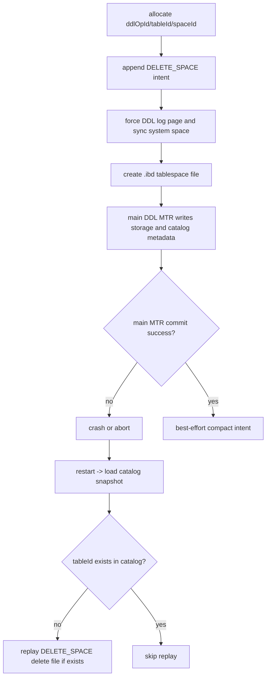
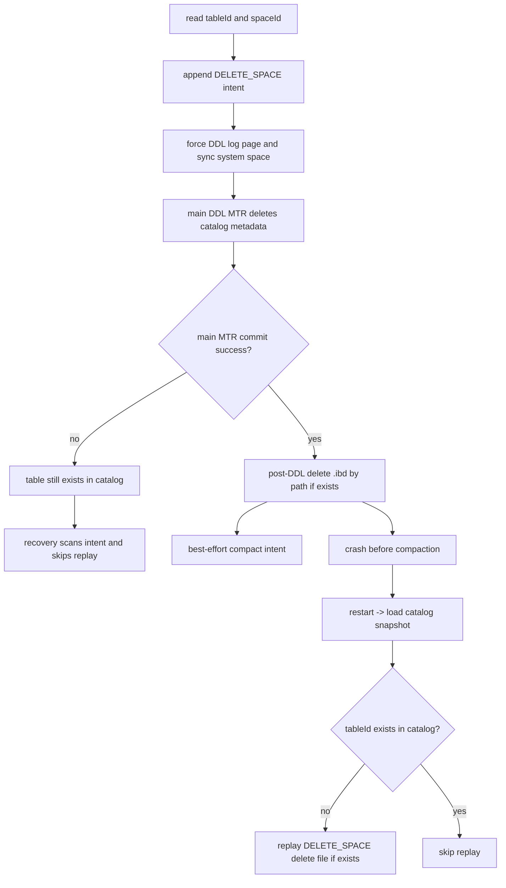
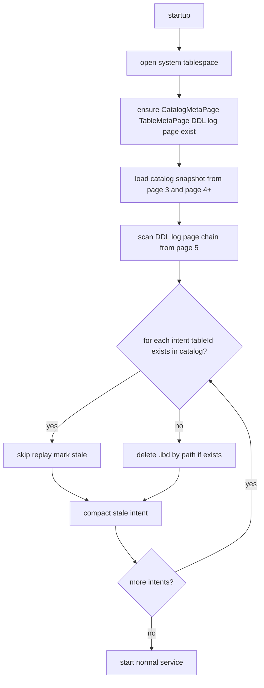

# Atomic DDL 方案修正版

Kernel-Safe Mode: ON
Module: storage.catalog

## A. Module Context Snapshot

- 目标模块：`cn.zhangyis.minidb.storage.catalog.*`
- 相关约束来源：
  - `md/context.md`
  - `md/instructions.md`
  - `md/MTR_Design.md`
  - `md/wal-implementation.md`
  - `md/catlog/MySQL · 源码分析 · 原子DDL的实现过程.md`
  - `md/catlog/MySQL · 源码分析 · 8.0 原子DDL的实现过程续.md`
  - `md/catlog/MySQL · 源码分析 · 8.0 · DDL的那些事.md`
- 当前代码基线：
  - `CatalogManager.createTable()` 先创建 `.ibd`，失败时依赖 `try/catch` 补偿删除。
  - `CatalogManager.dropTable()` 当前只删除 catalog 元数据，不删除表空间文件。
  - `MiniTransaction.rollback()` 只 `unpin` 页面，不恢复页内字节；因此“在可回滚主 MTR 中改写 DDL log 页”是不安全的。
  - `DdlLogPage` / `DdlLogRecord` / `DdlLogReplay` 已有骨架，但还没有完整的 manager、bootstrap 和 recovery 串起来。
  - `DiskManager.dropTablespace()` 目前只对“已打开”的表空间友好；恢复逻辑不能依赖 `tablespaceExists(spaceId)`。
- 当前版本的物理前提：
  - 仅支持 `file-per-table`。
  - 一个表一个 `.ibd` 文件。
  - 在这个前提下，删除 `.ibd` 文件已经能清理整棵索引树，因此 durable DDL log 的首版动作只需要 `DELETE_SPACE`。

## B. Invariants

### Forbidden Designs

1. 在主 DDL MTR 中删除、改写或“标记已消费” DDL Log 记录。
   - 危险原因：当前 `MiniTransaction.rollback()` 不会回滚页内容，未提交的页改动可能借旧 dirty 状态落盘。
   - 破坏模块 / invariant：`storage.mtr`、`storage.buffer`、`storage.catalog.ddl`；破坏 I1、I2。
   - failure type：silent corruption / recovery failure。

2. 以 `diskManager.tablespaceExists(spaceId)` 作为 recovery 是否删除文件的判断条件。
   - 危险原因：崩溃重启后 orphan `.ibd` 文件通常没有重新 `open` 到内存映射，`tablespaceExists()` 会返回 false，导致恢复静默跳过。
   - 破坏模块 / invariant：`storage.disk`、`storage.catalog.ddl`；破坏 I3、I4。
   - failure type：recovery failure。

3. 把 `REMOVE_CACHE` 当作 crash recovery 的 durable 步骤。
   - 危险原因：cache 是进程内临时状态，崩溃后天然丢失，把它写入持久日志只会扩大状态机，不增加恢复正确性。
   - 破坏模块 / invariant：`storage.catalog.cache`、`storage.catalog.ddl`；破坏 I4。
   - failure type：crash 或设计复杂度上升后引入 silent corruption。

### Core Invariants

- I1. DDL cleanup intent 必须在任何不可逆外部效果之前 durable。
  - `CREATE TABLE`：必须先 durable intent，再创建 `.ibd` 文件。
  - `DROP TABLE`：必须先 durable intent，再提交 metadata 删除。

- I2. 主 DDL MTR 不得修改 DDL log 页面。
  - DDL log 只允许由独立、短生命周期、必定 `commit + force` 的 DDL-log MTR 修改。

- I3. recovery 是否执行 cleanup，只能以持久化 catalog 状态为准，不能以 cache、内存映射或“文件是否已打开”为准。

- I4. replay 必须幂等。
  - 文件已不存在时 `DELETE_SPACE` 必须静默成功。
  - 同一 `ddlOpId` 被重复扫描不得产生额外副作用。

- I5. DDL log 页的落盘路径必须明确。
  - 方案首版采用“独立 MTR 提交后立即刷 page 5 / page-chain 并 `sync(space 0)`”。
  - 不能只写 Buffer Pool 而不 force。

### Required Invariant Set Before Coding

1. Correctness invariants
   - cleanup intent 在外部副作用前 durable。
   - recovery 只在 “catalog 中找不到 `tableId`” 时执行 `DELETE_SPACE`。
   - stale intent 可以被忽略或压缩，但不能误删活表。

2. Alignment rules
   - DDL log head page 固定为 system space `page 5`。
   - `DATA_OFFSET = FIL_HEADER_SIZE(38) + DDL_LOG_HEADER_SIZE(16) = 54`。
   - `ENTRY_SIZE = 36` bytes，按固定长度顺序排列。

3. Wrap-around rules
   - 本设计不是 ring buffer。
   - page chain 只允许 append 和 compact，不允许覆盖尚未 compact 的记录。
   - `nextPage = 0` 表示链尾，没有 head/tail wrap-around。

4. Happens-before / visibility requirements
   - `appendIntentAndForce()` happens-before `createTablespace()`。
   - `appendIntentAndForce()` happens-before `dropTable()` 的 metadata commit。
   - `loadCatalogSnapshot()` happens-before `replayPendingIntents()` 的判定。
   - `deleteTablespaceIfExists()` 完成 happens-before `compactIntent()`。

5. Silent-corruption conditions
   - intent 写入了 Buffer Pool 但未 force，crash 后丢失。
   - recovery 以 cache 或 opened tablespace map 代替 catalog 判定。
   - 主 MTR 改写 DDL log 页后 abort，但页内容仍被后台刷盘。

6. Fields used only to maintain invariants
   - `ddlOpId`：同一次 DDL 的逻辑分组键。
   - `replayGuard`：定义 replay 触发条件，首版固定为 `TABLE_ABSENT`。
   - `nextPage`：page chain 链接字段，只为扩容和遍历服务。
   - `entryLen`：页面健壮性校验字段。

### Latch / Lock / JMM Contract

- DDL 逻辑锁：继续复用 `CatalogManager` 的 `dbName -> ReentrantLock`，同库名 DDL 串行。
- Catalog 页锁序：`CatalogMetaPage(page 3) -> TableMetaPage(page 4+)`。
- DDL log 页锁：由独立 DDL-log MTR 单独获取，不与主 DDL MTR 混持，避免 page 3/4 与 page 5 反向锁序。
- DiskManager 锁：DDL log force 和 `.ibd` 文件删除都在页 latch 释放后执行，不在 catalog 页 X-latch 期间持有文件系统锁。
- JMM：`initialized` 保持 `volatile`；DDL log manager 内部计数器若新增，使用 `AtomicLong` 或在 catalog 页中持久化，不允许纯内存自增后懒写。

## C. Implementation

### 1. 首版 durable journal 范围

- durable DDL log 只记录物理清理动作：
  - `DELETE_SPACE`
- 以下动作不进入首版 on-disk DDL log：
  - `REMOVE_CACHE`
  - `FREE_TREE`
- 原因：
  - `REMOVE_CACHE` 是进程内状态，不需要 crash recovery。
  - `FREE_TREE` 在 `file-per-table` 下被 `DELETE_SPACE` 覆盖；等后续支持共享表空间时再引入。

### 2. DDL Log 记录布局

DDL log 头页固定为 system space `page 5`；如果单页满，按 `nextPage` 追加新页。

```text
+---------------------------+
| FIL Header (38)           |
+---------------------------+
| DDL Log Header (16)       |
| - magic (4)               |
| - version (4)             |
| - count (4)               |
| - nextPage (4)            |
+---------------------------+
| Entry 1                   |
| - entryLen (4)            |
| - ddlOpId (8)             |
| - logType (1)             |  FREE_TREE=1, DELETE_SPACE=2, REMOVE_CACHE=3
| - replayGuard (1)         |  TABLE_ABSENT = 1
| - reserved (2)            |
| - spaceId (4)             |
| - tableId (8)             |
| - indexId (8)             |  v1 固定为 0
+---------------------------+
| Entry 2 ...               |
+---------------------------+
```

- `version`：修正为 v2，因为首版方案去掉了原文里的 `phase` 字段，改为 `replayGuard`。
- `replayGuard = TABLE_ABSENT` 的语义：
  - recovery 时如果 catalog snapshot 中不存在 `tableId`，则执行 cleanup。
  - 如果 catalog 中仍存在该表，则说明该 intent 只是 stale record，不能 replay。

### 3. Symbolic Trace / Math Check

#### Concrete Example

- `PAGE_SIZE = 16384`
- `FIL_HEADER_SIZE = 38`
- `DDL_LOG_HEADER_SIZE = 16`
- `DATA_OFFSET = 38 + 16 = 54`
- `ENTRY_SIZE = 36`
- 当页面已有 `count = 10` 条记录时：
  - `offset = 54 + 10 * 36 = 414`
  - 新记录占用 `[414, 450)`，仍在页内，允许写入。

#### Boundary Case

- 当页面已有 `count = 452` 条记录时：
  - `offset = 54 + 452 * 36 = 16326`
  - `offset + 36 = 16362 <= 16384`
  - 第 453 条记录还能写入。

- 当页面已有 `count = 453` 条记录时：
  - `offset = 54 + 453 * 36 = 16362`
  - `offset + 36 = 16398 > 16384`
  - 必须分配 `nextPage`，不能覆盖本页尾部。

### 4. CREATE TABLE 正确流程

#### 设计说明

- 目标：如果 `CREATE TABLE` 在创建 `.ibd` 之后、catalog commit 之前崩溃，recovery 能删除 orphan 文件。
- 关键点：
  - 主 MTR 不碰 DDL log。
  - 先写 durable intent，再创建 `.ibd`。
  - 成功创建后即使未来来不及 compact intent，recovery 也会因为 catalog 中存在该表而跳过 cleanup。

#### 步骤

1. 分配 `ddlOpId`、`tableId`、`spaceId`。
2. 独立 DDL-log MTR 追加 `DELETE_SPACE(spaceId, tableId, TABLE_ABSENT)`。
3. 立即 `flushPage(page 5 or touched ddl pages) + sync(system space)`。
4. 调用 `DiskManager.createTablespace(spaceId, table_{spaceId})`。
5. 主 DDL MTR 初始化表空间页、索引页、写入 catalog metadata，随后 commit。
6. 成功后执行 best-effort compaction：
   - 独立 DDL-log MTR 删除或压缩该 `ddlOpId` 的 intent。
   - 即使 crash 发生在 compaction 之前，recovery 仍会因为 catalog 中存在该表而跳过 cleanup。



### 5. DROP TABLE 正确流程

#### 设计说明

- 目标：如果 `DROP TABLE` 在 metadata 删除 commit 之后、物理文件删除之前崩溃，recovery 能补删 `.ibd`。
- 关键点：
  - cleanup intent 必须先 durable。
  - recovery 只在 catalog 中不存在 `tableId` 时才删除文件。
  - 主 MTR 仍然不碰 DDL log。

#### 步骤

1. 读取现有 `tableId` / `spaceId`。
2. 独立 DDL-log MTR 追加 `DELETE_SPACE(spaceId, tableId, TABLE_ABSENT)`。
3. 立即 `flushPage + sync(system space)`。
4. 主 DDL MTR 删除 `TableMetaPage` 和 `CatalogMetaPage` 中的表项并 commit。
5. Post-DDL 直接按文件路径执行 `deleteTablespaceIfExists(spaceId, table_{spaceId})`。
6. 物理删除成功后，独立 DDL-log MTR compact 该 intent。
7. 如果 crash 发生在第 4 步之后但第 6 步之前，recovery 会看到 catalog 中该表已不存在，于是执行 `DELETE_SPACE`。



### 6. Recovery 流程

#### 启动顺序

1. 打开 system space。
2. `CatalogBootstrap` 完成 page 3 / page 4 / page 5 的初始化检查。
3. 先加载 catalog snapshot。
4. 再扫描 DDL log page chain。
5. 对每条 intent：
   - 若 catalog 中存在 `tableId`，跳过 replay。
   - 若 catalog 中不存在 `tableId`，执行 `DELETE_SPACE`。
6. replay 成功后执行 DDL log compaction。

#### 为什么必须先 load catalog 再 replay

- recovery 判定依赖 durable catalog 状态。
- 如果顺序反过来，`CREATE TABLE` 成功但未 compact 的 stale intent 会误删活表。



### 7. 关键实现点

- `CatalogBootstrap.initCatalog()`
  - 除 page 3 / page 4 外，还要确保 page 5 被分配并初始化为 `FIL_PAGE_DDL_LOG`。
- `CatalogManager.bootstrap()` / `loadCatalog()`
  - `loadCatalog()` 之后立即执行 `replayPendingDdlIntents()`。
- `CatalogManager.createTable()`
  - 删除现有“失败后直接 dropTablespace”的唯一补偿路径，改为 “intent + force + create + main MTR + compact”。
- `CatalogManager.dropTable()`
  - 改为 “intent + force + metadata commit + post-DDL delete + compact”。
- `DdlLogManager`
  - 新增 `appendIntentAndForce()`、`scanAllIntents()`、`compactByOpId()`。
- `DdlLogReplay`
  - 改为基于 catalog snapshot 判定。
  - `DELETE_SPACE` 必须使用“按文件路径 delete-if-exists”，不能依赖 tablespace 是否已打开。
- `DiskManager`
  - 新增 `dropTablespaceIfExists(int spaceId, String name)`。
  - 该方法必须在未打开表空间的情况下也能删除 orphan 文件。

### 8. Planned Invariant Enforcement Mapping

| Invariant | Planned code location |
| --- | --- |
| I1: intent 先 durable | `DdlLogManager.appendIntentAndForce()` |
| I2: 主 MTR 不碰 DDL log | `CatalogManager.createTable()` / `dropTable()` 时序 |
| I3: recovery 以 catalog 为准 | `CatalogManager.replayPendingDdlIntents()` |
| I4: replay 幂等 | `DdlLogReplay.deleteSpaceIfExists()` |
| I5: DDL log force 语义明确 | `DdlLogManager.forceTouchedPages()` |

## D. Tests

### Unit Tests

1. `createTable_replaysDeleteSpace_whenCatalogEntryMissing`
   - 验证 invariant：I1、I3、I4。
   - 场景：intent 已 durable，`.ibd` 已创建，catalog metadata 未提交，重启后删除 orphan 文件。

2. `createTable_skipsDeleteSpace_whenCatalogEntryExists`
   - 验证 invariant：I3、I4。
   - 场景：`CREATE TABLE` 已成功提交，但 crash 发生在 compact 之前；重启后必须跳过 stale intent。

3. `dropTable_replaysDeleteSpace_whenCatalogEntryMissing`
   - 验证 invariant：I1、I3、I4。
   - 场景：`DROP TABLE` metadata 已提交，但 `.ibd` 尚未删除；重启后补删文件。

4. `dropTable_skipsDeleteSpace_whenCatalogEntryStillExists`
   - 验证 invariant：I2、I3。
   - 场景：intent 已写入，但 metadata delete 未提交；重启后不能删除活表文件。

5. `recovery_deletes_unopened_tablespace_file`
   - 验证 invariant：I3、I4。
   - 场景：`.ibd` 文件存在但未 `openTablespace()`；replay 仍能删除。

6. `ddlLog_page5_initialized_during_bootstrap`
   - 验证 invariant：I5。
   - 场景：首次启动时 page 5 被创建并写入 magic / version。

### Concurrency Tests

1. `sameDatabaseDdl_is_serialized_by_db_lock`
   - 验证同库 `createTable` / `dropTable` 并发时不会交叉改写同一逻辑对象。

2. `ddlLog_mtr_does_not_deadlock_with_catalog_mtr`
   - 验证 DDL log MTR 与主 catalog MTR 分离后，不存在 page 3/4 与 page 5 的反向锁序死锁。

### Reduced Testing Not Acceptable

- 这是行为变化的 storage 设计，不是注释或重命名。
- 任何未覆盖 crash path 的实现都不应合并。
