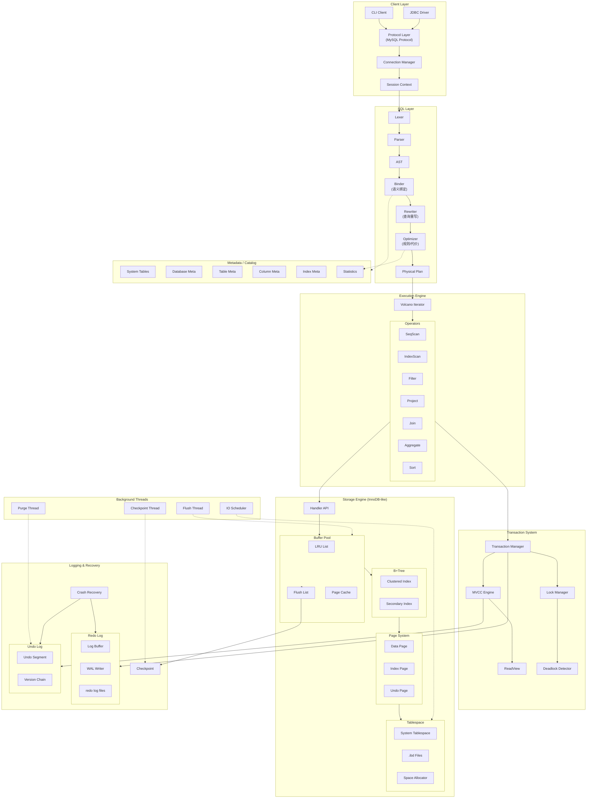
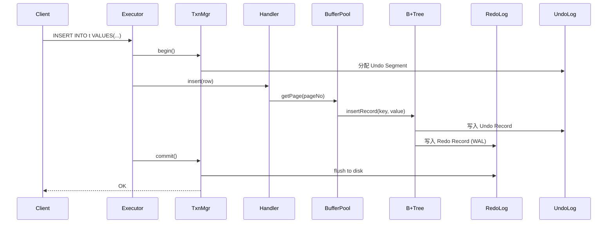
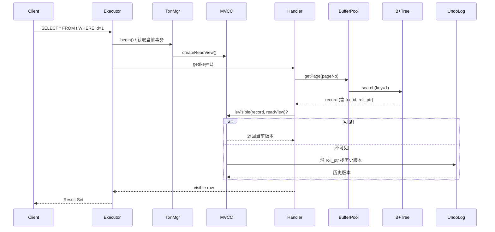

# Java InnoDB-like 数据库内核架构图

## 一、整体架构图 (Mermaid)



---

## 二、模块职责速查表

| 层次 | 核心组件 | 职责 |
|------|----------|------|
| **Client Layer** | Protocol, Session | MySQL协议解析、连接/会话管理 |
| **SQL Layer** | Parser → Binder → Optimizer | SQL解析、语义绑定、查询优化 |
| **Executor** | Volcano Iterator + Operators | 算子驱动执行，产生结果集 |
| **Catalog** | System Tables | 元数据管理（DB/Table/Index/Stats） |
| **Transaction** | TxnMgr + MVCC + LockMgr | ACID保证、隔离级别、死锁检测 |
| **Storage** | Handler API → Buffer Pool → B+Tree → Page → Tablespace | 数据物理存取 |
| **Logging** | Redo WAL + Undo Version Chain | 持久性、崩溃恢复、MVCC版本 |
| **Background** | Purge/Flush/Checkpoint Threads | 异步清理、刷盘、检查点 |

---

## 三、数据流路径

### 3.1 SQL 执行完整路径

```
Client → Protocol → Session → Lexer → Parser → AST
    → Binder (查 Catalog) → Rewriter → Optimizer (查 Stats)
    → Physical Plan → Volcano Engine → Operators
    → Transaction Begin → Handler API → Buffer Pool
    → B+Tree → Page → Tablespace
    → Redo/Undo Log → Commit → Result Set
```

### 3.2 写入路径 (INSERT/UPDATE)



### 3.3 读取路径 (SELECT with MVCC)



---

## 四、Java 包结构

```
com.minidb
├── client/                 # 协议层、连接管理
│   ├── protocol/           # MySQL 协议编解码
│   ├── connection/         # 连接池、连接管理
│   └── session/            # 会话上下文
│
├── sql/                    # SQL 层
│   ├── parser/             # Lexer, Parser, AST 节点
│   │   ├── lexer/
│   │   ├── ast/
│   │   └── Parser.java
│   ├── binder/             # 语义绑定、类型推导
│   ├── rewriter/           # 查询重写
│   ├── optimizer/          # 优化器 (RBO/CBO)
│   └── plan/               # 逻辑计划、物理计划
│
├── executor/               # 执行引擎
│   ├── operator/           # 各类算子
│   │   ├── SeqScanOperator.java
│   │   ├── IndexScanOperator.java
│   │   ├── FilterOperator.java
│   │   ├── ProjectOperator.java
│   │   ├── JoinOperator.java
│   │   ├── AggOperator.java
│   │   └── SortOperator.java
│   └── VolcanoExecutor.java
│
├── catalog/                # 元数据管理
│   ├── Database.java
│   ├── Table.java
│   ├── Column.java
│   ├── Index.java
│   ├── Statistics.java
│   └── CatalogManager.java
│
├── transaction/            # 事务系统
│   ├── Transaction.java
│   ├── TransactionManager.java
│   ├── mvcc/
│   │   ├── ReadView.java
│   │   └── MVCCEngine.java
│   └── lock/
│       ├── LockManager.java
│       ├── LockMode.java
│       └── DeadlockDetector.java
│
├── storage/                # 存储引擎
│   ├── handler/            # Handler API
│   │   └── TableHandler.java
│   ├── buffer/             # Buffer Pool
│   │   ├── BufferPool.java
│   │   ├── BufferFrame.java
│   │   └── LRUReplacer.java
│   ├── index/              # B+Tree 索引
│   │   ├── BPlusTree.java
│   │   ├── BTreePage.java
│   │   ├── LeafPage.java
│   │   └── InternalPage.java
│   ├── page/               # 页格式
│   │   ├── Page.java
│   │   ├── PageHeader.java
│   │   ├── SlotDirectory.java
│   │   └── RecordFormat.java
│   └── tablespace/         # 表空间管理
│       ├── Tablespace.java
│       ├── FileManager.java
│       └── SpaceAllocator.java
│
├── log/                    # 日志与恢复
│   ├── redo/
│   │   ├── RedoLog.java
│   │   ├── RedoLogBuffer.java
│   │   ├── RedoLogRecord.java
│   │   └── WALWriter.java
│   ├── undo/
│   │   ├── UndoLog.java
│   │   ├── UndoSegment.java
│   │   └── UndoRecord.java
│   └── recovery/
│       ├── RecoveryManager.java
│       └── Checkpoint.java
│
├── background/             # 后台线程
│   ├── PurgeThread.java
│   ├── FlushThread.java
│   ├── CheckpointThread.java
│   └── IOScheduler.java
│
└── common/                 # 公共工具
    ├── config/
    ├── exception/
    ├── util/
    └── Constants.java
```

---

## 五、核心接口定义

### 5.1 Handler API

```java
public interface TableHandler {
    void open(Table table);
    void close();
    
    // 读操作
    Row get(byte[] primaryKey);
    RowIterator scan();
    RowIterator scanRange(byte[] startKey, byte[] endKey);
    RowIterator indexScan(Index index, byte[] key);
    
    // 写操作
    void insert(Row row);
    void update(byte[] primaryKey, Row newRow);
    void delete(byte[] primaryKey);
}
```

### 5.2 Buffer Pool API

```java
public interface BufferPool {
    Page getPage(int tableSpaceId, int pageNo);
    Page newPage(int tableSpaceId);
    void unpinPage(int tableSpaceId, int pageNo, boolean isDirty);
    void flushPage(int tableSpaceId, int pageNo);
    void flushAllPages();
}
```

### 5.3 Transaction API

```java
public interface TransactionManager {
    Transaction begin();
    void commit(Transaction txn);
    void rollback(Transaction txn);
    Transaction getCurrentTransaction();
}

public interface MVCCEngine {
    ReadView createReadView(Transaction txn);
    boolean isVisible(Row row, ReadView readView);
    Row getVisibleVersion(Row row, ReadView readView);
}
```

### 5.4 Redo/Undo Log API

```java
public interface RedoLog {
    long append(RedoLogRecord record);
    void flush(long lsn);
    void checkpoint();
}

public interface UndoLog {
    long writeUndo(UndoRecord record);
    UndoRecord readUndo(long undoPtr);
    void purge(long minTrxId);
}
```

---

## 六、关键数据结构

### 6.1 Page 结构 (16KB)

```
+------------------+
| Page Header      |  (38 bytes)
|   - page_no      |
|   - page_type    |
|   - prev_page    |
|   - next_page    |
|   - lsn          |
|   - checksum     |
+------------------+
| Free Space Ptr   |
+------------------+
|                  |
| User Records     |  (变长记录区)
| (heap 方向 ↓)    |
|                  |
+------------------+
|   Free Space     |
+------------------+
|                  |
| Slot Directory   |  (目录区 ↑)
| (从尾部向上增长) |
+------------------+
| Page Trailer     |  (8 bytes)
+------------------+
```

### 6.2 Record 格式 (Compact)

```
+----------+----------+----------+----------------+
| 变长字段 | NULL标志 | 记录头   | 实际列数据     |
| 长度列表 | 位图     | (5 bytes)|                |
+----------+----------+----------+----------------+
                      |
                      v
              +---------------+
              | delete_flag   | 1 bit
              | min_rec_flag  | 1 bit
              | n_owned       | 4 bits
              | heap_no       | 13 bits
              | record_type   | 3 bits
              | next_record   | 16 bits (相对偏移)
              +---------------+
```

### 6.3 行隐藏列 (MVCC)

```
+--------+--------+----------+------------------+
| ROW_ID | TRX_ID | ROLL_PTR | 用户列数据...    |
| 6 bytes| 6 bytes| 7 bytes  |                  |
+--------+--------+----------+------------------+
           |           |
           |           +---> 指向 Undo Log 历史版本
           +---> 最后修改该行的事务 ID
```

### 6.4 Redo Log Record 格式

```
+------+------+--------+--------+------+----------+
| Type | LSN  | TrxID  | PageNo | Len  | Payload  |
| 1B   | 8B   | 8B     | 4B     | 2B   | 变长     |
+------+------+--------+--------+------+----------+

Type: MLOG_INSERT, MLOG_UPDATE, MLOG_DELETE, MLOG_UNDO_INSERT, ...
```

### 6.5 Undo Log Record 格式

```
+------+--------+---------+--------+--------------+
| Type | TrxID  | TableID | PK     | Old Values   |
| 1B   | 8B     | 4B      | 变长   | 变长         |
+------+--------+---------+--------+--------------+
                                   |
                                   +-- roll_ptr 指向更老版本
```

---

## 七、推荐实现顺序

### Phase 1: 基础骨架
1. [ ] Catalog (Database, Table, Column 元数据)
2. [ ] Page 结构 + Tablespace + FileManager
3. [ ] Buffer Pool (简单 LRU)
4. [ ] 简单 TableScan (无索引)
5. [ ] SQL Parser (CREATE TABLE, INSERT, SELECT)

### Phase 2: 存储引擎
6. [ ] B+Tree 聚簇索引
7. [ ] Handler API 完整实现
8. [ ] Redo Log (WAL)
9. [ ] Undo Log 基础结构

### Phase 3: 事务系统
10. [ ] Transaction Manager
11. [ ] MVCC + ReadView
12. [ ] 行锁 (Record Lock)
13. [ ] 死锁检测

### Phase 4: 优化与完善
14. [ ] 二级索引
15. [ ] Optimizer (索引选择)
16. [ ] Crash Recovery
17. [ ] 后台线程 (Purge, Flush, Checkpoint)

---

## 八、与 MySQL InnoDB 的简化点

| 特性 | MySQL InnoDB | 本项目简化 |
|------|--------------|-----------|
| Page 大小 | 16KB 可配置 | 固定 16KB |
| Buffer Pool | 多实例 + 预读 | 单实例简单 LRU |
| B+Tree | 完整分裂/合并/SMO | 基础分裂合并 |
| Redo Log | 循环写 + 组提交 | 简单追加写 |
| Undo Log | 回滚段 + 多版本 | 简化版本链 |
| 锁 | 行锁 + 间隙锁 + Next-Key | 仅行锁 |
| 隔离级别 | RC/RR/Serializable | 仅 RR |
| 表空间 | 共享 + 独立 | 仅 file-per-table |
| 压缩 | 页压缩 | 不支持 |
| 在线 DDL | 支持 | 不支持 |

---

## 九、参考资料

- 《MySQL技术内幕：InnoDB存储引擎》—— 姜承尧
- 《高性能MySQL》—— Baron Schwartz
- 《数据库系统实现》—— Garcia-Molina
- MySQL 8.0 源码: https://github.com/mysql/mysql-server
- InnoDB 文档: https://dev.mysql.com/doc/refman/8.0/en/innodb-storage-engine.html
