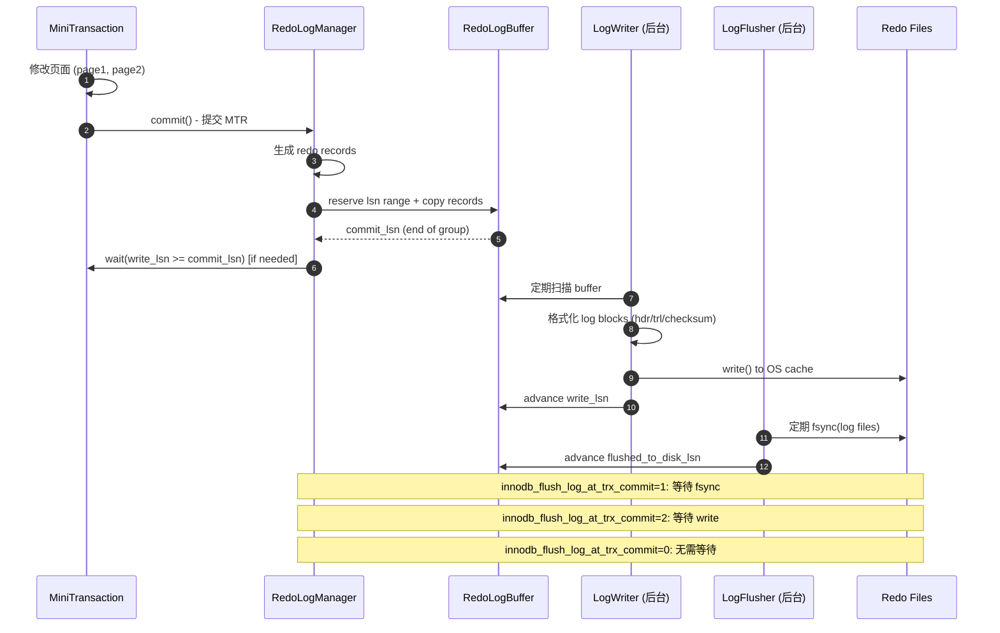
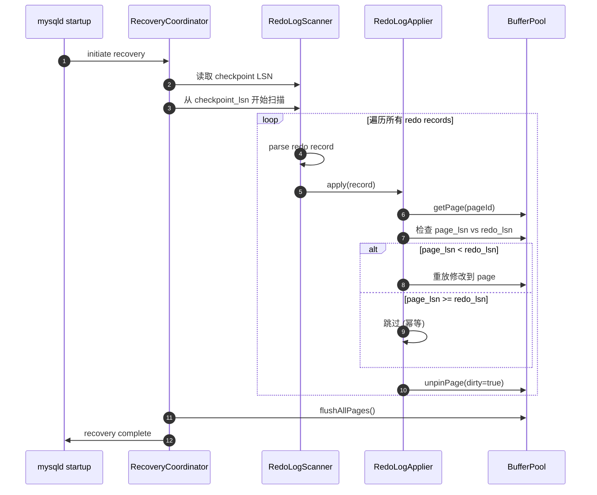
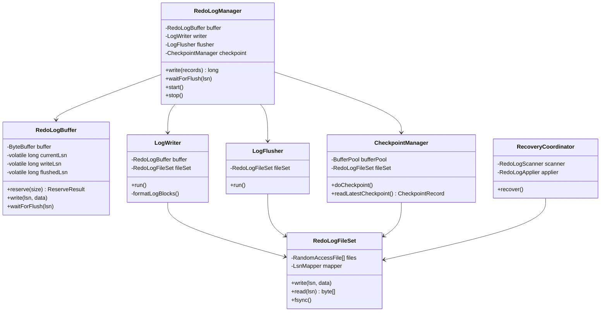

# Redo Log 实现计划与设计大纲

## 文档概述

本文档详细规划了 mini-db 项目中 Redo Log 子系统的实现方案。设计基于：
- MySQL 8.x InnoDB Redo Log 架构
- CatKang 《庖丁解InnoDB之REDO LOG》
- 数据库内核月报 (2019/03, 2022/09)
- mini-db 现有架构 (BufferPool, MTR, Page)

---

## 0. 关键术语澄清

**重要**: 以下术语在文档中有明确不同的含义，请勿混淆：

| 术语 | 定义 | 作用 |
|------|------|------|
| **Redo Group** | 一个 MTR 生成的所有 redo records + MLOG_MULTI_REC_END 标记 | 日志组织单元，保证 MTR 的原子性边界，恢复时按组解析 |
| **Group Commit** | 多个事务 (多个 MTR) 共享一次 fsync 操作 | 性能优化，减少磁盘同步次数 (Phase 5) |
| **Log Block** | 512B 的物理存储单元 (header 12B + data 496B + trailer 4B) | 磁盘写入的最小单位 |
| **LSN** (Log Sequence Number) | 包含 log block 开销的物理字节偏移 | 全局单调递增，用于定位和恢复 |
| **SN** (Sequence Number) | 纯 redo payload 字节流偏移 (不含 block 开销) | 用户线程视角的逻辑增长 |

**区分示例**:
- "一个 MTR 产生一个 redo group" ✓ (日志组织)
- "10 个 MTR 通过 group commit 共享一次 fsync" ✓ (提交优化)
- "redo group 可跨多个 log blocks" ✓ (物理布局)

---

## 1. 设计目标与约束

### 1.1 核心目标

1. **持久性保证 (Durability)**: 保证事务提交后修改可恢复
2. **崩溃恢复 (Crash Recovery)**: 重启后能重放 redo log 恢复数据
3. **WAL 规则**: Write-Ahead Logging - redo log 必须先于数据页落盘
4. **高性能**: 顺序写换随机写，批量提交优化

### 1.2 分阶段并发模型与 Group Commit (关键约束)

| 阶段 | 并发模型 | Flush 机制 | Group Commit | 目的 |
|------|----------|-----------|-------------|------|
| Phase 1-2 | **串行 commit** | 周期性 flusher (10ms) | **无** (天然批量但不可控) | 验证正确性 |
| Phase 5 | **并发 commit** | Leader/Follower + 精准唤醒 | **有** (可控批量) | 性能优化 |

**关键澄清**:
- **Phase 1-2 不是 group commit**，只是"周期性 fsync 产生的天然批量"
- **真正的 group commit** 需要 leader/follower + 提交队列 + 精准唤醒 (Phase 5)

#### 1.2.1 Phase 1-2: 串行 Commit + 周期性 Flush

**特征**:
- MTR commit 串行 (commitLock)
- Flusher 每 10ms 定期 fsync
- 提交线程 `waitForFlush()` 时 Condition.await()

**天然批量** (但不可控):
```
T1: commit → write buffer → waitForFlush(lsn=100)
T2: commit → write buffer → waitForFlush(lsn=200)
T3: commit → write buffer → waitForFlush(lsn=300)
    (10ms 后)
Flusher: fsync() → flushed_lsn = 300 → signalAll()
    → T1, T2, T3 同时被唤醒 (批量效果)
```

**问题**:
1. **延迟不可控**: P99 延迟主要由 10ms 周期决定
2. **批量窗口不可控**: 如果提交频繁，flusher 可能被频繁唤醒，批量被打碎
3. **惊群问题**: `signalAll()` 唤醒所有等待者，造成线程抖动
4. **无 leader**: 没有提交线程主动驱动 flush

**适用场景**: 验证正确性、低吞吐场景 (< 1K TPS)

#### 1.2.2 Phase 5: 并发 Commit + Group Commit

见 Section 9 详细设计。

**特征**:
- MTR commit 并发 (去掉 commitLock)
- Leader/Follower 机制
- 提交线程主动驱动 flush (抢 leader)
- 精准唤醒 (只唤醒本批次)

**Phase 1-2 串行 Commit 实现**:
```java
// RedoLogManager.write() 使用全局锁
private final Lock commitLock = new ReentrantLock();

public long write(List<RedoRecord> records) {
    commitLock.lock();  // 串行化所有 MTR commit
    try {
        // reserve + write + advance writeReadySn (单生产者，无空洞)
        byte[] data = serialize(records);
        long endLsn = buffer.reserveAndWrite(data);

        // 通知 writer (但不等待 fsync)
        logWriter.notifyNewData();

        return endLsn;
    } finally {
        commitLock.unlock();
    }
}
```

### 1.3 简化策略 (mini-db vs MySQL 8.0)

| 特性 | MySQL 8.0 | mini-db Phase 1-2 | mini-db Phase 5 (可选) |
|------|-----------|-------------------|------------------------|
| 并发写入 | recent_written/recent_closed 无锁化 | 串行 commit (commitLock) | 可选实现 recent_written |
| 文件布局 | 32个文件动态容量 (#innodb_redo) | 固定2个文件循环写入 (ib_logfile0/1) | 不变 |
| Log Buffer | 复杂的 link_buf 结构 | 简单的环形缓冲区 + 串行写入 | 不变 |
| 后台线程 | writer/flusher/closer/checkpoint 4个线程 | writer/flusher 2个线程 | 不变 |
| Redo 粒度 | 数十种 MLOG_* (页内逻辑增量) | **页内 patch (offset+len+bytes)** | 扩展更多类型 |
| Group Commit | 内置 | Phase 5 实现 | ✓ |

---

## 2. 架构设计

### 2.1 核心模块拆分

基于 InnoDB 架构和 skill 文档的模块化建议：

```
cn.zhangyis.minidb.storage.redo/
├── api/                          # 对外API
│   ├── RedoLogManager.java      - 主入口，统一接口
│   └── RedoLogRecovery.java     - 崩溃恢复接口
├── buffer/                       # Log Buffer
│   ├── RedoLogBuffer.java       - 内存缓冲区 (环形队列)
│   ├── LogBlockFormatter.java   - log block 格式化 (header/trailer)
│   └── LogBlockConstants.java   - 常量定义 (block size, header size等)
├── record/                       # Redo Record
│   ├── RedoRecordType.java      - 日志类型枚举 (MLOG_*)
│   ├── RedoRecord.java          - 抽象基类
│   ├── PhysicalRedoRecord.java  - 物理日志 (Page ID + data)
│   └── RedoRecordSerializer.java - 序列化/反序列化
├── writer/                       # 后台写入
│   ├── LogWriter.java           - 后台线程: log buffer → OS cache
│   └── LogFlusher.java          - 后台线程: OS cache → disk (fsync)
├── fileset/                      # 文件管理
│   ├── RedoLogFileSet.java      - 管理 ib_logfile0/1 循环写入
│   ├── LsnMapper.java           - lsn → file offset 映射
│   └── RedoLogFileHeader.java   - 文件头结构 (checkpoint信息)
├── checkpoint/                   # Checkpoint
│   ├── CheckpointManager.java   - 计算并写入 checkpoint
│   └── CheckpointRecord.java    - checkpoint 记录结构
├── recovery/                     # 崩溃恢复
│   ├── RedoLogScanner.java      - 扫描 redo log 文件
│   ├── RedoLogApplier.java      - 重放 redo 到 page
│   └── RecoveryCoordinator.java - 恢复流程协调
└── state/                        # 状态管理
    ├── LsnState.java            - LSN 水位管理
    └── RedoLogMetrics.java      - 性能指标
```

### 2.2 关键数据流

#### 2.2.1 写路径 (mtr_commit → disk)



#### 2.2.2 崩溃恢复路径



---

## 3. 详细设计

### 3.1 Redo Log 三层模型 (sn → lsn → offset)

参考 CatKang 的经典三层抽象：

#### 3.1.1 逻辑层: sn (Sequence Number)

- **定义**: 纯 redo payload 字节流，不包含 block 开销
- **增长**: 每写入 N 字节 payload，sn 增加 N
- **用途**: 用户线程看到的逻辑增长

#### 3.1.2 物理层: lsn (Log Sequence Number)

- **定义**: 包含 log block header/trailer 开销的物理字节偏移
- **结构**: log block (512B) = header(12B) + data(496B) + trailer(4B)
- **换算**:
  ```java
  // sn → lsn
  public static long snToLsn(long sn) {
      long blockNo = sn / LOG_BLOCK_DATA_SIZE;
      long offset = sn % LOG_BLOCK_DATA_SIZE;
      return blockNo * OS_FILE_LOG_BLOCK_SIZE + LOG_BLOCK_HDR_SIZE + offset;
  }

  // lsn → sn
  public static long lsnToSn(long lsn) {
      long blockNo = lsn / OS_FILE_LOG_BLOCK_SIZE;
      long offset = lsn % OS_FILE_LOG_BLOCK_SIZE;
      long snBase = blockNo * LOG_BLOCK_DATA_SIZE;

      if (offset < LOG_BLOCK_HDR_SIZE) {
          return snBase; // 落在 header，吸附到 block 开始
      } else if (offset >= OS_FILE_LOG_BLOCK_SIZE - LOG_BLOCK_TRL_SIZE) {
          return snBase + LOG_BLOCK_DATA_SIZE; // 落在 trailer，吸附到下个 block
      } else {
          return snBase + (offset - LOG_BLOCK_HDR_SIZE);
      }
  }
  ```

#### 3.1.3 文件层: offset (File Offset + 对齐约束)

**布局**:
- 2个文件 ib_logfile0 / ib_logfile1，逻辑上拼成一个环形大文件
- 文件头: 前 **2KB (4 个 log blocks)** 保留给 checkpoint 信息
- **关键约束**: 所有操作必须 log block (512B) 对齐

**对齐约束**:

1. **CHECKPOINT_HEADER_SIZE 必须是 512 的倍数**
   ```java
   public static final int CHECKPOINT_HEADER_SIZE = 2048;  // 4 blocks
   assert CHECKPOINT_HEADER_SIZE % OS_FILE_LOG_BLOCK_SIZE == 0;
   ```

2. **LOG_FILE_SIZE 必须是 512 的倍数**
   ```java
   public static final long LOG_FILE_SIZE = 512 * 1024 * 1024;  // 512MB
   assert LOG_FILE_SIZE % OS_FILE_LOG_BLOCK_SIZE == 0;
   ```

3. **Log block 不能跨文件边界**
   - Writer 在接近文件尾时，如果剩余空间 < 512B，直接跳到下一个文件
   - 填充 padding (全 0) 到文件尾

**LSN 到 File Position 的映射**:

```java
public class LsnMapper {
    private final long fileSize;
    private final int headerSize;
    private final long capacity;  // 实际可用容量

    public LsnMapper(long fileSize, int headerSize) {
        assert fileSize % OS_FILE_LOG_BLOCK_SIZE == 0;
        assert headerSize % OS_FILE_LOG_BLOCK_SIZE == 0;

        this.fileSize = fileSize;
        this.headerSize = headerSize;
        // 每个文件可用空间 = fileSize - headerSize
        // 2个文件总可用 = 2 * (fileSize - headerSize)
        this.capacity = 2 * (fileSize - headerSize);
    }

    /**
     * LSN → File Position
     * 返回: (fileIndex, offsetInFile)
     */
    public FilePosition lsnToFilePosition(long lsn) {
        // 1. 对 capacity 取模 (环形)
        long logicalOffset = lsn % capacity;

        // 2. 确定文件索引 (0 或 1)
        long usablePerFile = fileSize - headerSize;
        int fileIndex = (int) (logicalOffset / usablePerFile);

        // 3. 计算文件内偏移 (跳过 header)
        long offsetInUsable = logicalOffset % usablePerFile;
        long offsetInFile = headerSize + offsetInUsable;

        // 4. 对齐检查 (debug)
        assert offsetInFile % OS_FILE_LOG_BLOCK_SIZE == 0
            || offsetInFile == headerSize  // 允许第一个block的开始
            : "LSN mapping result not block-aligned";

        return new FilePosition(fileIndex, offsetInFile);
    }

    /**
     * 检查是否需要切换文件 (接近文件尾且剩余空间 < 1 block)
     */
    public boolean needSwitchFile(long currentLsn, int nextWriteSize) {
        FilePosition pos = lsnToFilePosition(currentLsn);
        long remaining = fileSize - pos.offsetInFile;

        // 如果写入 nextWriteSize 后会跨越文件边界，需要切换
        return remaining < nextWriteSize;
    }

    /**
     * 获取下一个文件的起始 LSN
     * (用于在文件尾填充 padding)
     */
    public long getNextFileLsn(long currentLsn) {
        FilePosition pos = lsnToFilePosition(currentLsn);
        long usablePerFile = fileSize - headerSize;

        // 当前文件剩余空间
        long remaining = fileSize - pos.offsetInFile;

        // 跳到下一个文件的起始
        return currentLsn + remaining;
    }
}

/**
 * File Position 结构
 */
public record FilePosition(int fileIndex, long offsetInFile) {
    public FilePosition {
        assert fileIndex == 0 || fileIndex == 1;
        assert offsetInFile >= 0;
    }
}
```

**写入时的边界处理**:

```java
public class LogWriter {
    private final LsnMapper mapper;

    private void writeLogBlocks(List<LogBlock> blocks) throws IOException {
        for (LogBlock block : blocks) {
            long blockLsn = block.getStartLsn();

            // 检查是否需要切换文件
            if (mapper.needSwitchFile(blockLsn, OS_FILE_LOG_BLOCK_SIZE)) {
                // 填充当前文件剩余空间为 0
                long nextFileLsn = mapper.getNextFileLsn(blockLsn);
                long paddingSize = nextFileLsn - blockLsn;

                logger.debug("Padding {} bytes to reach next file boundary", paddingSize);
                writePadding(blockLsn, (int) paddingSize);

                // 更新 blockLsn 到下一个文件的起始
                blockLsn = nextFileLsn;
            }

            // 写入 log block
            FilePosition pos = mapper.lsnToFilePosition(blockLsn);
            RandomAccessFile file = files[pos.fileIndex];
            file.seek(pos.offsetInFile);
            file.write(block.serialize());
        }
    }

    private void writePadding(long lsn, int size) throws IOException {
        byte[] padding = new byte[size];
        Arrays.fill(padding, (byte) 0);

        FilePosition pos = mapper.lsnToFilePosition(lsn);
        RandomAccessFile file = files[pos.fileIndex];
        file.seek(pos.offsetInFile);
        file.write(padding);
    }
}
```

### 3.2 RedoLogBuffer 设计 (关键修正: 内部使用 SN)

#### 3.2.1 核心原则: SN vs LSN 的边界

**致命错误修正**: 之前版本混用了 SN 和 LSN，导致映射系统崩溃。

**正确原则**:
- **RedoLogBuffer 内部**: 全部使用 **SN** (Sequence Number，纯 payload 字节)
- **SN → LSN 转换点**: 只在 `LogBlockFormatter.format()` 时发生
- **对外接口**: 返回 LSN (因为外部需要 LSN 作为全局标识)

**数据流**:
```
MTR → redo records (bytes)
  ↓
RedoLogBuffer.reserveAndWrite(data)
  currentSn += data.length  ← 内部用 SN
  ↓
LogWriter: read buffer
  ↓
LogBlockFormatter.format(startSn, data)
  startLsn = snToLsn(startSn)  ← SN→LSN 转换
  补齐 block header/trailer/checksum
  ↓
write to file (LSN 定位)
```

#### 3.2.2 核心结构

```java
public class RedoLogBuffer {
    // 环形缓冲区 (默认 16MB)
    private final ByteBuffer buffer;
    private final int capacity;

    // ===== 关键: 内部全部使用 SN (不是 LSN!) =====
    private volatile long currentSn;      // 下一次写入的 SN
    private volatile long writeReadySn;   // 连续写完可以被 writer 拿走的 SN
    private volatile long writeSn;        // 已写入 OS cache 的 SN
    private volatile long flushedSn;      // 已 fsync 到磁盘的 SN

    // 起始 LSN (用于对外接口的转换)
    private final long startLsn;

    // 保护 buffer 写入的锁
    private final Lock bufferLock = new ReentrantLock();
    private final Condition spaceAvailable;
    private final Condition writeComplete;
    private final Condition flushComplete;

    public RedoLogBuffer(int capacity, long startLsn) {
        this.capacity = capacity;
        this.buffer = ByteBuffer.allocateDirect(capacity);
        this.buffer.order(ByteOrder.LITTLE_ENDIAN);

        this.startLsn = startLsn;

        // 从 LSN 推算起始 SN
        long startSn = LsnMapper.lsnToSn(startLsn);
        this.currentSn = startSn;
        this.writeReadySn = startSn;
        this.writeSn = startSn;
        this.flushedSn = startSn;

        this.spaceAvailable = bufferLock.newCondition();
        this.writeComplete = bufferLock.newCondition();
        this.flushComplete = bufferLock.newCondition();
    }
}
```

#### 3.2.3 核心方法 (SN 版本)

```java
/**
 * 预留空间并写入 (Phase 1-2: 由 commitLock 保证单生产者)
 *
 * @param data 序列化后的 redo records (纯 payload)
 * @return 该 redo group 的 end LSN (对外接口用 LSN)
 */
public long reserveAndWrite(byte[] data) throws InterruptedException {
    bufferLock.lock();
    try {
        // 1. 等待空间足够
        while (getAvailableSpace() < data.length) {
            logger.debug("Log buffer full, waiting for writer to advance...");
            spaceAvailable.await(100, TimeUnit.MILLISECONDS);
        }

        // 2. 计算写入位置 (用 SN)
        long startSn = currentSn;
        int startPos = snToBufferPos(startSn);

        // 3. 写入数据 (可能需要环形 wrap)
        if (startPos + data.length <= capacity) {
            buffer.position(startPos);
            buffer.put(data);
        } else {
            int firstPart = capacity - startPos;
            buffer.position(startPos);
            buffer.put(data, 0, firstPart);
            buffer.position(0);
            buffer.put(data, firstPart, data.length - firstPart);
        }

        // 4. 推进 SN (关键: 增量是 payload 字节数)
        currentSn += data.length;
        writeReadySn = currentSn;  // 串行写入，无空洞

        // 5. 转换为 LSN 返回给外部
        long endLsn = snToLsn(currentSn);

        logger.debug("Reserved and wrote {} bytes, sn: {} -> {}, end lsn: {}",
            data.length, startSn, currentSn, endLsn);

        return endLsn;

    } finally {
        bufferLock.unlock();
    }
}

/**
 * 获取可用空间 (用 SN 计算)
 */
private long getAvailableSpace() {
    return capacity - (writeReadySn - writeSn);
}

/**
 * SN 到 buffer 位置的映射
 * 注意: 这是环形缓冲区内的位置，与 log block 无关
 */
private int snToBufferPos(long sn) {
    return (int) ((sn % capacity + capacity) % capacity);
}

/**
 * SN → LSN 转换 (对外接口)
 */
private long snToLsn(long sn) {
    // 使用全局 LsnMapper 转换
    return LsnMapper.snToLsn(sn + (startLsn - LsnMapper.lsnToSn(startLsn)));
}

/**
 * 等待写入完成 (接受 LSN 参数，内部转 SN)
 */
public void waitForWrite(long lsn) throws InterruptedException {
    long targetSn = lsnToSn(lsn);

    bufferLock.lock();
    try {
        while (writeSn < targetSn) {
            writeComplete.await(100, TimeUnit.MILLISECONDS);
        }
    } finally {
        bufferLock.unlock();
    }
}

/**
 * 等待刷盘完成 (Phase 1-2: 简单 Condition 等待)
 * Phase 5 需要改为精准唤醒机制
 */
public void waitForFlush(long lsn) throws InterruptedException {
    long targetSn = lsnToSn(lsn);

    bufferLock.lock();
    try {
        while (flushedSn < targetSn) {
            // Phase 1-2: 简单等待，会被 signalAll() 唤醒 (可能惊群)
            // Phase 5: 改为 LockSupport.park() + 精准唤醒
            flushComplete.await(100, TimeUnit.MILLISECONDS);
        }
    } finally {
        bufferLock.unlock();
    }
}

/**
 * 等待写入完成 (innodb_flush_log_at_trx_commit=2)
 */
public void waitForWrite(long lsn) throws InterruptedException {
    long targetSn = lsnToSn(lsn);

    bufferLock.lock();
    try {
        while (writeSn < targetSn) {
            writeComplete.await(100, TimeUnit.MILLISECONDS);
        }
    } finally {
        bufferLock.unlock();
    }
}

/**
 * LSN → SN 转换 (内部辅助)
 */
private long lsnToSn(long lsn) {
    return LsnMapper.lsnToSn(lsn);
}

/**
 * LogWriter 调用: 推进 writeSn
 * @param newWriteSn 已写入的 SN
 *
 * Phase 1-2: signalAll() (简单但可能惊群)
 * Phase 5: 精准唤醒 target_sn <= newWriteSn 的线程
 */
public void advanceWriteSn(long newWriteSn) {
    bufferLock.lock();
    try {
        this.writeSn = newWriteSn;

        // Phase 1-2: signalAll (简单实现)
        // 问题: 唤醒所有等待 write 的线程，即使它们的 target > writeSn
        writeComplete.signalAll();
        spaceAvailable.signalAll();

        // Phase 5 改进:
        // flushNotifier.wakeupWaiters(newWriteSn);  // 只唤醒满足条件的
    } finally {
        bufferLock.unlock();
    }
}

/**
 * LogFlusher 调用: 推进 flushedSn (Phase 1-2 版本)
 * @param newFlushedSn 已刷盘的 SN
 *
 * 关键问题: signalAll() 在高并发下会造成惊群
 */
public void advanceFlushedSn(long newFlushedSn) {
    bufferLock.lock();
    try {
        this.flushedSn = newFlushedSn;

        // Phase 1-2: signalAll (可能惊群)
        // 如果有 100 个线程在 waitForFlush()，每次 flusher 推进都唤醒全部
        // 但可能只有 10 个线程的 target_sn <= flushedSn，其他 90 个会立即再次 await
        flushComplete.signalAll();

        // Phase 5 改进 (见 Section 9.2):
        // flushNotifier.wakeupBatch(newFlushedSn);  // 精准唤醒
    } finally {
        bufferLock.unlock();
    }
}

/**
 * 供 LogWriter 读取数据
 * @return (startSn, endSn, data)
 */
public BufferReadResult read(long startSn, long endSn) {
    bufferLock.lock();
    try {
        int startPos = snToBufferPos(startSn);
        int length = (int) (endSn - startSn);

        byte[] data = new byte[length];

        if (startPos + length <= capacity) {
            buffer.position(startPos);
            buffer.get(data);
        } else {
            int firstPart = capacity - startPos;
            buffer.position(startPos);
            buffer.get(data, 0, firstPart);
            buffer.position(0);
            buffer.get(data, firstPart, length - firstPart);
        }

        return new BufferReadResult(startSn, endSn, data);
    } finally {
        bufferLock.unlock();
    }
}

public long getWriteReadySn() { return writeReadySn; }
public long getWriteSn() { return writeSn; }
public long getFlushedSn() { return flushedSn; }
}

/**
 * Buffer 读取结果
 */
record BufferReadResult(long startSn, long endSn, byte[] data) {}
```

#### 3.2.4 关键要点总结

| 操作 | 使用单位 | 说明 |
|------|---------|------|
| `currentSn += data.length` | SN | 纯 payload 增量 |
| `snToBufferPos(sn)` | SN | 环形缓冲区定位 (与 log block 无关) |
| `reserveAndWrite() 返回值` | LSN | 对外接口，用于标识和等待 |
| `LogBlockFormatter.format(startSn, data)` | SN→LSN | **唯一**转换点，补齐 block 开销 |
| `LsnMapper.lsnToFilePosition(lsn)` | LSN | 文件定位，必须 block 对齐 |

**验证**: LogWriter 从 buffer 读取的是 SN 范围的 payload，format 后的 LSN 自然 block 对齐。

### 3.3 Redo Record 格式 (页内 Patch，非整页)

#### 3.3.1 物理日志格式: 页内 Patch

**关键设计**: 只记录修改的区域 (offset + len + bytes)，而非整页拷贝。

**优势**:
- Redo 体积小 (修改 4B 只产生 ~15B redo，而非 16KB)
- 恢复写放大低
- 支持 10K TPS 性能目标

**格式**:
```
┌─────────────────────────────────────────────────────────────┐
│ Redo Record Header (11 bytes)                               │
├─────────────────────────────────────────────────────────────┤
│ type (1B)       - MLOG_WRITE_BYTES (页内字节修改)           │
│ space_id (4B)   - 表空间 ID                                  │
│ page_no (4B)    - 页号                                       │
│ data_len (2B)   - payload 长度 (offset+len+data)            │
├─────────────────────────────────────────────────────────────┤
│ Redo Payload (变长)                                         │
├─────────────────────────────────────────────────────────────┤
│ offset (2B)     - 页内偏移 (0-16383)                        │
│ length (2B)     - 修改长度 (1-16384)                        │
│ data (N bytes)  - 修改后的数据 (N = length)                 │
└─────────────────────────────────────────────────────────────┘
```

**示例**:
- 修改 Page 100 的偏移 38 处的 4 字节 (FIL Header 的 page_no):
  ```
  type=MLOG_WRITE_BYTES | space_id=1 | page_no=100 | data_len=8
  offset=38 | length=4 | data=[0x64, 0x00, 0x00, 0x00]
  ```
  总共: 11 + 8 = 19 字节 (而非 16KB)

#### 3.3.2 Redo Record 类型枚举

```java
public enum RedoRecordType {
    /** 页内字节修改 (最常用) */
    MLOG_WRITE_BYTES(1),

    /** Redo Group 结束标记 (必须) */
    MLOG_MULTI_REC_END(31),

    /** 整页 redo (仅用于调试/特殊页面) */
    MLOG_FULL_PAGE(255);

    private final int value;
    // ...
}
```

#### 3.3.3 Redo Record 类层次

```java
public abstract class RedoRecord {
    protected RedoRecordType type;
    protected long lsn;  // 该 record 的起始 LSN

    public abstract byte[] serialize();
    public abstract int getSize();
    public abstract PageId getPageId();  // 用于恢复时路由
}

public class WriteBytesRecord extends RedoRecord {
    private final PageId pageId;
    private final int offset;      // 页内偏移
    private final byte[] data;     // 修改后的数据

    public WriteBytesRecord(PageId pageId, int offset, byte[] data) {
        this.type = RedoRecordType.MLOG_WRITE_BYTES;
        this.pageId = pageId;
        this.offset = offset;
        this.data = data;
    }

    @Override
    public byte[] serialize() {
        ByteBuffer buf = ByteBuffer.allocate(getSize());
        buf.order(ByteOrder.LITTLE_ENDIAN);

        // Header
        buf.put((byte) type.getValue());
        buf.putInt(pageId.getSpaceId());
        buf.putInt(pageId.getPageNo());
        buf.putShort((short) (4 + data.length));  // payload: offset(2) + len(2) + data

        // Payload
        buf.putShort((short) offset);
        buf.putShort((short) data.length);
        buf.put(data);

        return buf.array();
    }

    @Override
    public int getSize() {
        return 11 + 4 + data.length;  // header(11) + payload(4+N)
    }

    // Getters
    public int getOffset() { return offset; }
    public byte[] getData() { return data; }
}

/**
 * Redo Group 结束标记
 * 每个 MTR 提交时必须写入此标记
 */
public class MultiRecEndRecord extends RedoRecord {
    public MultiRecEndRecord() {
        this.type = RedoRecordType.MLOG_MULTI_REC_END;
    }

    @Override
    public byte[] serialize() {
        return new byte[] { (byte) type.getValue() };  // 只有 1 字节
    }

    @Override
    public int getSize() {
        return 1;
    }

    @Override
    public PageId getPageId() {
        return null;  // End marker 不属于任何页面
    }
}
```

#### 3.3.4 整页 Redo (兜底机制，不推荐)

```java
/**
 * 整页 Redo (仅用于特殊场景)
 * - 调试时对比数据一致性
 * - 页面格式化 (如 B+Tree split)
 * - 不应该作为常规 redo 类型
 */
public class FullPageRecord extends RedoRecord {
    private final PageId pageId;
    private final byte[] pageData;  // 16KB

    // 序列化会产生 16KB+ redo，性能差
    // ...
}
```

### 3.4 MTR 集成 (生成页内 Patch + Group End Marker)

#### 3.4.1 关键设计

1. **追踪页面修改**: MTR 需要记录每个页面的修改区域 (offset + length)
2. **生成 patch redo**: 只记录修改的字节，而非整页
3. **添加 group end**: 每个 MTR 必须以 MLOG_MULTI_REC_END 结束

#### 3.4.2 MiniTransaction 增强

```java
public class MiniTransaction implements AutoCloseable {
    // 现有字段...
    private final List<MemoSlot> memo;
    private final RedoLogManager redoLogManager;  // 新增

    /**
     * MemoSlot 增强: 记录页面修改区域
     */
    private static class MemoSlot {
        final PageId pageId;
        final Page page;
        boolean isDirty;

        // 新增: 记录修改区域 (简化版: 单个区域)
        int modifiedOffset = -1;
        int modifiedLength = 0;
        byte[] modifiedData = null;

        // 或者使用列表支持多个修改区域
        // List<PageModification> modifications;
    }

    /**
     * 记录页面修改 (新增方法)
     * 在 markDirty() 后调用，记录具体修改了哪些字节
     */
    public void logModification(Page page, int offset, int length) {
        for (MemoSlot slot : memo) {
            if (slot.pageId.equals(page.getPageId())) {
                // 简化: 只记录第一次修改 (或合并区域)
                if (slot.modifiedOffset == -1) {
                    slot.modifiedOffset = offset;
                    slot.modifiedLength = length;
                    slot.modifiedData = new byte[length];
                    page.getBytes(offset, slot.modifiedData);
                } else {
                    // TODO: 合并多个修改区域
                }
                return;
            }
        }
    }
}
```

#### 3.4.3 修改后的 commit() 流程

```java
public void commit() throws MiniDbException {
    checkActive();

    try {
        // ===== Step 1: 生成 redo group (patch + end marker) =====
        List<RedoRecord> redoGroup = new ArrayList<>();

        for (MemoSlot slot : memo) {
            if (slot.isDirty) {
                if (slot.modifiedOffset != -1) {
                    // 生成页内 patch redo
                    WriteBytesRecord record = new WriteBytesRecord(
                        slot.pageId,
                        slot.modifiedOffset,
                        slot.modifiedData
                    );
                    redoGroup.add(record);
                } else {
                    // 兜底: 如果没有记录修改区域，生成整页 redo (临时方案)
                    logger.warn("Page {} modified but no patch tracked, using full page redo",
                        slot.pageId);
                    FullPageRecord record = new FullPageRecord(
                        slot.pageId,
                        slot.page.getBytes()
                    );
                    redoGroup.add(record);
                }
            }
        }

        // 关键: 添加 group end marker
        if (!redoGroup.isEmpty()) {
            redoGroup.add(new MultiRecEndRecord());
        }

        // ===== Step 2: 写入 RedoLogManager (串行) =====
        long commitLsn = 0;
        if (!redoGroup.isEmpty()) {
            // RedoLogManager.write() 内部持有 commitLock，保证串行
            commitLsn = redoLogManager.write(redoGroup);

            // ===== Step 3: 等待 WAL (根据策略) =====
            int flushMode = redoLogManager.getFlushLogAtTrxCommit();
            if (flushMode == 1) {
                // 等待 fsync 完成
                redoLogManager.waitForFlush(commitLsn);
            } else if (flushMode == 2) {
                // 等待 write 到 OS cache
                redoLogManager.waitForWrite(commitLsn);
            }
            // flushMode == 0: 不等待 (异步刷盘)
        }

        // ===== Step 4: 更新 page LSN =====
        for (MemoSlot slot : memo) {
            if (slot.isDirty) {
                slot.page.setLsn(commitLsn);
            }
        }

        // ===== Step 5: unpin 所有页面 =====
        for (int i = memo.size() - 1; i >= 0; i--) {
            MemoSlot slot = memo.get(i);
            bufferPool.unpinPage(slot.pageId, slot.isDirty);
        }

        memo.clear();
        state = State.COMMITTED;

    } catch (Exception e) {
        rollback();
        throw new MiniDbException("MTR commit failed", e);
    }
}
```

#### 3.4.4 Page 修改 API 增强

为了自动追踪修改，Page 类需要增强：

```java
public class Page {
    // 现有字段...
    private MiniTransaction owningMtr;  // 新增: 记录所属 MTR

    /**
     * 写入 int (增强版: 自动记录修改)
     */
    public void putInt(int offset, int value) {
        buffer.putInt(offset, value);
        markDirty();

        // 自动记录修改区域
        if (owningMtr != null) {
            byte[] data = new byte[4];
            ByteBuffer.wrap(data).order(ByteOrder.LITTLE_ENDIAN).putInt(value);
            owningMtr.logModification(this, offset, 4);
        }
    }

    // 其他 put* 方法类似增强
    public void putBytes(int offset, byte[] src) {
        buffer.position(offset);
        buffer.put(src);
        buffer.rewind();
        markDirty();

        if (owningMtr != null) {
            owningMtr.logModification(this, offset, src.length);
        }
    }
}
```

**注意**: 这种方式会自动追踪所有修改，但性能有开销。另一种方案是在 MTR.commit() 时使用"脏页快照对比"来推断修改区域（更复杂但更灵活）。

### 3.5 Log Block 格式

参考 InnoDB 的 512B log block：

```
┌─────────────────────────────────────────────────────────────┐
│ Log Block Header (12 bytes)                                 │
├─────────────────────────────────────────────────────────────┤
│ block_no (4B)       - block 序号 (全局递增)                 │
│ data_len (2B)       - 本 block 中的有效数据长度              │
│ first_rec_group (2B) - 本 block 中第一个 record group 的偏移 │
│ checkpoint_no (4B)  - 写入时的 checkpoint 序号              │
├─────────────────────────────────────────────────────────────┤
│ Data Area (496 bytes)                                       │
│   - 存储 redo records                                       │
│   - 可能跨越多个 record groups                              │
│   - 一个 record group 对应一个 mtr                          │
├─────────────────────────────────────────────────────────────┤
│ Log Block Trailer (4 bytes)                                │
├─────────────────────────────────────────────────────────────┤
│ checksum (4B)       - 本 block 的 CRC32 校验和              │
└─────────────────────────────────────────────────────────────┘
```

### 3.6 后台线程设计 (Condition 唤醒 + FileChannel)

#### 3.6.1 LogWriter 线程 (SN 版本)

```java
public class LogWriter implements Runnable {
    private final RedoLogBuffer buffer;
    private final RedoLogFileSet fileSet;
    private final LogBlockFormatter formatter;

    private volatile boolean running = true;
    private final Lock writerLock = new ReentrantLock();
    private final Condition newDataAvailable;

    // 配置
    private final long writerTimeoutMs = 1;
    private final int batchSizeThreshold = 1024 * 1024;  // 1MB

    public LogWriter(RedoLogBuffer buffer, RedoLogFileSet fileSet) {
        this.buffer = buffer;
        this.fileSet = fileSet;
        this.formatter = new LogBlockFormatter();
        this.newDataAvailable = writerLock.newCondition();
    }

    @Override
    public void run() {
        Thread.currentThread().setName("RedoLogWriter");

        while (running) {
            try {
                // 1. 检查是否有数据需要写入 (用 SN)
                long writeReadySn = buffer.getWriteReadySn();
                long writeSn = buffer.getWriteSn();
                long toWrite = writeReadySn - writeSn;

                if (toWrite == 0) {
                    writerLock.lock();
                    try {
                        newDataAvailable.await(writerTimeoutMs, TimeUnit.MILLISECONDS);
                    } finally {
                        writerLock.unlock();
                    }
                    continue;
                }

                // 2. 批量写入
                if (toWrite >= batchSizeThreshold || shouldForceWrite()) {
                    writeBatch(writeSn, writeReadySn);
                }

            } catch (InterruptedException e) {
                Thread.currentThread().interrupt();
                logger.info("LogWriter interrupted, shutting down");
                break;
            } catch (Exception e) {
                logger.error("LogWriter error", e);
            }
        }

        logger.info("LogWriter stopped");
    }

    /**
     * 写入一批 log blocks
     * 关键: SN → LSN 转换发生在这里
     */
    private void writeBatch(long startSn, long endSn) throws IOException {
        long writeStart = System.nanoTime();

        // 1. 从 buffer 读取 payload (用 SN)
        BufferReadResult readResult = buffer.read(startSn, endSn);
        byte[] payloadData = readResult.data();

        // ===== 关键: SN → LSN 转换点 =====
        // 2. 格式化为 log blocks (补齐 header/trailer)
        //    format() 方法会：
        //    - 将 payload 按 496B 切块
        //    - 每块补齐 12B header + 4B trailer
        //    - 计算 checksum
        //    - 返回的 LogBlock 带有正确的 LSN (block 对齐)
        List<LogBlock> blocks = formatter.format(startSn, payloadData);

        // 3. 写入文件 (使用 LSN 定位)
        for (LogBlock block : blocks) {
            // block.getStartLsn() 已经是 block 对齐的 LSN
            fileSet.write(block);
        }

        // 4. 推进 writeSn (仍然用 SN)
        buffer.advanceWriteSn(endSn);

        long writeTime = System.nanoTime() - writeStart;
        logger.debug("LogWriter: wrote {} payload bytes ({} blocks) in {}μs",
            endSn - startSn, blocks.size(), writeTime / 1000);
    }

    private boolean shouldForceWrite() {
        return true;  // 简化: 总是写入
    }

    public void notifyNewData() {
        writerLock.lock();
        try {
            newDataAvailable.signal();
        } finally {
            writerLock.unlock();
        }
    }

    public void shutdown() {
        running = false;
        notifyNewData();
    }
}
```

#### 3.6.1.1 LogBlockFormatter (SN→LSN 转换核心)

```java
/**
 * Log Block 格式化器
 * 职责: 将 payload (SN 定位) 转换为 log blocks (LSN 定位)
 */
public class LogBlockFormatter {
    private static final int BLOCK_SIZE = 512;
    private static final int HEADER_SIZE = 12;
    private static final int TRAILER_SIZE = 4;
    private static final int DATA_SIZE = 496;  // 512 - 12 - 4

    /**
     * 格式化 payload 为 log blocks
     *
     * @param startSn payload 的起始 SN
     * @param payload 纯 redo records 数据
     * @return log blocks 列表 (每个 block 的 startLsn 已 block 对齐)
     */
    public List<LogBlock> format(long startSn, byte[] payload) {
        List<LogBlock> blocks = new ArrayList<>();

        int offset = 0;
        long currentSn = startSn;

        while (offset < payload.length) {
            // 1. 计算本 block 可容纳的 payload 长度
            int dataLen = Math.min(DATA_SIZE, payload.length - offset);

            // 2. SN → LSN 转换 (关键!)
            long blockStartLsn = LsnMapper.snToLsn(currentSn);

            // 3. 创建 log block
            LogBlock block = new LogBlock(blockStartLsn);

            // 4. 填充 header
            block.setBlockNo(calculateBlockNo(blockStartLsn));
            block.setDataLen((short) dataLen);
            block.setFirstRecGroup((short) 0);  // 简化: 不记录
            block.setCheckpointNo(0);  // 简化

            // 5. 填充 data
            byte[] blockData = new byte[dataLen];
            System.arraycopy(payload, offset, blockData, 0, dataLen);
            block.setData(blockData);

            // 6. 计算并填充 trailer checksum
            block.setChecksum(calculateChecksum(block));

            blocks.add(block);

            // 7. 推进 (用 SN!)
            currentSn += dataLen;
            offset += dataLen;
        }

        return blocks;
    }

    private long calculateBlockNo(long lsn) {
        return lsn / BLOCK_SIZE;
    }

    private int calculateChecksum(LogBlock block) {
        CRC32 crc = new CRC32();
        crc.update(block.serializeWithoutChecksum());
        return (int) crc.getValue();
    }
}

/**
 * Log Block 结构
 */
public class LogBlock {
    private final long startLsn;  // 该 block 的起始 LSN (block 对齐)

    // Header fields
    private long blockNo;
    private short dataLen;
    private short firstRecGroup;
    private int checkpointNo;

    // Data
    private byte[] data;  // 最多 496 字节

    // Trailer
    private int checksum;

    public LogBlock(long startLsn) {
        assert startLsn % 512 == 0 : "Block LSN must be 512-aligned";
        this.startLsn = startLsn;
    }

    /**
     * 序列化为 512B
     */
    public byte[] serialize() {
        ByteBuffer buf = ByteBuffer.allocate(512);
        buf.order(ByteOrder.LITTLE_ENDIAN);

        // Header (12B)
        buf.putLong(blockNo);
        buf.putShort(dataLen);
        buf.putShort(firstRecGroup);
        // checkpointNo 省略简化

        // Data (最多 496B)
        buf.put(data);

        // Padding to 508B
        int paddingLen = 496 - data.length;
        for (int i = 0; i < paddingLen; i++) {
            buf.put((byte) 0);
        }

        // Trailer (4B)
        buf.putInt(checksum);

        return buf.array();
    }

    public byte[] serializeWithoutChecksum() {
        // 用于 checksum 计算
        ByteBuffer buf = ByteBuffer.allocate(508);
        buf.order(ByteOrder.LITTLE_ENDIAN);
        buf.putLong(blockNo);
        buf.putShort(dataLen);
        buf.putShort(firstRecGroup);
        buf.put(data);
        // padding
        for (int i = data.length; i < 496; i++) {
            buf.put((byte) 0);
        }
        return buf.array();
    }

    // Getters/Setters
    public long getStartLsn() { return startLsn; }
    public void setBlockNo(long blockNo) { this.blockNo = blockNo; }
    public void setDataLen(short dataLen) { this.dataLen = dataLen; }
    public void setFirstRecGroup(short firstRecGroup) { this.firstRecGroup = firstRecGroup; }
    public void setCheckpointNo(int checkpointNo) { this.checkpointNo = checkpointNo; }
    public void setData(byte[] data) { this.data = data; }
    public void setChecksum(int checksum) { this.checksum = checksum; }
}
```

#### 3.6.2 LogFlusher 线程 (Phase 1-2 周期性版本)

**重要澄清**: 这不是真正的 group commit，只是周期性 fsync 产生的天然批量。

```java
/**
 * Log Flusher 线程 (Phase 1-2: 周期性 fsync)
 *
 * 特点:
 * - 每 10ms 定期执行 fsync
 * - 推进 flushed_to_disk_sn
 * - signalAll() 唤醒所有等待者 (可能惊群)
 *
 * 不是真正的 Group Commit，因为:
 * - 批量窗口不可控 (固定 10ms)
 * - 无 leader/follower 机制
 * - signalAll 造成惊群
 *
 * Phase 5 改进: 见 Section 9.2
 */
public class LogFlusher implements Runnable {
    private final RedoLogBuffer buffer;
    private final RedoLogFileSet fileSet;

    private volatile boolean running = true;
    private final Lock flusherLock = new ReentrantLock();
    private final Condition newWriteAvailable;

    // 配置: 周期性 flush 间隔
    private final long flusherIntervalMs = 10;

    public LogFlusher(RedoLogBuffer buffer, RedoLogFileSet fileSet) {
        this.buffer = buffer;
        this.fileSet = fileSet;
        this.newWriteAvailable = flusherLock.newCondition();
    }

    @Override
    public void run() {
        Thread.currentThread().setName("RedoLogFlusher");

        while (running) {
            try {
                // 1. 检查是否有数据需要 flush (用 SN)
                long writeSn = buffer.getWriteSn();
                long flushedSn = buffer.getFlushedSn();

                if (writeSn <= flushedSn) {
                    // 没有新数据，等待 10ms 或被唤醒
                    flusherLock.lock();
                    try {
                        newWriteAvailable.await(flusherIntervalMs, TimeUnit.MILLISECONDS);
                    } finally {
                        flusherLock.unlock();
                    }
                    continue;
                }

                // 2. 执行 fsync (关键: 这是唯一的 fsync 点)
                long flushStart = System.nanoTime();
                fileSet.fsync();
                long flushTime = System.nanoTime() - flushStart;

                // 3. 推进 flushed_to_disk_sn
                buffer.advanceFlushedSn(writeSn);
                // 内部会 signalAll()，唤醒所有 waitForFlush() 的线程

                // 4. 统计本批次大小 (简单估算)
                long batchSizeBytes = (writeSn - flushedSn);
                logger.debug("LogFlusher: fsynced {} bytes (sn {} -> {}) in {}μs",
                    batchSizeBytes, flushedSn, writeSn, flushTime / 1000);

            } catch (InterruptedException e) {
                Thread.currentThread().interrupt();
                logger.info("LogFlusher interrupted, shutting down");
                break;
            } catch (Exception e) {
                logger.error("LogFlusher error", e);
            }
        }

        logger.info("LogFlusher stopped");
    }

    /**
     * 唤醒 flusher (由 LogWriter 调用)
     * Phase 1-2: 可选唤醒 (flusher 主要依赖周期)
     */
    public void notifyNewWrite() {
        flusherLock.lock();
        try {
            newWriteAvailable.signal();
        } finally {
            flusherLock.unlock();
        }
    }

    public void shutdown() {
        running = false;
        notifyNewWrite();
    }
}
```

**Phase 1-2 的天然批量效果**:
```
时刻 0ms:  T1 commit → waitForFlush(lsn=100)
时刻 2ms:  T2 commit → waitForFlush(lsn=200)
时刻 5ms:  T3 commit → waitForFlush(lsn=300)
时刻 10ms: Flusher fsync() → flushed_sn=300 → signalAll()
          → T1, T2, T3 同时被唤醒 (批量: 3个事务/次fsync)
```

**问题**:
- 如果提交频率 > 100 TPS，flusher 可能被频繁唤醒，批量被打碎
- P99 延迟受 10ms 周期限制
- signalAll 在高并发下造成惊群

**Phase 5 改进**: 提交线程主动驱动 flush (Leader/Follower)，见 Section 9.2。

#### 3.6.3 RedoLogFileSet (FileChannel 实现)

```java
public class RedoLogFileSet {
    private final FileChannel[] channels;  // 使用 FileChannel 而非 RandomAccessFile
    private final Path[] filePaths;
    private final LsnMapper mapper;

    public RedoLogFileSet(String dataDir, long fileSize, int headerSize) throws IOException {
        this.filePaths = new Path[] {
            Paths.get(dataDir, "ib_logfile0"),
            Paths.get(dataDir, "ib_logfile1")
        };

        this.channels = new FileChannel[2];
        for (int i = 0; i < 2; i++) {
            // 使用 FileChannel 打开 (支持 force)
            this.channels[i] = FileChannel.open(
                filePaths[i],
                StandardOpenOption.READ,
                StandardOpenOption.WRITE,
                StandardOpenOption.CREATE
            );

            // 预分配文件空间
            channels[i].truncate(fileSize);
        }

        this.mapper = new LsnMapper(fileSize, headerSize);
    }

    /**
     * 写入 log block (使用 FileChannel.write)
     */
    public void write(LogBlock block) throws IOException {
        FilePosition pos = mapper.lsnToFilePosition(block.getStartLsn());

        ByteBuffer buf = ByteBuffer.wrap(block.serialize());
        channels[pos.fileIndex].write(buf, pos.offsetInFile);

        // 注意: 这里只写入 OS cache，不 sync
    }

    /**
     * fsync 两个文件 (使用 FileChannel.force)
     */
    public void fsync() throws IOException {
        // force(true) = fsync data + metadata
        channels[0].force(true);
        channels[1].force(true);
    }

    /**
     * 读取指定 LSN 的数据 (用于恢复)
     */
    public ByteBuffer read(long lsn, int length) throws IOException {
        FilePosition pos = mapper.lsnToFilePosition(lsn);

        ByteBuffer buf = ByteBuffer.allocate(length);
        buf.order(ByteOrder.LITTLE_ENDIAN);

        channels[pos.fileIndex].read(buf, pos.offsetInFile);
        buf.flip();

        return buf;
    }

    public FileChannel getFile(int index) {
        return channels[index];
    }

    public void close() throws IOException {
        for (FileChannel ch : channels) {
            if (ch != null) {
                ch.close();
            }
        }
    }
}
```

#### 3.6.4 线程唤醒链路

```
User Thread: MTR.commit()
    ↓
RedoLogManager.write()
    ↓
buffer.reserveAndWrite()
    ↓
logWriter.notifyNewData()  ← 唤醒 writer
    ↓
LogWriter: write to OS cache
    ↓
buffer.advanceWriteLsn()
    ↓
logFlusher.notifyNewWrite()  ← 唤醒 flusher
    ↓
LogFlusher: fsync
    ↓
buffer.advanceFlushedLsn()
    ↓
buffer.flushComplete.signalAll()  ← 唤醒 waitForFlush
```

**优势**:
- 低延迟: 有数据立即唤醒，无需轮询
- 低 CPU: 无数据时线程 park，零 CPU 占用
- 可配置: 支持批量阈值和超时策略

### 3.7 Checkpoint 设计 (增强安全边界)

#### 3.7.1 Checkpoint 安全边界定义 (Phase 1-2 简化版)

**关键约束**: Checkpoint 不能越过任何尚未加入 flush list 的修改。

**Phase 1-2 简化策略** (无 recent_closed):

1. **FlushList 必须严格按 oldest_modification_lsn 排序**
   - 插入时按 LSN 顺序插入
   - 或维护最小堆结构

2. **available_for_checkpoint_lsn = FlushList.getOldestLsn()**
   - 如果 FlushList 为空 → checkpoint_lsn = current_lsn (所有页都干净)
   - 否则取最老脏页的 LSN

3. **MTR commit 时必须原子地**:
   - 写入 redo log
   - 将脏页加入 FlushList (LSN 已设置)
   - 这保证了 "LSN L 的 redo 存在 → 对应脏页必在 FlushList 或已刷盘"

**Phase 5 扩展** (有 recent_closed):
```
available_for_checkpoint_lsn = min(
    FlushList.getOldestLsn(),
    recent_closed.getMaxContiguousClosedLsn()
)
```

#### 3.7.2 Checkpoint Record 格式

```java
public class CheckpointRecord {
    private static final long CHECKPOINT_MAGIC = 0x1B581E51;  // 魔数

    private long checkpointLsn;      // checkpoint 位置 (LSN)
    private long checkpointNo;       // checkpoint 序号 (递增)
    private long flushedLsn;         // 此时的 flushed LSN
    private int logFileSize;         // 日志文件大小
    private long timestamp;          // 创建时间
    private long checksum;           // CRC32 校验和

    // 写入文件头 (2KB reserved space)
    public void writeToFile(FileChannel channel) throws IOException {
        ByteBuffer buf = ByteBuffer.allocate(64);  // checkpoint record 大小
        buf.order(ByteOrder.LITTLE_ENDIAN);

        buf.putLong(CHECKPOINT_MAGIC);
        buf.putLong(checkpointLsn);
        buf.putLong(checkpointNo);
        buf.putLong(flushedLsn);
        buf.putInt(logFileSize);
        buf.putLong(timestamp);

        // 计算 checksum (不包含 checksum 字段本身)
        buf.flip();
        CRC32 crc = new CRC32();
        crc.update(buf);
        this.checksum = (int) crc.getValue();

        // 写入 checksum
        buf.limit(buf.capacity());
        buf.putLong(checksum);

        // 写入文件开头
        buf.flip();
        channel.write(buf, 0);
        channel.force(true);  // fsync
    }

    /**
     * 从文件读取 checkpoint
     * @return null 如果无效
     */
    public static CheckpointRecord readFromFile(FileChannel channel) throws IOException {
        ByteBuffer buf = ByteBuffer.allocate(64);
        buf.order(ByteOrder.LITTLE_ENDIAN);

        channel.read(buf, 0);
        buf.flip();

        long magic = buf.getLong();
        if (magic != CHECKPOINT_MAGIC) {
            return null;  // 无效
        }

        CheckpointRecord record = new CheckpointRecord();
        record.checkpointLsn = buf.getLong();
        record.checkpointNo = buf.getLong();
        record.flushedLsn = buf.getLong();
        record.logFileSize = buf.getInt();
        record.timestamp = buf.getLong();
        record.checksum = buf.getLong();

        // 验证 checksum
        if (!record.isValid()) {
            return null;
        }

        return record;
    }

    /**
     * 验证 checksum
     */
    public boolean isValid() {
        ByteBuffer buf = ByteBuffer.allocate(56);  // 不包含 checksum
        buf.order(ByteOrder.LITTLE_ENDIAN);
        buf.putLong(CHECKPOINT_MAGIC);
        buf.putLong(checkpointLsn);
        buf.putLong(checkpointNo);
        buf.putLong(flushedLsn);
        buf.putInt(logFileSize);
        buf.putLong(timestamp);
        buf.flip();

        CRC32 crc = new CRC32();
        crc.update(buf);
        return (int) crc.getValue() == checksum;
    }
}
```

#### 3.7.3 Checkpoint 触发时机

1. **定期 Checkpoint** (每 10 秒)
2. **Log 空间不足** (redo log 用量 > 80%)
3. **关闭数据库** (flushAllPages 后)

#### 3.7.4 CheckpointManager 实现 (Phase 1-2 版本)

```java
public class CheckpointManager {
    private final BufferPool bufferPool;
    private final RedoLogBuffer redoLogBuffer;
    private final RedoLogFileSet fileSet;

    private long checkpointNo = 0;

    /**
     * 执行 checkpoint (Phase 1-2 简化版)
     */
    public void doCheckpoint() throws IOException {
        logger.info("Starting checkpoint...");

        // ===== Step 1: 确定 checkpoint LSN =====
        // Phase 1-2: 直接取 FlushList 最老 LSN
        long checkpointLsn;

        FlushList flushList = bufferPool.getFlushList();
        long oldestLsn = flushList.getOldestModificationLsn();

        if (oldestLsn == Long.MAX_VALUE) {
            // FlushList 为空，所有页都干净
            // checkpoint_lsn = 当前 flushed LSN
            checkpointLsn = LsnMapper.snToLsn(redoLogBuffer.getFlushedSn());
            logger.info("No dirty pages, checkpoint at current flushed lsn={}", checkpointLsn);
        } else {
            checkpointLsn = oldestLsn;
            logger.info("Checkpoint at oldest dirty page lsn={}", checkpointLsn);
        }

        // ===== Step 2: 创建 checkpoint record =====
        CheckpointRecord record = new CheckpointRecord();
        record.setCheckpointLsn(checkpointLsn);
        record.setCheckpointNo(++checkpointNo);
        record.setFlushedLsn(LsnMapper.snToLsn(redoLogBuffer.getFlushedSn()));
        record.setLogFileSize((int) RedoLogConfig.LOG_FILE_SIZE);
        record.setTimestamp(System.currentTimeMillis());

        // ===== Step 3: 写入文件 (交替写入 ib_logfile0/1) =====
        int targetFile = (int) (checkpointNo % 2);
        FileChannel channel = fileSet.getFile(targetFile);
        record.writeToFile(channel);

        // ===== Step 4: 回收 redo 空间 =====
        long reclaimedBytes = fileSet.reclaimSpace(checkpointLsn);

        logger.info("Checkpoint completed: lsn={}, no={}, reclaimed={}KB",
            checkpointLsn, checkpointNo, reclaimedBytes / 1024);
    }

    /**
     * 后台 checkpoint 线程
     */
    public void startCheckpointThread() {
        Thread thread = new Thread(() -> {
            while (running) {
                try {
                    Thread.sleep(10_000);  // 每 10 秒
                    doCheckpoint();
                } catch (InterruptedException e) {
                    break;
                } catch (Exception e) {
                    logger.error("Checkpoint failed", e);
                }
            }
        }, "CheckpointThread");
        thread.setDaemon(true);
        thread.start();
    }
}
```

#### 3.7.5 FlushList 排序约束

```java
public class FlushList {
    // 必须按 oldest_modification_lsn 排序的链表
    // 或使用最小堆

    /**
     * 添加脏页 (必须维护 LSN 顺序)
     */
    public void add(int frameIndex, long lsn) {
        writeLock();
        try {
            // 按 LSN 顺序插入 (或追加到尾部，如果 LSN 单调递增)
            // ...
        } finally {
            writeUnlock();
        }
    }

    /**
     * 获取最老脏页的 LSN (O(1))
     */
    public long getOldestModificationLsn() {
        readLock();
        try {
            if (head == null) {
                return Long.MAX_VALUE;  // 空列表
            }
            // 假设 head 是最老的
            BufferFrame oldestFrame = frames[head];
            return oldestFrame.getPage().getLsn();
        } finally {
            readUnlock();
        }
    }
}
```

#### 3.7.6 MTR Commit 的原子性保证

```java
public void commit() throws MiniDbException {
    // ...

    // ===== Step 2: 写入 redo log =====
    long commitLsn = redoLogManager.write(redoGroup);

    // ===== Step 3: 更新 page LSN + 加入 FlushList (原子) =====
    // 关键: 这两步必须原子完成，否则 checkpoint 可能越过未登记的脏页
    for (MemoSlot slot : memo) {
        if (slot.isDirty) {
            // 设置 page LSN
            slot.page.setLsn(commitLsn);
        }
    }

    // ===== Step 4: unpin 页面 (会加入 FlushList) =====
    for (int i = memo.size() - 1; i >= 0; i--) {
        MemoSlot slot = memo.get(i);
        // unpinPage 内部会将 dirty page 加入 FlushList
        bufferPool.unpinPage(slot.pageId, slot.isDirty);
    }

    // 此时保证: commitLsn 的 redo 已落盘 + 脏页已在 FlushList
}
```

#### 3.7.7 Phase 5 扩展: recent_closed

当实现并发 commit 时，需要 recent_closed 追踪：

```java
// MTR commit 时标记
recentClosed.markClosed(startLsn, endLsn);

// Checkpoint 时计算安全边界
long maxContiguousClosed = recentClosed.getMaxContiguousClosedLsn();
long checkpointLsn = Math.min(
    flushList.getOldestLsn(),
    maxContiguousClosed
);
```

**原因**: 并发下可能出现"LSN 100 的脏页已在 FlushList，但 LSN 50-99 的脏页还在某个 MTR 中未提交"。如果只看 FlushList，checkpoint 到 100 会越过未提交的修改。

### 3.8 崩溃恢复设计 (修正依赖顺序)

#### 3.8.1 启动恢复流程 (修正版)

**关键修正**: BufferPool 必须在 recovery 之前初始化，因为 applier 需要使用 BufferPool.getPage()。

```java
public class MiniDB {
    public static MiniDB start(String dataDir) throws Exception {
        logger.info("Starting MiniDB from {}", dataDir);

        // ===== Step 1: 初始化 DiskManager =====
        DiskManager diskManager = new DiskManager(dataDir);

        // ===== Step 2: 初始化 BufferPool (先于 recovery) =====
        // 关键: recovery 需要 BufferPool.getPage()
        BufferPoolConfig config = BufferPoolConfig.defaultConfig(1024);
        BufferPool bufferPool = new BufferPool(config, diskManager);

        // ===== Step 3: 初始化 RedoLogManager =====
        RedoLogConfig redoConfig = RedoLogConfig.defaultConfig();
        RedoLogManager redoLogManager = new RedoLogManager(dataDir, redoConfig);

        // ===== Step 4: 崩溃恢复 (如果需要) =====
        if (redoLogManager.needRecovery()) {
            logger.info("Crash detected, starting recovery...");

            RecoveryCoordinator recovery = new RecoveryCoordinator(
                redoLogManager.getFileSet(),
                bufferPool  // 传入已初始化的 BufferPool
            );
            recovery.recover();

            logger.info("Recovery completed, flushing all dirty pages...");
            bufferPool.flushAllPages();
        }

        // ===== Step 5: 启动后台线程 =====
        redoLogManager.start();  // 启动 LogWriter, LogFlusher, CheckpointManager

        // ===== Step 6: 返回数据库实例 =====
        return new MiniDB(bufferPool, diskManager, redoLogManager);
    }
}
```

#### 3.8.2 RecoveryCoordinator (修正版)

```java
public class RecoveryCoordinator {
    private final RedoLogFileSet fileSet;
    private final BufferPool bufferPool;  // 恢复时使用已初始化的 BufferPool

    public RecoveryCoordinator(RedoLogFileSet fileSet, BufferPool bufferPool) {
        this.fileSet = fileSet;
        this.bufferPool = bufferPool;
    }

    public void recover() throws Exception {
        logger.info("Starting crash recovery...");

        // 1. 读取 checkpoint
        CheckpointRecord checkpoint = readLatestValidCheckpoint();
        logger.info("Found valid checkpoint: lsn={}, no={}",
            checkpoint.checkpointLsn, checkpoint.checkpointNo);

        // 2. 从 checkpoint LSN 开始扫描
        RedoLogScanner scanner = new RedoLogScanner(fileSet, checkpoint.checkpointLsn);
        RedoLogApplier applier = new RedoLogApplier(bufferPool);

        int appliedCount = 0;
        int skippedCount = 0;
        long lastValidLsn = checkpoint.checkpointLsn;

        // 3. 遍历并重放 redo records
        while (scanner.hasNext()) {
            try {
                RedoRecord record = scanner.next();

                if (record instanceof MultiRecEndRecord) {
                    // Redo group 结束标记，更新最后有效 LSN
                    lastValidLsn = record.getLsn();
                    logger.debug("Redo group end at lsn={}", lastValidLsn);
                    continue;
                }

                // 重放 redo record
                boolean applied = applier.apply(record);
                if (applied) {
                    appliedCount++;
                } else {
                    skippedCount++;
                }

            } catch (CorruptedRedoException e) {
                // 遇到损坏的 redo，截断到最后一个完整 group
                logger.warn("Corrupted redo at lsn={}, truncating to last valid lsn={}",
                    scanner.getCurrentLsn(), lastValidLsn);
                break;
            }
        }

        logger.info("Recovery completed: applied={}, skipped={} (already applied)",
            appliedCount, skippedCount);
    }

    /**
     * 读取最新的有效 checkpoint
     * 校验 magic + checksum + checkpoint_no 单调性
     */
    private CheckpointRecord readLatestValidCheckpoint() throws IOException {
        CheckpointRecord cp0 = null;
        CheckpointRecord cp1 = null;

        // 读取 ib_logfile0 的 checkpoint
        try {
            cp0 = CheckpointRecord.readFromFile(fileSet.getFile(0));
            if (!cp0.isValid()) {
                logger.warn("Checkpoint in ib_logfile0 is invalid (checksum mismatch)");
                cp0 = null;
            }
        } catch (Exception e) {
            logger.warn("Failed to read checkpoint from ib_logfile0: {}", e.getMessage());
        }

        // 读取 ib_logfile1 的 checkpoint
        try {
            cp1 = CheckpointRecord.readFromFile(fileSet.getFile(1));
            if (!cp1.isValid()) {
                logger.warn("Checkpoint in ib_logfile1 is invalid (checksum mismatch)");
                cp1 = null;
            }
        } catch (Exception e) {
            logger.warn("Failed to read checkpoint from ib_logfile1: {}", e.getMessage());
        }

        // 选择有效且序号更大的
        if (cp0 == null && cp1 == null) {
            throw new IOException("No valid checkpoint found in both log files");
        } else if (cp0 == null) {
            return cp1;
        } else if (cp1 == null) {
            return cp0;
        } else {
            // 都有效，选序号更大的
            return (cp0.checkpointNo > cp1.checkpointNo) ? cp0 : cp1;
        }
    }
}
```

#### 3.8.3 Redo 重放逻辑 (幂等性 + 页内 patch)

```java
public class RedoLogApplier {
    private final BufferPool bufferPool;

    public RedoLogApplier(BufferPool bufferPool) {
        this.bufferPool = bufferPool;
    }

    /**
     * 应用 redo record
     *
     * @return true 如果应用了修改，false 如果跳过 (幂等)
     */
    public boolean apply(RedoRecord record) throws Exception {
        if (record instanceof WriteBytesRecord) {
            return applyWriteBytes((WriteBytesRecord) record);
        } else if (record instanceof FullPageRecord) {
            return applyFullPage((FullPageRecord) record);
        }
        // 其他类型...
        return false;
    }

    /**
     * 应用页内 patch (MLOG_WRITE_BYTES)
     */
    private boolean applyWriteBytes(WriteBytesRecord record) throws Exception {
        PageId pageId = record.getPageId();

        // 1. 获取页面
        BufferFrame frame = bufferPool.getPage(pageId, FetchMode.READ_EXISTING);
        Page page = frame.getPage();

        try {
            // 2. 检查幂等性: page_lsn >= redo_lsn 则跳过
            if (page.getLsn() >= record.getLsn()) {
                logger.debug("Skip redo: page_lsn={} >= redo_lsn={}",
                    page.getLsn(), record.getLsn());
                return false;
            }

            // 3. 应用 patch
            page.putBytes(record.getOffset(), record.getData());
            page.setLsn(record.getLsn());
            page.markDirty();

            logger.debug("Applied redo: pageId={}, offset={}, len={}, lsn={}",
                pageId, record.getOffset(), record.getData().length, record.getLsn());

            return true;

        } finally {
            // 4. 释放页面 (标记为脏)
            bufferPool.unpinPage(pageId, true);
        }
    }

    /**
     * 应用整页 redo (MLOG_FULL_PAGE，兜底)
     */
    private boolean applyFullPage(FullPageRecord record) throws Exception {
        PageId pageId = record.getPageId();

        BufferFrame frame = bufferPool.getPage(pageId, FetchMode.READ_EXISTING);
        Page page = frame.getPage();

        try {
            if (page.getLsn() >= record.getLsn()) {
                return false;
            }

            // 替换整页数据
            page.putBytes(0, record.getPageData());
            page.setLsn(record.getLsn());
            page.markDirty();

            logger.debug("Applied full page redo: pageId={}, lsn={}", pageId, record.getLsn());
            return true;

        } finally {
            bufferPool.unpinPage(pageId, true);
        }
    }
}
```

#### 3.8.4 恢复选项 B: 不依赖 BufferPool (可选方案)

如果希望恢复阶段完全独立，可以实现：

```java
/**
 * RecoveryApplier (不依赖 BufferPool)
 * 直接通过 DiskManager 读页、修改、写回
 */
public class DirectRecoveryApplier {
    private final DiskManager diskManager;
    private final Map<PageId, byte[]> pageCache = new HashMap<>();  // 临时缓存

    public boolean apply(RedoRecord record) throws IOException {
        PageId pageId = record.getPageId();

        // 1. 读取页面 (从缓存或磁盘)
        byte[] pageData = pageCache.get(pageId);
        if (pageData == null) {
            ByteBuffer buf = diskManager.readPage(pageId);
            pageData = new byte[16384];
            buf.get(pageData);
            pageCache.put(pageId, pageData);
        }

        // 2. 检查幂等性
        long pageLsn = ByteBuffer.wrap(pageData).order(ByteOrder.LITTLE_ENDIAN)
            .getLong(Page.FIL_PAGE_LSN);
        if (pageLsn >= record.getLsn()) {
            return false;
        }

        // 3. 应用修改
        if (record instanceof WriteBytesRecord) {
            WriteBytesRecord wr = (WriteBytesRecord) record;
            System.arraycopy(wr.getData(), 0, pageData, wr.getOffset(), wr.getData().length);
        }

        // 4. 更新 page LSN
        ByteBuffer.wrap(pageData).order(ByteOrder.LITTLE_ENDIAN)
            .putLong(Page.FIL_PAGE_LSN, record.getLsn());

        return true;
    }

    public void flush() throws IOException {
        // 恢复完成后，批量写回所有修改的页面
        for (Map.Entry<PageId, byte[]> entry : pageCache.entrySet()) {
            diskManager.writePage(entry.getKey(), ByteBuffer.wrap(entry.getValue()));
        }
    }
}
```

**方案对比**:
- **方案 A (使用 BufferPool)**: 代码复用好，恢复后页面自然在缓存中
- **方案 B (独立 applier)**: 解耦更好，但需要重复实现页面操作逻辑

**建议**: Phase 1-2 使用方案 A (简单)，未来如有需要可切换到方案 B。

---

## 4. 关键设计决策总结 (7 条核心约束)

### 4.0 SN/LSN 分离: RedoLogBuffer 内部用 SN (最关键)

**约束**: RedoLogBuffer 内部**只使用 SN**，LSN 转换仅在 `LogBlockFormatter.format()` 发生

**理由**:
- 混用 SN/LSN 会导致 LSN 映射错误 (不 block 对齐)
- SN 是纯 payload 增量，适合环形缓冲区
- LSN 包含 block 开销，只在格式化时计算

**实现**:
```java
public class RedoLogBuffer {
    // 内部全部用 SN
    private volatile long currentSn;
    private volatile long writeReadySn;
    private volatile long writeSn;
    private volatile long flushedSn;

    public long reserveAndWrite(byte[] data) {
        currentSn += data.length;  // 纯 payload 增量
        writeReadySn = currentSn;

        // 对外返回 LSN
        return snToLsn(currentSn);
    }
}

public class LogBlockFormatter {
    public List<LogBlock> format(long startSn, byte[] payload) {
        // SN → LSN 转换 (唯一转换点)
        long blockStartLsn = LsnMapper.snToLsn(startSn);
        // 补齐 header/trailer, 保证 LSN block 对齐
        // ...
    }
}
```

**验证**:
- `LsnMapper.snToLsn()` 结果必须 512 对齐
- `snToBufferPos()` 使用 SN (与 log block 无关)
- `LogBlock.startLsn` 总是 512 的倍数

### 4.1 并发模型: Phase 1-2 串行 commit

**约束**: 同一时刻只有一个 MTR 在 commit (通过 `RedoLogManager.commitLock`)

**理由**:
- 简化 `RedoLogBuffer.reserveAndWrite()` 实现，无需处理空洞
- 验证正确性优先，性能优化 (group commit) 放到 Phase 5

**实现**:
```java
public class RedoLogManager {
    private final Lock commitLock = new ReentrantLock();

    public long write(List<RedoRecord> records) {
        commitLock.lock();  // 关键: 串行化
        try {
            // reserve + write + advance writeReadyLsn (安全)
        } finally {
            commitLock.unlock();
        }
    }
}
```

### 4.2 Redo 记录粒度: 页内 Patch (非整页)

**约束**: 使用 `MLOG_WRITE_BYTES` (offset + len + bytes)，而非整页拷贝

**理由**:
- 整页 redo 会导致 redo 体积膨胀 16KB 倍，无法达到性能目标
- 页内 patch 是 InnoDB physiological logging 的核心

**格式**:
```
type(1B) | space_id(4B) | page_no(4B) | data_len(2B)
  | offset(2B) | length(2B) | data(N bytes)
```

**性能对比**:
- 修改 4B: patch redo = 19B vs 整页 redo = 16KB+ (800x 差距)

### 4.3 Redo Group 边界: MLOG_MULTI_REC_END 标记

**约束**: 每个 MTR 的 redo records 必须以 `MLOG_MULTI_REC_END` 结束

**理由**:
- 恢复扫描时识别组边界，处理尾部损坏
- 保证 MTR 原子性 (部分写入时安全截断到上一个完整组)

**实现**:
```java
public void commit() {
    List<RedoRecord> redoGroup = generateRecords();
    redoGroup.add(new MultiRecEndRecord());  // 必须添加
    redoLogManager.write(redoGroup);
}
```

### 4.4 LSN 映射对齐: Log Block 边界约束

**约束**:
1. `CHECKPOINT_HEADER_SIZE` 必须是 512 的倍数
2. `LOG_FILE_SIZE` 必须是 512 的倍数
3. Log block 不能跨文件边界 (接近尾部时填充 padding)

**理由**:
- 保证 LSN 映射结果总是 block 对齐
- 简化文件 I/O 实现 (每次写入完整 block)

**校验**:
```java
assert CHECKPOINT_HEADER_SIZE % 512 == 0;
assert LOG_FILE_SIZE % 512 == 0;
```

### 4.5 恢复流程: BufferPool 先于 Recovery

**约束**: 初始化顺序必须是 BufferPool → RedoLogManager → Recovery

**理由**:
- `RedoLogApplier.apply()` 依赖 `BufferPool.getPage()`
- 否则出现依赖矛盾 (调用未初始化的对象)

**正确顺序**:
```java
BufferPool bufferPool = new BufferPool(...);  // 先
RedoLogManager redoLogManager = new RedoLogManager(...);
if (needRecovery) {
    RecoveryCoordinator recovery = new RecoveryCoordinator(fileSet, bufferPool);
    recovery.recover();
}
```

### 4.6 WAL 规则: 刷脏页等待 flushed_to_disk_lsn

**约束**: `BufferPool.flushPage()` 必须等待 `flushed_to_disk_lsn >= page.lsn`

**理由**:
- 保证 redo log 先于数据页落盘 (WAL 核心)
- 与 `innodb_flush_log_at_trx_commit` 解耦 (刷脏页是独立事件)

**实现**:
```java
public void flushPage(PageId pageId) {
    // 1. WAL 检查
    redoLogManager.waitForFlush(page.getLsn());

    // 2. 写入磁盘
    diskManager.writePage(pageId, page.getBuffer());
}
```

**错误示例** (违反 WAL):
```java
// ✗ 错误: 只等待 write_lsn
redoLogManager.waitForWrite(page.getLsn());  // redo 在 OS cache
diskManager.writePage(...);                  // 数据落盘
// 崩溃 → redo 丢失 → 数据损坏
```

### 4.7 Checkpoint 安全边界: FlushList 排序 + 原子加入

**约束**:
1. FlushList 必须按 `oldest_modification_lsn` 排序
2. `checkpoint_lsn = FlushList.getOldestLsn()` (Phase 1-2)
3. MTR commit 时原子地: 写 redo → 设 page LSN → 加入 FlushList

**理由**:
- 防止 checkpoint 越过尚未登记的脏页修改
- 如果 FlushList 无序，`getOldestLsn()` 无法保证安全边界

**实现**:
```java
public class FlushList {
    // 按 LSN 排序的链表 (或最小堆)
    public void add(int frameIndex, long lsn) {
        // 按 LSN 顺序插入
        insertInOrder(frameIndex, lsn);
    }

    public long getOldestModificationLsn() {
        return head != null ? frames[head].getPage().getLsn() : Long.MAX_VALUE;
    }
}

public class CheckpointManager {
    public void doCheckpoint() {
        // Phase 1-2 简化: 直接取最老 LSN
        long checkpointLsn = flushList.getOldestModificationLsn();

        // Phase 5 扩展: 还需考虑 recent_closed
        // checkpointLsn = min(flushList.oldest, recentClosed.maxContiguous);
    }
}
```

**错误示例** (越界 checkpoint):
```java
// ✗ 错误: FlushList 无序
flushList.add(frame1, lsn=100);  // 乱序添加
flushList.add(frame2, lsn=50);

// checkpoint 取到 lsn=50，但 lsn=100 的页也在 FlushList
// 恢复时可能遇到 lsn=100 的页但 checkpoint 认为可以跳过 lsn=50-99
```

### 4.8 提交线程不得直接 fsync (Group Commit 前提)

**约束**: 任何 `innodb_flush_log_at_trx_commit=1` 的提交线程**不得直接调用** `fsync()`

**理由**:
- 如果提交线程直接 fsync，会破坏批量 (一个事务一次 fsync)
- Group Commit 的核心是"多个事务共享一次 fsync"
- 必须通过 flusher 推进 `flushed_to_disk_lsn` 来实现批量

**正确实现** (Phase 1-2):
```java
public void commit() {
    // 1. 写入 redo log
    long commitLsn = redoLogManager.write(redoGroup);

    // 2. 等待 flusher 推进 flushed_to_disk_lsn
    if (flushLogAtTrxCommit == 1) {
        // ✓ 正确: 等待 flusher，不自己 fsync
        redoLogManager.waitForFlush(commitLsn);
    }
}

// Flusher 线程 (唯一 fsync 点)
public class LogFlusher {
    public void run() {
        while (running) {
            // ...
            fileSet.fsync();  // 唯一的 fsync 调用
            buffer.advanceFlushedSn(writeSn);  // 推进水位，唤醒等待者
        }
    }
}
```

**错误实现** (破坏批量):
```java
// ✗ 错误: 提交线程直接 fsync
public void commit() {
    long commitLsn = redoLogManager.write(redoGroup);

    if (flushLogAtTrxCommit == 1) {
        fileSet.fsync();  // 每个事务一次 fsync，无批量效果
    }
}
```

**工程真相**:
- Phase 1-2: 周期性 flusher 产生天然批量 (但不可控)
- Phase 5: Leader/Follower 机制产生可控批量 (见 Section 9.2)
- **两者的共同前提**: 提交线程只等待，不直接 fsync

---

## 5. 实现阶段规划

### Phase 1: 基础设施 (2-3周)

**目标**: 搭建 redo log 骨架，能写入和读取

**关键修正**: Phase 1 就直接实现页内 patch，不要先整页后优化。

**任务**:
1. ✅ 定义包结构和接口
2. ✅ 实现 `LsnMapper` (sn↔lsn↔offset 转换，**核心**)
3. ✅ 实现 `RedoLogBuffer` (**使用 SN**)
4. ✅ 实现 `LogBlockFormatter` (SN→LSN 转换点)
5. ✅ 实现 `RedoLogFileSet` (FileChannel + 文件管理)
6. ✅ 实现 **`WriteBytesRecord`** (页内 patch，**主要**) + `MultiRecEndRecord` (组边界)
7. ✅ (可选) 实现 `FullPageRecord` 作为 debug 兜底

**验收**:
- 单元测试: `LsnMapperTest`
  - `snToLsn()` 结果必须 512 对齐 (assert)
  - `lsnToSn()` 正确处理 header/trailer 吸附
  - 双向转换一致性: `lsnToSn(snToLsn(sn)) == sn`
- 单元测试: `RedoLogBufferTest`
  - `reserveAndWrite()` 推进 `currentSn` (不是 LSN)
  - `snToBufferPos()` 环形 wrap 正确
  - 返回的 LSN 能被 `waitForFlush()` 等待
- 单元测试: `LogBlockFormatterTest`
  - 格式化后的 `block.startLsn` 必须 512 对齐
  - checksum 正确
  - payload 完整还原
- 单元测试: `WriteBytesRecordTest`
  - 序列化/反序列化一致
  - 体积检查: 修改 4B 产生 19B redo (不是 16KB)

### Phase 2: 写路径 (2-3周) ✅ 已完成

**目标**: MTR 提交时能写 redo log

**任务**:
1. ✅ 实现 `LogWriter` 后台线程
2. ✅ 实现 `LogFlusher` 后台线程
3. ✅ 集成到 `MiniTransaction.commit()`
   - 添加 `MiniTransaction(BufferPool, RedoLogManager)` 构造函数
   - 增强 `MemoSlot` 支持 `PageModification` 记录
   - 添加 `logModification(Page, int, int)` 方法追踪页面修改
   - `commit()` 中生成 `WriteBytesRecord` + `MultiRecEndRecord`
   - 串行获取 `commitLock` 写入 `RedoLogManager`
   - 根据 flush 策略等待持久化
   - 更新 page LSN
4. ✅ 实现 `RedoLogManager.write()` 和 `waitForFlush()`
5. ✅ 支持 `innodb_flush_log_at_trx_commit` 配置
6. ✅ BufferPool WAL 规则实施
   - 添加 `setRedoLogManager()` 方法
   - `flushPageInternal()` 刷盘前等待 redo log fsync
   - `flushAllPages()` 批量刷盘前等待最大 LSN fsync

**验收**:
- 集成测试: `RedoLogWriteTest` - MTR 提交后 redo 可读
- 性能测试: 吞吐量 > 10K transactions/sec (单线程)

### Phase 3: Checkpoint (1-2周) ✅ 已完成

**目标**: 定期 checkpoint，回收 redo 空间

**任务**:
1. ✅ 实现 `CheckpointRecord` 读写
   - 64 字节格式：magic + checkpointLsn + checkpointNo + flushedLsn + logFileSize + timestamp + checksum
   - 支持序列化/反序列化和 CRC32 校验
2. ✅ 实现 `CheckpointManager.doCheckpoint()`
   - 计算 checkpoint LSN (最老脏页 LSN 或当前 flushed LSN)
   - 创建 CheckpointRecord 并写入文件头
   - 交替写入 ib_logfile0/1
3. ✅ 实现定期 checkpoint 线程
   - 默认每 10 秒执行
   - 支持 redo log 使用率阈值触发强制 checkpoint
4. ✅ 集成到 RedoLogManager
   - 添加 initCheckpoint(BufferPool) 方法
   - 添加 startCheckpoint() 方法
   - 添加 doCheckpoint() 手动触发方法
5. ✅ BufferPool 添加 getOldestDirtyPageLsn() 方法

**验收**:
- 集成测试: `CheckpointTest` - checkpoint 后旧 redo 可回收
- 长时间运行测试: 24小时不 OOM

### Phase 4: 崩溃恢复 (2-3周) ✅ 已完成

**目标**: 崩溃后能恢复数据

**任务**:
1. ✅ 实现 `RedoLogScanner` (扫描文件)
   - 从指定 LSN 开始扫描
   - 解析 log blocks 和 redo records
   - 处理跨 block 的 records
   - 支持 Iterator 接口
2. ✅ 实现 `RedoLogApplier` (重放 redo)
   - 应用 WriteBytesRecord 到页面
   - 应用 FullPageRecord (兜底)
   - 幂等性检查 (page_lsn >= record_lsn 则跳过)
   - 统计应用/跳过/失败数量
3. ✅ 实现 `RecoveryCoordinator` (协调恢复流程)
   - 读取最新有效 checkpoint
   - 创建 scanner 和 applier
   - 扫描并重放 redo records
   - 处理不完整的 redo groups
   - 刷新所有恢复的脏页
4. ⬜ 集成到数据库启动流程 (待后续实现)

**验收**:
- 崩溃测试: 随机 kill 进程，重启后数据一致
- 集成测试: `RecoveryTest` - 测试恢复组件

### Phase 5: 优化与监控 (1-2周)

**目标**: 性能优化，监控指标

**任务**:
1. ✅ 实现 `RedoLogMetrics` (吞吐、延迟、空间使用)
2. ✅ 优化: 批量写入 (group commit)
3. ✅ 优化: 减少 buffer copy
4. ✅ 文档: 性能调优指南

**验收**:
- 性能测试: 达到目标 QPS
- 监控面板: Grafana 展示关键指标

---

## 5. 关键配置参数

```java
public class RedoLogConfig {
    // 文件配置
    public static final int LOG_FILE_COUNT = 2;           // ib_logfile0/1
    public static final long LOG_FILE_SIZE = 512 * 1024 * 1024;  // 512MB per file

    // Log Block 配置
    public static final int OS_FILE_LOG_BLOCK_SIZE = 512;
    public static final int LOG_BLOCK_HDR_SIZE = 12;
    public static final int LOG_BLOCK_TRL_SIZE = 4;
    public static final int LOG_BLOCK_DATA_SIZE = 496;

    // Buffer 配置
    public static final int LOG_BUFFER_SIZE = 16 * 1024 * 1024;  // 16MB

    // 后台线程配置
    public static final int LOG_WRITER_INTERVAL_MS = 1;   // writer 间隔 1ms
    public static final int LOG_FLUSHER_INTERVAL_MS = 10; // flusher 间隔 10ms
    public static final int CHECKPOINT_INTERVAL_SEC = 10; // checkpoint 间隔 10s

    // Flush 策略 (对应 innodb_flush_log_at_trx_commit)
    public static final int FLUSH_AT_TRX_COMMIT_NONE = 0;  // 不等待
    public static final int FLUSH_AT_TRX_COMMIT_SYNC = 1;  // 等待 fsync (默认)
    public static final int FLUSH_AT_TRX_COMMIT_WRITE = 2; // 等待 write (OS cache)
}
```

---

## 6. 测试策略

### 6.1 单元测试

- `LsnMapperTest` - sn/lsn/offset 转换正确性
- `LogBlockFormatterTest` - block 格式化和校验和
- `RedoLogBufferTest` - reserve/write/wrap-around
- `PhysicalRedoRecordTest` - 序列化/反序列化

### 6.2 集成测试

- `RedoLogWriteTest` - MTR 提交后 redo 可读
- `CheckpointTest` - checkpoint 流程正确性
- `CrashRecoveryTest` - 崩溃恢复数据一致性

### 6.3 压力测试

- `RedoLogThroughputTest` - 测试 QPS 上限
- `RedoLogLatencyTest` - 测试 P99 延迟
- `LongRunningTest` - 24小时稳定性测试

### 6.4 崩溃测试

```java
@Test
public void testCrashRecovery() throws Exception {
    // 1. 启动数据库，写入数据
    MiniDB db = MiniDB.start();
    for (int i = 0; i < 10000; i++) {
        db.insert("test_table", i, "data_" + i);
    }

    // 2. 随机 kill 进程 (模拟崩溃)
    db.kill();

    // 3. 重启，触发恢复
    MiniDB db2 = MiniDB.start();

    // 4. 验证数据完整性
    for (int i = 0; i < 10000; i++) {
        String data = db2.query("test_table", i);
        assertEquals("data_" + i, data);
    }
}
```

---

## 7. 性能目标

| 指标 | 目标值 | 测试条件 |
|------|--------|---------|
| 写入吞吐 | 10K TPS | 单线程, flush=1 |
| 批量提交吞吐 | 50K TPS | 10 线程, group commit |
| P99 延迟 | < 10ms | flush=1 |
| 恢复速度 | > 100MB/s | 扫描+重放 |
| Checkpoint 开销 | < 100ms | 1000 脏页 |

---

## 8. 与现有代码集成点

### 8.1 MiniTransaction 修改

**已在 3.4 节详细说明**，关键点：

- `commit()` 中调用 `RedoLogManager.write(redoGroup)`
- 根据 `innodb_flush_log_at_trx_commit` 等待:
  - `=1`: `redoLogManager.waitForFlush(commitLsn)` (等待 fsync)
  - `=2`: `redoLogManager.waitForWrite(commitLsn)` (等待 OS cache)
  - `=0`: 不等待 (异步)
- 更新 page LSN: `page.setLsn(commitLsn)`

### 8.2 BufferPool 修改: WAL 规则实施

**关键**: 刷脏页必须保证对应的 redo log 已 **fsync 到磁盘** (flushed_to_disk_lsn)。

#### 8.2.1 FlushList 增强

```java
public class FlushList {
    // ... 现有代码 ...

    /**
     * 获取最老脏页的 LSN
     * 供 checkpoint 使用
     */
    public long getOldestModificationLsn() {
        readLock();
        try {
            if (head == null) {
                return Long.MAX_VALUE;  // 无脏页
            }
            return frames[head].getPage().getLsn();
        } finally {
            readUnlock();
        }
    }
}
```

#### 8.2.2 BufferPool.flushPage() 修改

```java
public class BufferPool {
    private RedoLogManager redoLogManager;  // 新增依赖

    /**
     * 刷新单个页面 (增强 WAL 检查)
     */
    public void flushPage(PageId pageId) throws MiniDbException {
        // ... 查找 frame ...

        BufferFrame frame = frames[frameIndex];
        if (!frame.isDirty()) {
            return;
        }

        Page page = frame.getPage();
        long pageLsn = page.getLsn();

        // ===== WAL 规则: 确保 redo log 已落盘 =====
        if (pageLsn > 0) {
            try {
                logger.debug("WAL check: waiting for redo lsn={} to be flushed before page flush",
                    pageLsn);
                redoLogManager.waitForFlush(pageLsn);
            } catch (InterruptedException e) {
                Thread.currentThread().interrupt();
                throw new MiniDbException("Interrupted while waiting for WAL", e);
            }
        }

        // ===== 写入磁盘 =====
        page.prepareForFlush();
        diskManager.writePage(page.getPageId(), page.getBuffer());

        // ===== 清除脏页状态 =====
        frame.setDirty(false);
        page.clearDirty();
        flushList.remove(frameIndex);

        logger.debug("Page flushed: pageId={}, lsn={}", pageId, pageLsn);
    }

    /**
     * 刷新所有脏页 (增强 WAL 检查)
     */
    public void flushAllPages() throws MiniDbException {
        // 1. 收集所有脏页和它们的 LSN
        List<FrameToFlush> dirtyFrames = new ArrayList<>();
        long maxLsn = 0;

        poolLock.readLock().lock();
        try {
            List<Integer> frameIndices = flushList.getAllDirtyFrames();
            for (int idx : frameIndices) {
                BufferFrame frame = frames[idx];
                if (frame.isDirty()) {
                    long lsn = frame.getPage().getLsn();
                    dirtyFrames.add(new FrameToFlush(idx, lsn));
                    maxLsn = Math.max(maxLsn, lsn);
                }
            }
        } finally {
            poolLock.readLock().unlock();
        }

        if (dirtyFrames.isEmpty()) {
            return;
        }

        // ===== WAL 规则: 等待所有脏页的 redo log 落盘 =====
        if (maxLsn > 0) {
            try {
                logger.info("WAL check: waiting for max redo lsn={} to be flushed before batch flush",
                    maxLsn);
                redoLogManager.waitForFlush(maxLsn);
            } catch (InterruptedException e) {
                Thread.currentThread().interrupt();
                throw new MiniDbException("Interrupted while waiting for WAL", e);
            }
        }

        // 2. 批量刷盘 (无需再检查 WAL)
        logger.info("Starting batch flush of {} dirty pages", dirtyFrames.size());
        for (FrameToFlush ftf : dirtyFrames) {
            BufferFrame frame = frames[ftf.frameIndex];

            frame.readLock();
            try {
                if (frame.isDirty()) {
                    Page page = frame.getPage();
                    page.prepareForFlush();
                    diskManager.writePage(page.getPageId(), page.getBuffer());
                }
            } finally {
                frame.readUnlock();
            }
        }

        // 3. 清理元数据
        poolLock.writeLock().lock();
        try {
            for (FrameToFlush ftf : dirtyFrames) {
                BufferFrame frame = frames[ftf.frameIndex];
                if (frame.isDirty()) {
                    frame.setDirty(false);
                    frame.getPage().clearDirty();
                    flushList.remove(ftf.frameIndex);
                }
            }
        } finally {
            poolLock.writeLock().unlock();
        }

        logger.info("Batch flush completed");
    }

    private record FrameToFlush(int frameIndex, long lsn) {}
}
```

#### 8.2.3 WAL 规则与 innodb_flush_log_at_trx_commit 的关系

**重要澄清**: WAL 规则与事务提交策略是**解耦**的。

| 场景 | innodb_flush_log_at_trx_commit | 刷脏页时的 WAL 检查 |
|------|-------------------------------|-------------------|
| 事务提交 | 0: 不等待<br>2: 等待 write<br>1: 等待 flush | 不影响刷脏页 |
| 刷脏页 | **任何值** | **必须**等待 `flushed_to_disk_lsn >= page.lsn` |

**原理**:
- `innodb_flush_log_at_trx_commit=0/2` 只是允许事务提交不等待 redo fsync
- 但脏页刷盘是独立事件 (由 checkpoint/eviction/shutdown 触发)
- 无论提交策略如何，刷脏页时必须保证 WAL：**redo 先于数据落盘**

**示例场景**:
```
T1: MTR commit (flush_mode=0, 不等待) → 返回成功
T2: CheckpointManager 触发刷脏页 → 必须等待 T1 的 redo fsync 完成
```

如果不等待，可能出现：
- 脏页落盘 ✓
- Redo log 还在 OS cache (未 fsync) ✗
- 崩溃 → 重启后 redo 丢失，无法恢复该页 → **数据损坏**

### 8.3 启动流程修改 (已修正，见 3.8.1)

**关键顺序**:
1. DiskManager
2. **BufferPool** (先初始化)
3. RedoLogManager
4. Recovery (使用 BufferPool)
5. 启动后台线程

---

## 9. 后续扩展方向

### 9.1 并发优化 (对标 MySQL 8.0)

- 实现 `recent_written` / `recent_closed` (link_buf)
- 支持多用户线程并发写 log buffer
- Lock-free reserve 和 write

### 9.2 Group Commit 机制 (Phase 5，关键优化)

**目标**: 实现可控的批量提交，一次 fsync 覆盖多个事务，提升吞吐量。

#### 9.2.1 核心设计: Leader/Follower + 提交队列

**机制概览**:
1. **提交队列**: 每个事务 commit 时登记自己的 `commit_lsn`
2. **Leader 选举**: 第一个到达的线程抢占 leader 角色
3. **批量 flush**: Leader 执行一次 fsync，覆盖队列中所有 `commit_lsn <= flush_up_to_lsn` 的事务
4. **精准唤醒**: Leader 只唤醒本批次的 follower，避免惊群

**数据流**:
```
T1: commit(lsn=100) → tryBeLeader() → 成为 leader
T2: commit(lsn=200) → joinQueue() → 成为 follower
T3: commit(lsn=300) → joinQueue() → 成为 follower

Leader (T1):
  1. 等待短暂时间 (凑批次，如 100μs)
  2. flush_up_to_lsn = min(write_lsn, 300)  # 队列最大 lsn
  3. fsync()
  4. flushed_to_disk_lsn = flush_up_to_lsn
  5. 唤醒 lsn <= 300 的所有 follower (T1, T2, T3)

结果: 一次 fsync 完成 3 个事务提交
```

#### 9.2.2 详细实现

##### a) 提交队列结构

```java
/**
 * Group Commit 提交队列
 */
public class CommitQueue {
    // 按 commit_lsn 排序的 waiter 列表
    private final ConcurrentSkipListMap<Long, CommitWaiter> waiters = new ConcurrentSkipListMap<>();

    // Leader 锁 (CAS 抢占)
    private final AtomicBoolean leaderLock = new AtomicBoolean(false);

    /**
     * 尝试成为 leader
     * @return true 如果成功抢占
     */
    public boolean tryBeLeader() {
        return leaderLock.compareAndSet(false, true);
    }

    /**
     * 释放 leader 角色
     */
    public void releaseLeader() {
        leaderLock.set(false);
    }

    /**
     * 加入提交队列
     */
    public void joinQueue(long commitLsn, Thread waiterThread) {
        CommitWaiter waiter = new CommitWaiter(commitLsn, waiterThread);
        waiters.put(commitLsn, waiter);
    }

    /**
     * 获取队列中最大 LSN
     */
    public long getMaxCommitLsn() {
        Map.Entry<Long, CommitWaiter> last = waiters.lastEntry();
        return last != null ? last.getKey() : 0;
    }

    /**
     * 移除并唤醒 lsn <= flush_up_to_lsn 的所有 waiters
     */
    public void wakeupBatch(long flush_up_to_lsn) {
        List<CommitWaiter> toWakeup = new ArrayList<>();

        // 收集需要唤醒的 waiters
        Iterator<Map.Entry<Long, CommitWaiter>> it = waiters.entrySet().iterator();
        while (it.hasNext()) {
            Map.Entry<Long, CommitWaiter> entry = it.next();
            if (entry.getKey() <= flush_up_to_lsn) {
                toWakeup.add(entry.getValue());
                it.remove();
            } else {
                break;  // 已排序，后面的都 > flush_up_to_lsn
            }
        }

        // 精准唤醒 (避免惊群)
        for (CommitWaiter waiter : toWakeup) {
            LockSupport.unpark(waiter.thread);
        }
    }
}

/**
 * 提交等待者
 */
class CommitWaiter {
    final long commitLsn;
    final Thread thread;

    CommitWaiter(long lsn, Thread t) {
        this.commitLsn = lsn;
        this.thread = t;
    }
}
```

##### b) 提交流程 (Leader/Follower)

```java
/**
 * RedoLogManager.waitForFlush() (Phase 5 版本)
 */
public void waitForFlush(long commitLsn) throws InterruptedException {
    // 1. 登记到提交队列
    commitQueue.joinQueue(commitLsn, Thread.currentThread());

    // 2. 尝试成为 leader
    if (commitQueue.tryBeLeader()) {
        // ===== Leader 路径 =====
        try {
            performGroupCommit(commitLsn);
        } finally {
            commitQueue.releaseLeader();
        }
    } else {
        // ===== Follower 路径 =====
        // 等待 leader 完成 flush 并唤醒自己
        while (buffer.getFlushedSn() < LsnMapper.lsnToSn(commitLsn)) {
            // park 等待 leader 唤醒
            LockSupport.parkNanos(TimeUnit.MILLISECONDS.toNanos(100));

            // Double-check: 可能被 spurious wakeup
            if (buffer.getFlushedSn() >= LsnMapper.lsnToSn(commitLsn)) {
                break;
            }
        }
    }
}

/**
 * Leader 执行 group commit
 */
private void performGroupCommit(long leaderCommitLsn) throws IOException {
    // ===== Step 1: 等待短暂时间凑批次 (可配置) =====
    long batchWaitMicros = 100;  // 100μs
    long batchStartTime = System.nanoTime();

    // 等待期间可能有更多 follower 加入
    LockSupport.parkNanos(batchWaitMicros * 1000);

    // ===== Step 2: 确定本批次的 flush 上界 =====
    long maxQueueLsn = commitQueue.getMaxCommitLsn();
    long writeSn = buffer.getWriteSn();
    long writeLsn = LsnMapper.snToLsn(writeSn);

    // flush_up_to_lsn = min(队列最大 lsn, write_lsn)
    long flush_up_to_lsn = Math.min(maxQueueLsn, writeLsn);

    logger.debug("Group commit: leader={}, batch_size={}, flush_up_to={}",
        leaderCommitLsn, commitQueue.size(), flush_up_to_lsn);

    // ===== Step 3: 执行 fsync =====
    fileSet.fsync();

    // ===== Step 4: 推进 flushed_to_disk_lsn =====
    long flushedSn = LsnMapper.lsnToSn(flush_up_to_lsn);
    buffer.advanceFlushedSn(flushedSn);

    // ===== Step 5: 精准唤醒本批次 (避免惊群) =====
    commitQueue.wakeupBatch(flush_up_to_lsn);

    long batchTime = (System.nanoTime() - batchStartTime) / 1000;
    logger.debug("Group commit completed: batch_time={}μs", batchTime);
}
```

##### c) 批量边界策略

| 策略 | flush_up_to_lsn 计算 | 优缺点 |
|------|---------------------|-------|
| **固定等待** (100μs) | `min(max(queue), write_lsn)` | 简单，延迟可预测 |
| **动态阈值** | 等待直到队列 >= N 或超时 | 批量更大，但复杂 |
| **写入驱动** | 等待 `write_lsn` 推进 | 与 writer 解耦 |

**推荐**: Phase 5 先实现固定等待 (100μs)，后续优化为动态阈值。

##### d) 性能对比

| 场景 | Phase 1-2 (周期 flush) | Phase 5 (Group Commit) |
|------|----------------------|----------------------|
| 单线程提交 | 延迟 ~10ms (周期) | 延迟 ~100μs (batch wait) |
| 10 线程并发 | TPS ~1K (10ms 限制) | TPS ~100K (批量效果) |
| 惊群问题 | signalAll 唤醒所有 | 精准唤醒本批次 |

#### 9.2.3 与 innodb_flush_log_at_trx_commit 的关系

| 参数 | Phase 1-2 | Phase 5 (Group Commit) |
|------|-----------|----------------------|
| `=1` | 等待周期 flusher | 等待 leader flush (可能自己是 leader) |
| `=2` | 等待 writer | 不变 (write 不需要 group commit) |
| `=0` | 不等待 | 不变 |

**关键**: `=1` 时，提交线程要么成为 leader (执行 fsync)，要么成为 follower (等待 leader)，但**都不直接 fsync**。

#### 9.2.4 监控指标

```java
public class GroupCommitMetrics {
    // Leader/Follower 计数
    private final AtomicLong leaderCount = new AtomicLong(0);
    private final AtomicLong followerCount = new AtomicLong(0);

    // 批量大小直方图
    private final Histogram batchSizeHistogram;

    // 批量延迟
    private final Histogram batchLatencyHistogram;

    // 平均批量大小
    public double getAvgBatchSize() {
        long total = leaderCount.get() + followerCount.get();
        return total == 0 ? 0 : (double) total / leaderCount.get();
    }
}
```

**期望指标** (10 并发线程):
- 平均批量大小: 5-10 个事务/次 fsync
- Leader/Follower 比例: 1:9
- P99 延迟: < 1ms

### 9.3 更多 Redo 类型

- `MLOG_REC_INSERT` - B+Tree 插入
- `MLOG_REC_UPDATE_IN_PLACE` - 原地更新
- `MLOG_PAGE_CREATE` - 页面创建

### 9.4 监控与诊断

- Grafana 面板: LSN 增长曲线、刷盘延迟、checkpoint 频率、Group Commit 批量大小
- Slow redo log: 识别生成大量 redo 的 MTR
- Redo space alert: 空间不足预警

---

## 10. 参考文献

1. **CatKang 《庖丁解InnoDB之REDO LOG》**
   https://catkang.github.io/2020/02/27/mysql-redo.html

2. **数据库内核月报 - MySQL 8.0 redo 无锁化**
   https://mysql.taobao.org/monthly/2019/03/03/

3. **数据库内核月报 - MySQL 8.0.30+ redo 重构**
   https://mysql.taobao.org/monthly/2022/09/03/

4. **MySQL 8.0 Source Code**
   - `storage/innobase/log/log0log.cc` - redo log 实现
   - `storage/innobase/log/log0recv.cc` - 崩溃恢复

5. **《MySQL内核：InnoDB存储引擎》(姜承尧)**

---

## 附录 A: 类图



---

## 附录 B: LSN 水位线图解

```
时间轴 →

User Thread:  [reserve] -----> [write] ---------------------> [wait flush]
                  ↓               ↓                              ↓
            currentLsn++    writeReadyLsn++                (blocked)

LogWriter:    -----[scan]-----> [format] --> [write OS] ----> [notify]
                                                ↓               ↓
                                           writeLsn++     wake up waiters

LogFlusher:   ------[scan]-------------> [fsync] ---------> [notify]
                                            ↓                  ↓
                                      flushedLsn++       wake up waiters

Checkpoint:   -------[scan flush list]-----> [write checkpoint] --> [reclaim]
                          ↓                          ↓
                   oldestModLsn            checkpointLsn++

LSN 水位线关系:
    checkpointLsn <= flushedLsn <= writeLsn <= writeReadyLsn <= currentLsn
```

---

## 附录 C: MySQL 8.0 无锁并发写入实现 (Phase 5+)

### C.1 概述

基于 MySQL 8.0 的 redo log 无锁化设计，实现了 `LockFreeRedoLogBuffer`，支持多个 MTR 并发写入 log buffer。

**参考文档**:
- http://mysql.taobao.org/monthly/2019/02/05/
- https://catkang.github.io/2020/02/27/mysql-redo.html
- http://mysql.taobao.org/monthly/2019/03/03/

### C.2 核心组件

#### C.2.1 LockFreeRedoLogBuffer

无锁环形缓冲区，使用 CAS 原子操作实现并发写入。

**核心字段**:
```java
// SN 指针 (原子操作)
private final AtomicLong currentSn;      // 下一个要分配的 SN
private volatile long writeSn;           // 已写入文件的 SN
private volatile long flushedSn;         // 已 fsync 的 SN

// LinkBuf 追踪连续性
private final LinkBuf recentWritten;     // 追踪 buffer 写入连续性
private final LinkBuf recentClosed;      // 追踪脏页注册连续性

// WaitSlots 分片等待
private final WaitSlots writeWaitSlots;
private final WaitSlots flushWaitSlots;
```

#### C.2.2 LinkBuf

追踪并发写入的连续性边界，使用 VarHandle + long[] 实现无锁标记。

**核心方法**:
- `addLink(startSn, length)`: 标记区间完成
- `advanceTail()`: 推进连续边界到最大连续完成位置

#### C.2.3 WaitSlots

分片等待槽位，避免全局 signalAll 造成惊群。

### C.3 三重背压机制

参考 MySQL 8.0，在 `reserveSpace()` 中实现三重检查：

```java
public long reserveSpace(int size) throws InterruptedException {
    long startSn = currentSn.getAndAdd(size);
    long endSn = startSn + size;

    // 检查 1: log_buffer_full (环形空间)
    while (endSn - flushedSn > capacity) {
        wakeupLogWriter();
        wakeupLogFlusher();
        flushWaitSlots.waitFor(targetFlushedSn, ...);
    }

    // 检查 2: log_recent_written_wait (LinkBuf 容量)
    while (endSn - recentWritten.getTail() > linkBufCoverage) {
        wakeupLogWriter();
        recentWrittenWaitSlots.waitFor(targetTail, ...);
    }

    // 检查 3: log_recent_closed_wait (脏页追踪容量)
    while (endSn - recentClosed.getTail() > linkBufCoverage) {
        wakeupLogCloser();
        recentClosedWaitSlots.waitFor(targetTail, ...);
    }

    return startSn;
}
```

### C.4 主动唤醒机制

当用户线程等待时，主动唤醒后台服务加速处理：

```java
// Buffer 持有后台服务引用
private volatile BackgroundService logWriter;
private volatile BackgroundService logFlusher;
private volatile BackgroundService logCloser;

// 等待前主动唤醒
private void wakeupLogWriter() {
    if (logWriter != null) logWriter.wakeup();
}
```

### C.5 后台服务生命周期

使用 `BackgroundService` 抽象基类管理后台线程：

| 服务 | 职责 | 启动顺序 |
|------|------|---------|
| LogCloser | 推进 recentClosed.tail | 10 |
| LogWriteNotifier | 唤醒 write 等待者 | 20 |
| LogFlushNotifier | 唤醒 flush 等待者 | 30 |
| LockFreeLogWriter | 写入文件 + 推进 writeSn | 40 |
| LockFreeLogFlusher | fsync + 推进 flushedSn | 50 |

**生命周期状态**:
```
NEW → INITIALIZING → INITIALIZED → STARTING → RUNNING → STOPPING → STOPPED → DESTROYED
```

### C.6 关键修复记录

#### C.6.1 getData() 环形缓冲区有效性检查

**问题**: 原实现使用 `sn < flushedSn` 检查数据有效性，导致 LogWriter 处理 partial block 时无法读取前缀数据。

**修复**: 改为检查环形缓冲区容量：
```java
// 旧代码 (错误)
if (sn < flushedSn || sn + length > currentSn) {
    return null;
}

// 新代码 (正确)
if (sn + length > currentSn || currentSn - sn > capacity) {
    return null;
}
```

**原理**: 数据有效性取决于是否被覆盖，而非是否已刷盘。只要 `currentSn - sn <= capacity`，数据仍在环形缓冲区中可读。

#### C.6.2 CheckpointManager.doCheckpoint() 序号递增

**问题**: 当 checkpoint LSN 与上次相同时跳过，导致序号不递增。

**修复**: 移除跳过逻辑，每次调用都递增序号并写入记录。

---

**文档状态**: DRAFT v1.1
**作者**: Claude Code (基于 redolog skill 和 mini-db 架构)
**创建日期**: 2026-01-14
**最后更新**: 2026-01-29
